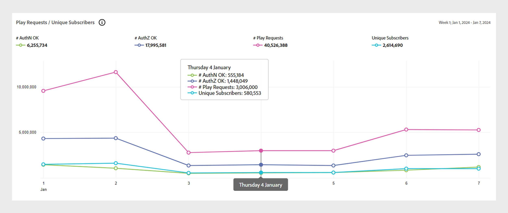

# [!UICONTROL General usage]개 보고서 {#general-usage-reports}

[!UICONTROL Account IQ] 보고서는 데이터를 자세히 분석하여 [집단](/help/accountiq/product-concepts.md#segmet-def)을 격리하고, 예외 항목을 식별하며, 계정 특성에 대한 이해를 도울 수 있는 기본 분석 도구입니다.

[!UICONTROL General usage] 보고서 페이지에서는 사용 중인 계정 장치 수, 감지된 IP 및 각각의 우편 번호를 기반으로 하위 그룹 지표를 만드는 도구를 제공합니다.

보고서는 모두 [세그먼트 및 시간 간격](/help/accountiq/segments-timeinterval.md) 패널에서 선택한 현재 세그먼트를 기반으로 합니다. [스냅숏 개요-계정 임계값 초과](#snapshot-overview) 패널에서 임계값을 지정하여(장치 수, IP 수 및 우편 번호 수) 선택 항목을 미세 조정하고 범위를 좁힐 수 있습니다.

## 요청 및 고유 구독자 재생 {#playreq-uniquesubs}

여기에 있는 선 그래프는 정의된 세그먼트에 대해 선택한 시간 간격의 재생 요청 및 고유 구독자와 같은 값의 시간에 따른 변경 사항을 보여줍니다.

+++ D2C 서비스: 요청/고유 구독자 재생

*D2C 서비스에 대한 요청/고유 구독자 재생*

+++

+++프로그래머: 요청/고유 구독자 재생

*프로그래머를 위한 요청/고유 구독자 재생*

+++

+++MVPD: 고유 구독자

*MVPD에 대한 고유 구독자*

+++

 

x축은 현재 간격을 기준으로 한 시간을 나타내고 y축은 해당 기간 동안의 기본 가입자 활동 지표를 나타낸다. 선 그래프는 현재 세그먼트에 있는 구독자의 활동을 시각화하고 비교하는 데 도움이 됩니다. Account IQ 버전에 따라 지표는 다음과 같습니다.

* **AuthN OK**: 성공한 인증 수입니다. [AuthN OK](/help/accountiq/product-concepts.md#authn-ok-def)에 대해 자세히 알아보십시오.

* **AuthZ OK**: 성공한 승인 수입니다. [AuthZ OK](/help/accountiq/product-concepts.md#authz-ok-def)에 대해 자세히 알아보십시오.

* **재생 요청**: 재생 요청 수입니다. [재생 요청](/help/accountiq/product-concepts.md#play-requests-def)에 대해 자세히 알아보세요.

* **고유 구독자**: 성공한 고유 구독자 수입니다. [고유 구독자](/help/accountiq/product-concepts.md#unique-subscriber-def)에 대해 자세히 알아보세요.

>[!NOTE]
>
>지표의 사용 가능 여부는 Account IQ 버전에 따라 다릅니다.

## 스냅샷 개요 - 임계값 초과 계정 {#snapshot-overview}

이 추가 필터를 사용하여 분석 및 보고서를 미세 조정하여 다양한 사용 임계값을 설정합니다. 세그먼트를 선택하면 다음 필터를 사용하여 구독자 동작을 추가로 분석할 수도 있습니다.

* 장치 수 임계값

* IP 수 임계값

* 우편 번호 임계값 수

[선택한 임계값을 기반으로 하는 계정 세그먼트](#account-segments-basedon-segments) 패널에서 임계값을 업데이트하면 다음에서 효과를 볼 수 있습니다.

* [계정당 주당(또는 월별) 장치](#devices-week-account)

* [계정당 주당(또는 월별) 위치](#locations-week-account)

* [계정당 주당(또는 월별) IP](#ip-week-account)

* [계정 세그먼트의 내역 보기](#account-segment-historical-view)

>[!NOTE]
>
>각 임계값은 기본값 4로 설정됩니다. 즉, [일반 사용] 페이지에는 4개 이상의 장치를 사용하고 4개 이상의 서로 다른 IP 주소 *및*&#x200B;의 서로 다른 우편번호를 사용하는 구독자에 대한 분석이 표시됩니다.

### 선택한 임계값을 기반으로 세그먼트 기반 계정 {#account-segments-basedon-segments}

**선택한 임계값에 기반한 계정 세그먼트** 패널을 통해 장치 수, IP 수 및 우편번호 수에 대한 임계값(1에서 10 사이)을 설정할 수 있는 옵션을 제공합니다.

그래프는 다음을 보여 줍니다.

* 구독자 계정의 절대 수입니다.

* 장치 수, IP 수 및 임계값에 지정된 우편 번호 수를 사용하고 있는 세그먼트의 총 가입자 계정 중 백분율입니다.

## 계정당 주당(또는 월별) 장치 {#devices-week-account}

이 막대 그래프는 구독자가 디바이스를 사용하여 콘텐츠에 액세스하는 방법과 관련하여 사용 동작에 대한 통찰력을 제공합니다.

x축은 계정 수, y축은 장치 수를 나타냅니다. 계정당 장치 수에 대해 설정한 임계값에 따라 일주일 동안 특정 수의 장치에서 콘텐츠를 소비하는 구독자 계정의 절대 수를 표시합니다.

마우스로 막대(장치 수에 따라 다름)를 가리키면 일주일에 여러 장치를 사용하여 채널 콘텐츠를 스트리밍하는 구독자 계정의 수(및 세그먼트의 총 구독자 계정 중 백분율)에 대한 정보를 제공하는 레이블이 나타납니다.

이 그래프는 또한 다음을 표시합니다.

* 설정한 임계값을 표시하는 빨간색 선.

* 주(또는 월)당 구독자 계정에서 사용하는 다른 장치 수의 평균을 표시하는 녹색 줄입니다.

도넛은 설정된 임계값 이상의 현재 세그먼트의 계정에서 사용 중인 장치에 대한 대체 보기를 제공합니다.

## 계정당 주당(또는 월별) 위치 {#locations-week-account}

계정당 매주 [장치(또는 매월)](#devices-week-account)에 대한 지표와 마찬가지로, 계정당 매주(또는 매월) 위치 지표를 사용하면 다른 위치에서 구독자 계정 사용을 분석할 수 있습니다. X축은 계정 수, Y축은 위치 수를 나타냅니다.

위치 수에 대한 임계값을 설정하면 그래프를 사용하여 다음을 식별할 수 있습니다.

* 한 주 동안 특정 위치 x개에서 콘텐츠를 소비하는 구독자의 수(및 백분율)입니다.

* 임계값보다 많은 위치에서 콘텐츠를 보고 있는 총 구독자 계정의 백분율입니다.

* 주별 평균(계정의 다른 위치 수)을 임계값과 비교합니다.

## 계정당 주당(또는 월별) IP {#ip-week-account}

**계정당 주당 위치 수**&#x200B;에 대한 지표와 마찬가지로 **계정당 주당 IP 수** 지표를 사용하면 현재 세그먼트에 대한 스트리밍 원본의 변경 양을 평가할 수 있습니다.

x축은 계정 수를, y축은 IP 수를 나타냅니다.

세그먼트를 정의하고 IP 수에 대한 임계값을 설정하면 그래프를 사용하여 다음을 식별할 수 있습니다.

* 한 주에 특정 수의 IP에서 콘텐츠를 소비하는 구독자의 수(및 백분율)입니다.

* 임계값보다 많은 IP 주소에서 콘텐츠를 보고 있는 총 구독자 계정의 백분율입니다.

* 주별 평균(계정에 대한 다른 IP 수)을 임계값과 비교합니다.

## 계정 세그먼트-내역 보기 {#account-segment-historical-view}

내역 보기 막대 그래프는 다양한 시간 간격의 사용 지표를 비교하는 데 도움이 됩니다. 또한, 계정당 [주(또는 월) 장치](#devices-week-account), 계정당 [주(또는 월) 위치](#locations-week-account), 계정당 [주(또는 월) IP](#ip-week-account) 등 다양한 사용 지표를 집합적으로 표시합니다.

* x축은 시간 간격을 나타내고 y축은 가입자 계정, 장치, 위치 및 IP 수를 나타냅니다.

* 주황색 막대는 다양한 시간 간격으로 세그먼트를 나타냅니다.

* 선 그래프는 임계값에 따라 시간 간격 동안 [계정당 주(또는 월)당 장치](#devices-week-account), 계정당 주(또는 월)당 위치 [개](#locations-week-account), 계정당 주(또는 월)당 IP [개](#ip-week-account) 값의 변경 내용을 표시합니다.

* 파란색 막대는 특정 시간 간격 동안 업계 전체의 총 활성 구독자 수를 나타냅니다.

* 특정 범례를 선택할 수 있으며 그래프 크기를 조정할 수 있습니다.

