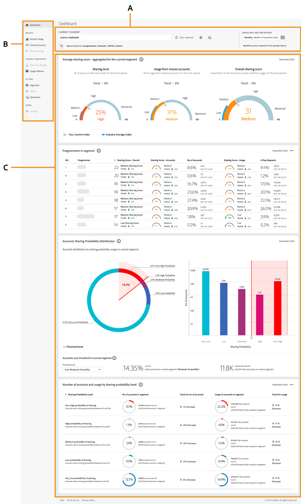

# 대시보드 소개 {#introduction-dashboard}

대시보드는 계정 공유의 범위와 영향에 대한 높은 수준의 개요를 제공하도록 설계된 그래프 및 보고서 모음의 데이터를 요약하고 집계합니다. [!UICONTROL Account IQ]의 주요 보고서와 지표가 포함된 단일 페이지를 제공합니다.

>[!NOTE]
>
>D2C 서비스, 프로그래머 및 MVPD 대시보드의 대부분의 데이터 패널은 동일합니다. 그러나 특정 데이터 패널은 버전마다 다를 수 있습니다.

+++D2C 서비스: 대시보드

D2C 서비스용 Account IQ의 {align="left"}

*D2C 서비스용 대시보드*

**A.** 세그먼트 및 시간 간격 패널 **B.** 페이지 탐색 **C.** 데이터 패널

+++

+++프로그래머: 대시보드

프로그래머용 Account IQ의 {align="left"}

프로그래머용 *대시보드*

**A.** 세그먼트 및 시간 간격 패널 **B.** 페이지 탐색 **C.** 데이터 패널

+++

+++MVPDs: 대시보드

MVPD에 대한 대시보드는 프로그래머들의 대시보드와 약간 다르다.

MVPD에 대한 [!UICONTROL Account IQ]의 {align="left"}

MVPD용 *대시보드*

**A.** 세그먼트 및 시간 간격 패널 **B.** 페이지 탐색 **C.** 데이터 패널

+++

D2C 서비스, 프로그래머 및 MVPD를 위한 대시보드는 다음과 같습니다.

* **세그먼트 및 시간 간격 패널**: 이 패널을 사용하면 세그먼트 및 시간 간격을 선택하여 계정 공유 보고서를 생성하고 선택한 세그먼트에 대한 요약을 제공할 수 있습니다. 자세한 내용은 [세그먼트 및 시간 간격](/help/accountiq/segments-timeinterval.md)을 참조하세요.

* **페이지 탐색**: 이 탭을 사용하여 Account IQ의 다양한 섹션 및 페이지를 탐색하고 탐색할 수 있습니다.

* **데이터 패널**: 패널에 표와 그래프를 통해 보고서를 공유하는 계정이 표시되므로 보고서를 로컬 장치에 직접 보고서로 내보낼 수 있습니다. 자세한 내용은 [데이터 패널](/help/accountiq/data-panels.md) 및 [데이터 패널 보고서 내보내기](/help/accountiq/export-reports.md)를 참조하십시오.
