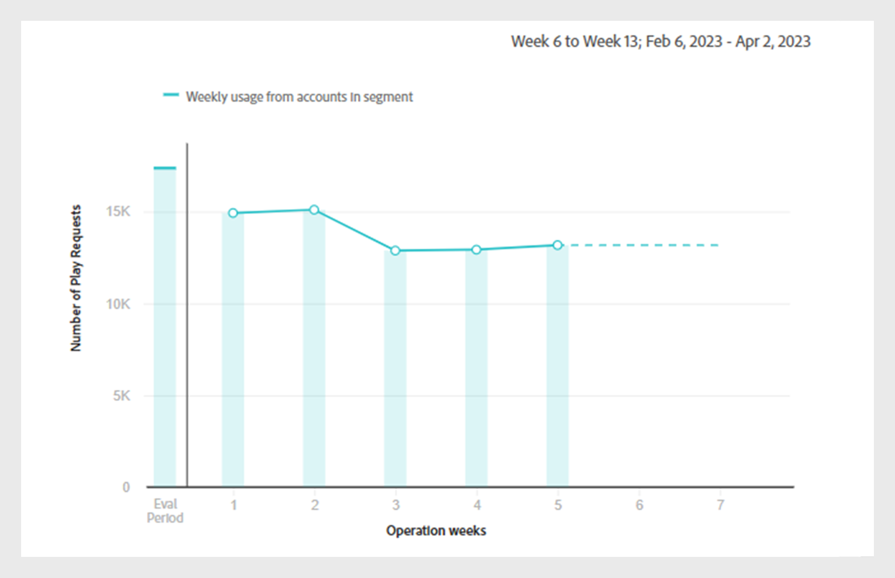

# 작업 {#operations-tab-next-steps}

[!DNL Account IQ] 분석을 사용하여 구독자의 사용 패턴을 분석하고 선택한 세그먼트에 대한 암호 공유 인스턴스를 식별한 후에는 [!DNL Account IQ]의 작업이라는 집중 절차를 통해 타깃팅된 작업을 수행할 수 있습니다.

**작업**&#x200B;을(를) 사용하면 계정 그룹에 대한 자격 증명 공유를 효과적으로 추적 및 관리하여 암호 공유를 완화하고 중요 구독자의 경험을 향상시킬 수 있습니다.

정의된 [세그먼트](/help/accountiq/product-concepts.md#segment-def)에 작업을 적용하여 특정 [시간 간격](/help/accountiq/product-concepts.md#time-interval-def) 내에 암호 공유를 해결하고 향후 날짜에 작업을 실행하도록 예약할 수 있습니다. 이러한 작업에는 암호 공유를 최소화하기 위한 제한 또는 공유하지 않는 계정에 대한 제한 완화가 포함됩니다.

작업을 사용하여 작업과 해당 범위를 지정할 뿐만 아니라 결과를 측정합니다.

결과를 평가하여 대출자를 전환하든, 자격 증명 공유를 완화하든 또는 이탈을 감소하든 간에 효과를 최적화하기 위한 전략을 구체화할 수 있습니다.

다음과 같은 작업을 통해 다양한 기능을 수행할 수 있습니다.

* [작업 보고서 보기](#operation-reports)
* [새 작업 만들기](#create-new-operation)
* [작업 중지](#stop-operation)

## 작업 보고서 보기 {#operation-reports}

작업 보고서를 통해 작업의 효과를 검토할 수 있습니다. 작업 보고서를 보려면 Account IQ 응용 프로그램의 왼쪽 패널에서 **작업** 아래의 **작업** 탭을 선택하십시오. 시스템에서 사용할 수 있는 작업 목록이 표시됩니다. 테이블 형식으로 각 작업에 대한 주요 세부 정보에 액세스할 수 있습니다. 세부 사항은 다음과 같습니다.

* 작업 이름
* 현재 상태(예: 예약됨, 실행 중, 종료됨, 오류 또는 중지됨)
* 진행 완료율
* 작업이 적용되는 타겟 대상자 또는 세그먼트
* 작업에 대해 선택한 작업 유형
* 작업 시작일
* 작업 종료일
* 작업이 생성된 날짜
* 작업의 마지막 수정 날짜

*Account IQ의 기존 작업 목록 및 세부 정보*

작업 목록에서 원하는 **작업 이름**&#x200B;을(를) 선택하십시오. 다음 보고서가 표시됩니다.

### 작업 성능 {#operation-performance}

작업 성능은 영향을 받는 계정의 수, 작업 진행 상황 및 작업의 [평가 기간](/help/accountiq/product-concepts.md#evaluation-period-def) 동안 세그먼트에 있는 계정의 전체 공유 점수를 요약하는 맨 위 줄의 판독값을 제공합니다.

*작업 성능 보고서*

**A.** 영향을 받은 계정 **B.** 작업 진행 상황 **C.** 전체 공유 점수

#### 영향을 받는 계정 {#impacted-accounts}

이 숫자는 작업의 평가 기간 동안 수행한 작업의 영향을 받는 구독자 계정 수를 표시합니다.

#### 작업 진행률 {#operation-progress}

이 측정은 계획된 일정에서 완료된 작업의 일수와 백분율을 보여 줍니다.

#### 전체 공유 점수 {#overall-sharing-score}

이 선 그래프는 [전체 공유 점수](/help/accountiq/data-panels.md#overall-sharing-score)를 나타내며, 여기에는 작업의 평가 기간 동안 매주 공유 계정의 공유 수준 및 사용이 포함됩니다.

### 작업 영향: 세그먼트의 계정 {#impact-accounts}

이 보고서는 시간에 따른 작업의 영향을 보여 주는 누적 열 그래프로 표시됩니다.

*작업이 세그먼트 그래프의 계정에 미치는 영향*

x축은 작업의 [평가 기간](/help/accountiq/product-concepts.md#evaluation-period-def)을 나타내고 y축은 작업 세그먼트에 있는 계정의 상태를 나타냅니다. 그래프의 각 막대는 세 가지 색상으로 구분됩니다.

* Pink는 이 작업에 사용된 세그먼트의 조건을 충족하는 계정 수를 나타냅니다.

* 파란색은 원래 세그먼트에 있었으나 작업의 [평가 기간](/help/accountiq/product-concepts.md#evaluation-period-def)에서 각 주 또는 월 동안 세그먼트의 조건을 충족하지 않은 활성 계정 수를 나타냅니다.

* 회색은 평가 기간 동안 비활성 상태였던 계정을 나타냅니다.

>[!NOTE]
>
>첫 번째 분홍색 막대는 평가 기간이 시작될 때 운영 세그먼트의 조건을 충족하는 계정 수를 나타냅니다.

시간이 지남에 따라 그래프는 원래 기준에 상대적인 계정 동작의 변화를 보여 줍니다(예를 들어, 90개 이상의 공유 확률과 5개 이상의 디바이스 사용이 비활성화됨).

### 작업에 미치는 영향: 공유 계정 지표 {#impact-shared-accounts}

공유 계정 지표는 작업의 [평가 기간](/help/accountiq/product-concepts.md#evaluation-period-def) 동안 작업의 세그먼트에서 구독자 계정의 공유 수준 및 재생 요청에 대한 개요를 제공합니다.

#### 공유 수준 {#share-level}

이 선 그래프는 작업의 평가 기간 동안 매주 [공유 수준](/help/accountiq/data-panels.md#sharing-level)을 나타냅니다.

{width="550" align="left"}

*수준 선 그래프 공유*

#### 재생 요청 수 {#play-requests}

이 선 그래프는 작업의 평가 기간에 매주 [재생 요청](/help/accountiq/general-usage-reports.md#playreq-uniquesubs)을 나타냅니다.

{width="550" align="left"}

*선 그래프 재생 요청 수*

### 작업에 미치는 영향: 일반 사용 지표 {#impact-general-usage}

일반 사용 지표는 작업의 [평가 기간](/help/accountiq/product-concepts.md#evaluation-period-def) 동안 작업의 세그먼트에 있는 평균 장치, IP 수 및 위치에 대한 개요를 제공합니다.

#### 장치 수 {#devices}

이 선 그래프는 작업의 평가 기간에 매주 평균 [장치 수](/help/accountiq/general-usage-reports.md#devices-week-account)를 나타냅니다.

{width="550" align="left"}

*장치 줄 그래프 수*

#### IP 및 위치 수 {#IPs-locations}

이 선 그래프는 작업의 평가 기간에 매주 평균 [IP 수](/help/accountiq/general-usage-reports.md#ip-week-account) 및 [위치](/help/accountiq/general-usage-reports.md#locations-week-account)를 나타냅니다.

{width="550" align="left"}

*IP 수 및 위치 선 그래프*

보고서를 닫고 기본 **작업** 페이지로 돌아가려면 왼쪽 패널의 **작업**&#x200B;에서 **작업** 탭을 선택하십시오.

## 새 작업 만들기 {#create-new-operation}

왼쪽 패널의 **작업** 아래에 있는 **작업** 탭으로 이동하면 **작업** 페이지 맨 위에서 **새 작업 만들기**&#x200B;를 선택합니다.

새 작업을 만들려면 다음 섹션의 지침을 따릅니다.

* [작업 세부 정보](#operation-details)
* [세그먼트](#segment)
* [작업](#action)
* [예약](#schedule)

### 작업 세부 정보 {#operation-details}

이 섹션에서 **작업 이름**&#x200B;에 작업 이름을 입력하십시오.

>[!TIP]
>
>빠른 식별을 위해 **작업 이름**&#x200B;에서 작업의 목적이나 작업의 특성을 설명하십시오. **설명 및 태그를 추가**&#x200B;하는 옵션은 향후 릴리스에서 사용할 수 있습니다.

*작업 이름 추가*

### 세그먼트 {#segment}

이 섹션에서 **세그먼트 선택**&#x200B;을 클릭하고 이 작업을 사용할 세그먼트를 선택하십시오. [세그먼트를 선택하는 방법](/help/accountiq/segments-timeinterval.md#segment-selection)을 알아보세요.

세그먼트를 선택한 후에는 자세한 세그먼트 요약을 보려면  아이콘을 클릭하세요. [세그먼트 요약](segments-timeinterval.md#segment-summary)에 대해 자세히 알아보세요.

*세그먼트 및 시간 간격 선택*

>[!NOTE]
>
>이전 이미지에 표시된 [비디오 카테고리](product-concepts.md#video-category-def)(예: **MVPD**, **프로그래머**, **채널**)은 Account IQ의 TV Everywhere 버전에서 사용되는 레이블을 나타냅니다. D2C 서비스로 로그인하는 경우 이러한 레이블에 회사의 특정 비디오 카테고리가 표시됩니다.

필요한 경우 다음을 사용합니다.  아이콘으로 선택한 세그먼트를 편집하거나  새 세그먼트를 만들 수 있는  아이콘입니다. 자세한 내용은 [새 세그먼트 만들기](work-with-segments.md#create-new-segment) 또는 [세그먼트 편집](work-with-segments.md#edit-segment)에 대한 지침을 참조하세요.

>[!IMPORTANT]
>
>**[!UICONTROL Fixed number of accounts]**(이)라는 **세그먼트 형식**&#x200B;이(가) 현재 기본적으로 선택되어 있습니다. **[!UICONTROL Variable number of accounts]**&#x200B;을(를) 선택하는 옵션은 향후 릴리스에서 사용할 수 있습니다.

특정 기간 동안의 작업을 모니터링하려면 **세부 기간 및 시간 간격**&#x200B;을 선택하십시오. [세부 기간 및 시간 간격을 선택하는 방법](/help/accountiq/segments-timeinterval.md#granularity-timeinterval)에 대해 자세히 알아보세요.

### 작업 {#action}

이 섹션에서 드롭다운 메뉴에서 선택한 세그먼트에 대해 수행할 **작업**&#x200B;을 선택합니다.

*동작 유형 선택*

다음 두 가지 옵션을 사용할 수 있습니다.

* Account IQ과 통합된 동시성 모니터링 시스템에 대해 **CM 정책**&#x200B;을(를) 선택하십시오.

* **외부 작업**&#x200B;을(를) 선택하여 Account IQ 시스템과 통합되지 않은 Account IQ 외부 워크플로우를 만들고 처리합니다.

>[!NOTE]
>
>외부 작업이 항상 암호 공유와 직접 관련되지는 않을 수 있지만, 새 시즌 시작과 같이 여전히 영향을 줄 수 있습니다.

### 예약 {#schedule}

이 섹션에서는 날짜 선택기에서 **시작 날짜** 및 **종료 날짜**&#x200B;를 선택하여 작업에 대한 활성화를 설정합니다.

>[!IMPORTANT]
>
>현재 기본 활성화 **시작 날짜** 및 **종료 날짜**&#x200B;이(가) **날짜**&#x200B;로 설정되어 있습니다. **조건이 충족되는 경우** 및 **수동으로**&#x200B;을(를) 선택하는 옵션은 향후 릴리스에서 사용할 수 있습니다.

>[!NOTE]
>
>시작 날짜와 종료 날짜가 모두 **4단계**&#x200B;에서 평가하기 위해 선택한 세부 기간과 일치하는지 확인하십시오.

* 주별로 집계된 세부 기간을 선택한 경우 주 단위 시작 및 종료 날짜를 선택합니다(예: 10주).
* 월별로 집계된 세부 기간을 선택한 경우 시작 날짜와 종료 날짜를 월 단위로 선택합니다.

*날짜 선택기에서 시작 날짜와 종료 날짜를 선택하십시오*

**A.** 시작 날짜 선택기 **B.** 종료 날짜 선택기

>[!NOTE]
>
>**시작 날짜**&#x200B;은(는) 평가 기간과 현재 날짜보다 나중이어야 하지만, **종료 날짜**&#x200B;은(는) 시작 날짜와 현재 날짜보다 나중이어야 향후 기간에 작업을 예약하고 실행할 수 있습니다.

새 작업을 처리하려면 **작업** 페이지 맨 위에서 **작업 저장**&#x200B;을(를) 선택하십시오.

## 작업 중지 {#stop-operation}

현재 **실행 중** 상태인 작업만 중지할 수 있습니다. 기존 작업을 중지하려면 다음 단계를 수행합니다.

1. Account IQ 응용 프로그램의 왼쪽 탐색에서 **작업** 아래의 **작업** 탭으로 이동합니다.
1. 중지할 작업의 **옵션** 메뉴를 선택하십시오.

   

   *작업을 중지하려면 옵션 메뉴 선택*

1. **중지**&#x200B;를 선택합니다.

