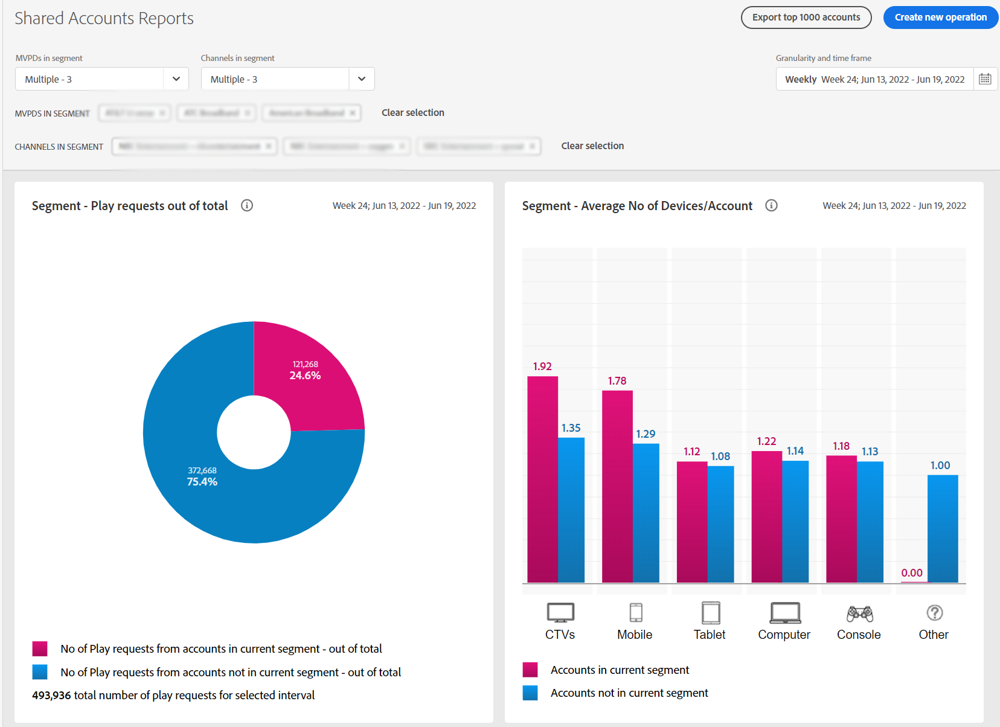

# 특정 프로그래머에 대한 계정 공유 보고서 보기 {#report-sp-programmers}

애플리케이션에 MVPD로 성공적으로 로그인하면 계정 IQ에서 보고서를 볼 수 있습니다.

1. 의 단계를 사용하여 분석 및 보고서 보기를 위해 구독자 세그먼트를 정의할 때 특정 프로그래머를 선택합니다. [세그먼트 정의 방법](/help/accountiq/howto-select-segment-timeframe.md).

   

1. 왼쪽 탐색에서 원하는 보고서 페이지를 선택합니다.

* [일반 사용](/help/accountiq/general-usage-reports.md)

  
* [공유 계정](/help/accountiq/shared-acc-reports.md)

  
* [사용 패턴](/help/accountiq/usage-patterns.md)

  

* [대시보드](/help/accountiq/dashboard.md) (대시보드에서는 다른 보고서 페이지에서 선택한 그래프를 볼 수 있습니다.)

  

이러한 각 페이지는 선택한 세그먼트의 활동을 반영합니다.
