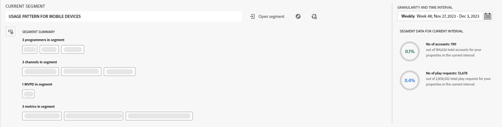

# 구독자 세그먼트 및 시간 간격 {#cohorts-segments}

계정 IQ에 로그인하면 맨 위에 있는 세그먼트 런처 패널에서 구독자를 지정할 수 있습니다 [세그먼트](/help/accountiq/product-concepts.md#segment-segmet-def). 이렇게 하면 구독자의 공유 동작 및 패턴에 대한 보고서를 볼 때 결과를 필터링하는 데 도움이 됩니다. 속성의 모든 계정이라는 기본 세그먼트가 이미 선택되어 있으며 세그먼트 런처에 다음 옵션이 표시됩니다.

{width="800" align="left"}

*그림: 축소된 세그먼트 요약이 있는 세그먼트 런처*

**A** 현재 선택된 세그먼트 이름 
**B** 시간 간격 및 세부 기간 선택기 
**C** 세그먼트 요약이 축소됨 
**D** 세그먼트 요약을 확장하는 옵션 
**E** 세그먼트 데이터(일정 기간 동안 세그먼트의 구독자 계정 수 기준) 
**F** 세그먼트 목록 열기 옵션 
**G** 세그먼트 편집 옵션 
**H** 새 세그먼트 만들기 옵션 

## 세그먼트 선택 {#segment-selection}

프로그래머 또는 MVPD 사용자의 경우 **세그먼트 열기** 옵션을 선택합니다. 목록에서 세그먼트를 선택하고 **세그먼트 열기** 계정 공유 보고서를 봅니다.

사용 **눈** 선택한 시간 간격 내에 구독자 계정 및 구독자에 의한 재생 요청 수에 대한 정보를 표시하는 세부 세그먼트 요약을 보는 아이콘.

+++프로그래머/MVPD에 대한 세그먼트 선택 패널

 {width="800" align="left"}

*그림: 프로그래머/MVPD용 세그먼트 패널*

+++

세그먼트 요약은 다음 매개 변수를 정의하는 데 사용됩니다.

**[!UICONTROL Programmers in segment]**

**[!UICONTROL Channels in segment]**

**[!UICONTROL MVPD in segment]**

**[!UICONTROL Metrics in segment]**

<!-- The definitions of these parameters will be defined in the glossary article-->

## [!UICONTROL Granularity and time interval] {#granularity-timeinterval}

다음 **[!UICONTROL Granularity and time interval]** 선택기를 사용하면 구독자 계정 공유 동작을 관찰하기 위해 주별/월별 기준으로 집계된 날짜 및 기간을 지정할 수 있습니다. 시간 간격의 기본 선택은 현재 주이지만 이미지에 표시된 옵션을 사용하여 지속 시간을 수정할 수 있습니다.

![[!UICONTROL Granularity and timeinterval]](assets/granularity-timeinterval-weekwise.png){width="350" align="left"}

*그림: 세부기간 및 시간 간격 대화 상자*

**A** 날짜 선택기에서 날짜 선택 
**B** 뒤로 이동하려면 왼쪽 화살표를 선택합니다. 
**C** 오른쪽 화살표를 선택하여 앞으로 이동 
**D** 주/월별로 세부기간 선택 
**E** 선택한 시간 간격 

이러한 컨트롤을 적용하면 문제 구문을 &quot;10월 X, Y, Z 채널을 시청한 MVPD A 구독자&quot;로 정의할 수 있습니다.

