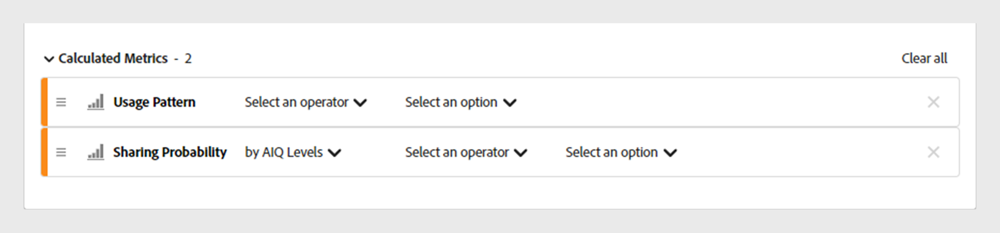
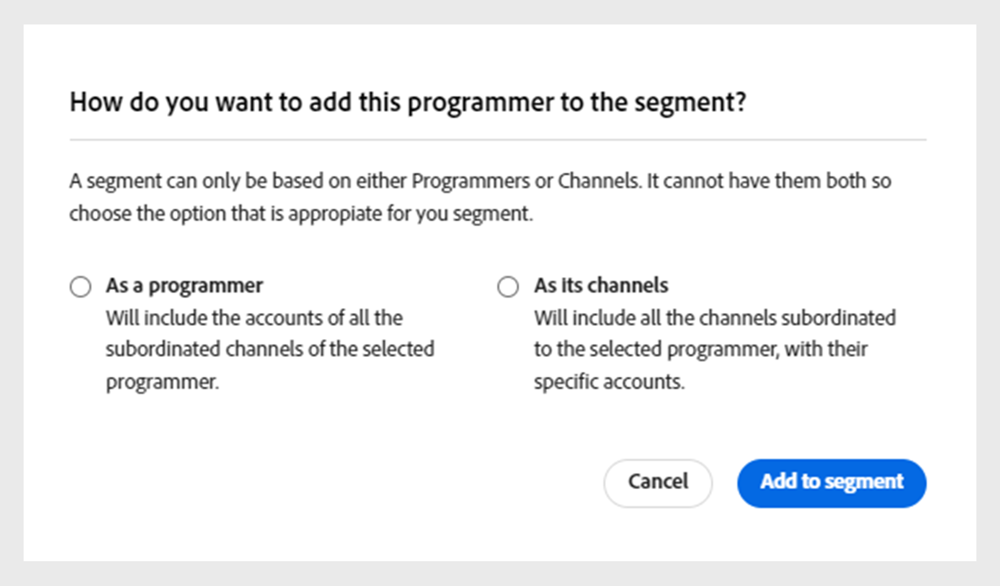
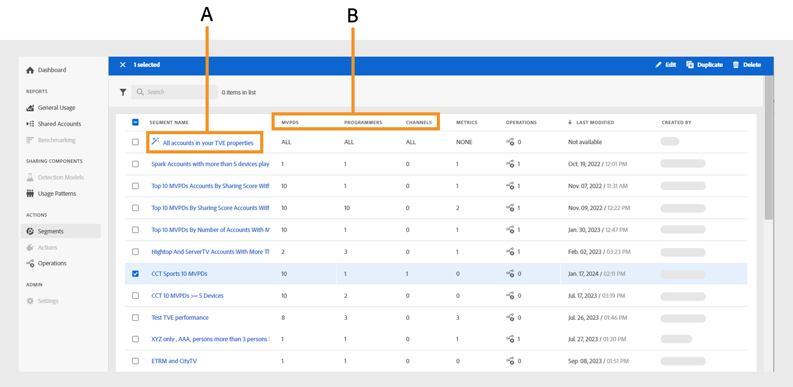

# 세그먼트 작업 {#work-with-segments}

[세그먼트](product-concepts.md#segmet-def) 사용자 정의 조건에서 자격 증명 공유를 분석할 수 있도록 해주는 구독자 계정의 컬렉션입니다. 세그먼트를 사용하여 다양한 가입자 계정 세트를 검사하고 테이블 및 그래프에서 해당 데이터 보고서를 생성할 수 있습니다. 계정 IQ에는 두 가지 유형의 세그먼트가 있습니다.

1. **기본 세그먼트**: **속성의 모든 계정** 는 특정 조건이 적용되지 않은 모든 활성 가입자 계정을 포함하는 시스템의 기본 세그먼트입니다.

   >[!NOTE]
   >
   >기본 세그먼트를 사용하면 과 같은 특정 테이블이 표시되지 않을 수 있습니다 [세그먼트의 비디오 카테고리](data-panels.md#video-categories-segment), [채널 및 MVPD별 점수 공유](data-panels.md#sharin-score-by-channels-and-mvpds), 및 [비디오 범주에 대한 사용 패턴 배포](usage-patterns.md#usage-pattern-dis-video-categories). 이러한 테이블은 한 번에 최대 20개의 행에 대한 데이터만 수용하고 표시할 수 있습니다. 나머지 테이블, 그래프 및 보고서는 기본 세그먼트와 사용자 지정 세그먼트에 대해 동일합니다.

1. **사용자 지정 세그먼트**: 사용자 정의 조건에서 자격 증명 공유를 분석하기 위해 D2C 콘텐츠 유형, 프로그래머, 채널 및 MVPD와 같은 특정 범주의 구독자 계정을 그룹화할 수 있는 맞춤화된 세그먼트입니다. 방법 자세히 알아보기 [사용자 지정 세그먼트 만들기](#create-new-segment).

   >[!IMPORTANT]
   >
   >이 안내서에 설명된 모든 절차는 사용자 지정 세그먼트를 기반으로 합니다. 하지만 기본 세그먼트와 사용자 지정 세그먼트에 대해서는 개념이 동일합니다.

로 이동하면 **작업** 및 선택 **[!UICONTROL Segments]** 왼쪽 패널의 탭에는 시스템에서 사용할 수 있는 세그먼트 목록이 표시됩니다. 세그먼트 페이지를 사용하여 테이블 형식으로 각 세그먼트에 대한 주요 세부 사항을 신속하게 평가할 수 있습니다. 세부 사항에는 세그먼트 이름, 번호 등이 포함됩니다. [비디오 카테고리](product-concepts.md#video-category-def), 지표, [작업](product-concepts.md#operation-def) 현재 세그먼트, 마지막으로 수정한 날짜 및 시간과 세그먼트 작성자의 이름을 사용합니다.

세그먼트를 사용하여 다음 기능을 수행할 수 있습니다.

* [새 세그먼트 만들기](#create-new-segment)
* [세그먼트 관리](#manage-segments)

## 새 세그먼트 만들기 {#create-new-segment}

새로운 세그먼트를 만드는 과정은 D2C 서비스나 TV Everywhere에서도 비슷하다. 비디오 카테고리는 계정 IQ의 각 버전에 대해 달라집니다.

+++2C 서비스

세그먼트를 작성하고 가입자의 공유 행동을 분석하려면 다음을 선택합니다. **[!UICONTROL Create new segment]** 오른쪽 상단에 있습니다.

*새 세그먼트 만들기 를 선택합니다*

>[!NOTE]
>
>이전 이미지에 표시된 비디오 범주, 예: **지역** 및 **컨텐츠 유형** 단지 예시일 뿐입니다. 계정 IQ에 로그인하면 이러한 레이블에 회사의 특정 비디오 범주가 표시됩니다.

다음 항목이 열립니다. **새 세그먼트** 다음 요소가 포함된 페이지:

*새 세그먼트 페이지*

**A.** 세그먼트 구성 요소 **B.** 세그먼트 정의 **C.** 세그먼트 요약

* **세그먼트 구성 요소**: 의 인벤토리 [비디오 카테고리](product-concepts.md##video-category-def) 세그먼트를 정의하는 데 사용되는 계산된 지표 및 입니다.

  >[!NOTE]
  >
  >사용 **[!UICONTROL Show all]** 세그먼트 구성 요소 목록을 확장합니다. 구성 요소를 빠르게 찾으려면 다음에서 해당 이름을 검색합니다. **세그먼트 구성 요소 검색** 전체 목록을 스크롤하는 대신

* **세그먼트 정의**: 다양한 세그먼트 구성 요소를 드래그하여 놓아 세그먼트를 작성할 수 있는 캔버스입니다.

* **세그먼트 요약**: 세그먼트 정의의 구성 요소를 기반으로 적격 계정을 추정하고 평가 기간 동안의 세그먼트에 대한 간단한 개요를 제공하는 요약입니다.

세그먼트를 만들려면 다음 단계를 수행하십시오.

1. 세그먼트 이름을 입력합니다. **세그먼트 이름** 세그먼트 목록과 세그먼트 선택 중에 표시됩니다.
1. 세그먼트에 대한 자세한 설명을 입력합니다. **세그먼트 설명**.
1. 예: 드래그 **지역 및 콘텐츠 유형** 왼쪽 패널의 세그먼트 구성 요소에서 **지역/콘텐츠 유형** 섹션 내 **세그먼트 정의**.

   >[!NOTE]
   >
   >지역 또는 콘텐츠 유형을 기반으로 세그먼트를 만들 수 있습니다. 드롭다운 메뉴에서 영역과 관련된 콘텐츠 유형을 확인합니다.

   을(를) 추가하여 시작하는 경우 **콘텐츠 유형** 다음에서 **지역/콘텐츠 유형** 섹션에서 콘텐츠 유형만 후속 구성 요소로 추가할 수 있습니다.

   을(를) 추가하여 시작하는 경우 **지역** 다음에서 **지역/콘텐츠 유형** 섹션에 [결정] 대화 상자가 표시됩니다.

   {width="550" align="left"}

   *세그먼트 구성 요소를 영역 또는 해당 콘텐츠 유형 대화 상자로 추가*

   영역과 관련된 콘텐츠 유형을 기준으로 특정 영역을 비교할지 아니면 세그먼트를 비교할지 결정합니다.

   선택 **[!UICONTROL As a region]** 에 영역을 추가하려면 **지역/콘텐츠 유형** 섹션.

   선택 **[!UICONTROL As its content types]** 을 클릭하여 영역의 콘텐츠 유형을 추가합니다.

1. 드래그 **지표** 왼쪽 패널의 세그먼트 구성 요소에서 **지표** 섹션 내 **세그먼트 정의**.

   

   *연산자를 선택하고 추가된 지표에 대한 값을 할당합니다*

   세그먼트 정의에 지표를 추가한 후 연산자를 선택합니다. **[!UICONTROL Select an operator]** 드롭다운 메뉴 및 다음을 사용하여 값 할당 **[!UICONTROL Select an option]**.

   위쪽 화살표는 증가하고 아래쪽 화살표는 감소하여 특정 지표의 값을 조정합니다.

1. 드래그 **계산된 지표** 왼쪽 패널의 세그먼트 구성 요소에서 **계산된 지표** 섹션 내 **세그먼트 정의**.

   

   *연산자를 선택하고 추가된 계산된 지표에 대한 값을 할당합니다*

   세그먼트 정의에 계산된 지표를 추가한 후 **[!UICONTROL Select an operator]** 드롭다운 메뉴에서 다음을 사용하여 값을 할당합니다. **[!UICONTROL Select an option]**.

   >[!NOTE]
   >
   >세그먼트 정의 아래에 놓는 모든 지표 및 계산된 지표는 해당 지표 및 계산된 지표에 값을 할당하는 적절한 연산자와 함께 사용됩니다.

1. 에서 세그먼트 세부 사항을 검토합니다. **세그먼트 요약** 세그먼트 전체에 걸쳐 구현할 변경 사항을 결정할 수 있습니다.
1. 선택 **[!UICONTROL Last week]** 또는 **[!UICONTROL Last month]** 다음에서 **평가 기간** 드롭다운 메뉴를 사용하여 지난 주 또는 월의 요약 값을 예측할 수 있습니다.
1. 선택 **[!UICONTROL Update estimation]** 선택한 평가 기간을 기반으로 현재 세그먼트의 예상 적격 계정 수를 계산합니다.
1. 선택 **[!UICONTROL Save segment]**.

이제 만든 세그먼트를 세그먼트 목록에서 사용할 수 있습니다.

+++

+++TV Everywhere

세그먼트를 작성하고 가입자의 공유 행동을 분석하려면 다음을 선택합니다. **[!UICONTROL Create new segment]** 오른쪽 상단에 있습니다.

*새 세그먼트 만들기 를 선택합니다*

다음 항목이 열립니다. **새 세그먼트** 다음 요소가 포함된 페이지:

*새 세그먼트 페이지*

**A.** 세그먼트 구성 요소 **B.** 세그먼트 정의 **C.** 세그먼트 요약

* **세그먼트 구성 요소**: 세그먼트를 정의하는 데 사용되는 프로그래머 및 채널, MVPD, 지표 및 계산된 지표의 인벤터리입니다.

  >[!NOTE]
  >
  >사용 **[!UICONTROL Show all]** 세그먼트 구성 요소 목록을 확장합니다. 구성 요소를 빠르게 찾으려면 다음에서 해당 이름을 검색합니다. **세그먼트 구성 요소 검색** 전체 목록을 스크롤하는 대신

* **세그먼트 정의**: 다양한 세그먼트 구성 요소를 드래그하여 놓아 세그먼트를 작성할 수 있는 캔버스입니다.

* **세그먼트 요약**: 세그먼트 정의의 구성 요소를 기반으로 적격 계정을 추정하고 평가 기간 동안의 세그먼트에 대한 간단한 개요를 제공하는 요약입니다.

세그먼트를 만들려면 다음 단계를 수행하십시오.

1. 세그먼트 이름을 입력합니다. **세그먼트 이름** 세그먼트 목록과 세그먼트 선택 중에 표시됩니다.
1. 세그먼트에 대한 자세한 설명을 입력합니다. **세그먼트 설명**.
1. 드래그 **프로그래머 및 채널** 왼쪽 패널의 세그먼트 구성 요소에서 **프로그래머/채널** 섹션 내 **세그먼트 정의**.

   >[!NOTE]
   >
   >프로그래머 또는 채널을 기반으로 세그먼트를 만들 수 있습니다. 드롭다운 메뉴에서 프로그래머와 연결된 채널을 봅니다.

   을(를) 추가하여 시작하는 경우 **채널** 다음에서 **프로그래머/채널** 섹션에서 채널은 후속 구성 요소로만 추가할 수 있습니다.

   을(를) 추가하여 시작하는 경우 **프로그래머** 다음에서 **프로그래머/채널** 섹션에 [결정] 대화 상자가 표시됩니다.

   {width="550" align="left"}

   *세그먼트 구성 요소를 프로그래머 또는 해당 채널 대화 상자로 추가*

   프로그래머와 연결된 채널을 기반으로 특정 프로그래머와 세그먼트를 비교할지 여부를 결정합니다.

   선택 **[!UICONTROL As a programmer]** 프로그래머를 **프로그래머/채널** 섹션.

   선택 **[!UICONTROL As its channels]** 프로그래머의 모든 채널을 추가합니다.

1. 드래그 **MVPD** 왼쪽 패널의 세그먼트 구성 요소에서 **MVPD** 섹션 내 **세그먼트 정의**.

   >[!NOTE]
   >
   >프로그래머로 로그인하면 MVPD가 **xfinity** 은 의 독립 실행형 옵션으로 **MVPD** 섹션. 다른 MVPD와 결합할 수 없습니다.

1. 드래그 **지표** 왼쪽 패널의 세그먼트 구성 요소에서 **지표** 섹션 내 **세그먼트 정의**.

   

   *연산자를 선택하고 추가된 지표에 대한 값을 할당합니다*

   세그먼트 정의에 지표를 추가한 후 연산자를 선택합니다. **[!UICONTROL Select an operator]** 드롭다운 메뉴 및 다음을 사용하여 값 할당 **[!UICONTROL Select an option]**.

   위쪽 화살표는 증가하고 아래쪽 화살표는 감소하여 특정 지표의 값을 조정합니다.

1. 드래그 **계산된 지표** 왼쪽 패널의 세그먼트 구성 요소에서 **계산된 지표** 섹션 내 **세그먼트 정의**.

   

   *연산자를 선택하고 추가된 계산된 지표에 대한 값을 할당합니다*

   세그먼트 정의에 계산된 지표를 추가한 후 **[!UICONTROL Select an operator]** 드롭다운 메뉴에서 다음을 사용하여 값을 할당합니다. **[!UICONTROL Select an option]**.

   >[!NOTE]
   >
   >세그먼트 정의 아래에 놓는 모든 지표 및 계산된 지표는 해당 지표 및 계산된 지표에 값을 할당하는 적절한 연산자와 함께 사용됩니다.

1. 에서 세그먼트 세부 사항을 검토합니다. **세그먼트 요약** 세그먼트 전체에 걸쳐 구현할 변경 사항을 결정할 수 있습니다.
1. 선택 **[!UICONTROL Last week]** 또는 **[!UICONTROL Last month]** 다음에서 **평가 기간** 드롭다운 메뉴를 사용하여 지난 주 또는 월의 요약 값을 예측할 수 있습니다.
1. 선택 **[!UICONTROL Update estimation]** 선택한 평가 기간을 기반으로 현재 세그먼트의 예상 적격 계정 수를 계산합니다.
1. 선택 **[!UICONTROL Save segment]**.

이제 만든 세그먼트를 세그먼트 목록에서 사용할 수 있습니다.
+++

## 세그먼트 관리 {#manage-segments}

세그먼트 목록에서 세그먼트를 선택한 다음 다음 작업을 수행할 수 있습니다.

* [세그먼트 편집](#edit-segment)
* [세그먼트 복제](#duplicate-segment)
* [세그먼트 삭제](#delete-segment)

*편집, 복제 또는 삭제할 세그먼트 선택*

**A.** [기본 세그먼트](#work-with-segments) **B.** [비디오 카테고리](product-concepts.md#video-category-def)

>[!NOTE]
>
>이 섹션에 표시되는 비디오 카테고리: **MVPD**, **프로그래머**, 및 **채널** 계정 IQ의 TV Everywhere 버전에 사용된 레이블을 나타냅니다. D2C 서비스로 로그인하는 경우 이러한 레이블에 회사의 특정 비디오 카테고리가 표시됩니다.

이름이 인 기본 세그먼트는 편집, 복제 또는 삭제할 수 없습니다. **속성의 모든 계정**.

### 세그먼트 편집 {#edit-segment}

1. 다음 위치로 이동 **[!UICONTROL Segments]** 아래의 탭 **작업** 왼쪽 패널에서 세그먼트 목록을 볼 수 있습니다.
1. 편집할 세그먼트를 선택합니다.
1. 선택 **[!UICONTROL Edit]**.
1. 세그먼트 이름, 설명 또는 구성 요소와 같은 세그먼트 세부 정보를 수정합니다. **세그먼트 정의**.

   >[!TIP]
   >
   >사용 **[!UICONTROL Clear all]** 세그먼트 정의 아래 각 섹션 내의 모든 세그먼트 구성 요소를 한 번에 제거합니다. 또는 교차 버튼을 선택하여 개별 항목을 제거합니다.

   

   *모든 세그먼트 구성 요소를 한 번에 제거하려면 모두 지우기 를 선택하십시오*

1. 다음 중 하나를 선택합니다. **[!UICONTROL Update segment]** 기존 세그먼트를 업데이트하거나 **[!UICONTROL Save as new segment]** 를 클릭하여 변경 내용으로 새 세그먼트를 만듭니다.

   >[!NOTE]
   >
   >현재 작업이 진행 중인 세그먼트는 업데이트할 수 없습니다. 변경 사항을 새 세그먼트로 저장하는 것은 작업이 진행 중인 세그먼트에 대한 유일한 옵션입니다.

### 세그먼트 복제 {#duplicate-segment}

1. 다음 위치로 이동 **[!UICONTROL Segments]** 아래의 탭 **작업** 왼쪽 패널에서 세그먼트 목록을 볼 수 있습니다.
1. 복제할 세그먼트를 선택합니다.
1. 선택 **[!UICONTROL Duplicate]**.

선택한 세그먼트의 복사본이 생성되어 세그먼트 목록의 끝에 배치됩니다. 복제된 세그먼트에서 필요한 세부 정보를 편집한 다음 중복 세그먼트를 업데이트하거나 새 세그먼트로 저장할 수 있습니다.

### 세그먼트 삭제 {#delete-segment}

1. 다음 위치로 이동 **[!UICONTROL Segments]** 아래의 탭 **작업** 왼쪽 패널에서 세그먼트 목록을 볼 수 있습니다.
1. 제거할 세그먼트를 선택합니다.

   여러 세그먼트를 선택하여 한 번의 작업으로 삭제합니다. 의 왼쪽에 있는 확인란을 선택할 수도 있습니다. **세그먼트 이름** 모든 세그먼트를 한 번에 삭제합니다.

   >[!NOTE]
   >
   > 작업에 사용되는 세그먼트가 없는 경우 하나 이상의 세그먼트 또는 모든 세그먼트만 삭제할 수 있습니다. 또한 이라는 기본 세그먼트를 삭제합니다. **속성의 모든 계정** 은(는) 허용되지 않습니다. 모든 세그먼트를 한 번에 삭제하려고 하면 선택 해제됩니다.

   

   *여러 세그먼트를 선택하여 둘 이상의 세그먼트 삭제*

1. 선택 **[!UICONTROL Delete]**.
1. 확인 대상 **[!UICONTROL Delete]** 을 클릭하여 세그먼트를 영구적으로 제거합니다.

   >[!NOTE]
   >
   >세그먼트는 시스템에서 영구적으로 삭제되며 이 작업은 실행 취소할 수 없습니다.
