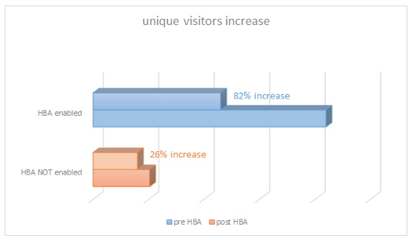

# TV Everywhere를 위한 홈 기반 인증

>[!NOTE]
>
>이 페이지의 컨텐츠는 정보용으로만 제공됩니다. 이 API를 사용하려면 Adobe의 현재 라이선스가 필요합니다. 허가되지 않은 사용은 허용되지 않습니다.

## 홈 기반 인증이란? {#whatis-home-based-authn}

HBA(Home Based Authentication)는 TV Everywhere 기능으로, 유료 TV 가입자가 집에 있을 때 MVPD 자격 증명을 입력하지 않고도 온라인으로 TV 컨텐츠를 볼 수 있으므로 인증 흐름의 사용자 경험을 크게 향상시킵니다.

OATC(Open Authentication Technology Committee)의 홈 기반 인증 정의: &quot;홈 내 자동 인증은 MVPD/OVD가 홈 네트워크의 특성(또는 홈 네트워크의 장치 간에 자동으로 액세스할 수 있는 식별자)을 사용하여 해당 홈 네트워크와 연결된 가입자 계정을 인증함으로써 사용자가 TVE로 보호된 콘텐츠에 액세스하기 위해 TVE 세션을 설정할 때 자격 증명을 수동으로 입력할 필요가 없도록 하는 프로세스입니다.&quot;

HBA 및 업계 표준에 대한 자세한 내용은 [OATC 사용 사례 및 요구 사항](https://dzf8vqv24eqhg.cloudfront.net/userfiles/258/326/ckfinder/files/Defining%20TVE%20Home-Based%20Authentication%20(HBA)%20%20Use%20Cases%20and%20Requirements%20Recommended%20Practice%20Version%201_0%20FINAL%20DRAFT%20FOR%20BOARD%20APPROVAL.pdf){target=_blank} 설명서 및 **HBA용 OATC 사용자 경험 지침**&#x200B;을 참조하십시오.

>[!NOTE]
>
>일부 HBA 흐름은 Premium Workflow 패키지의 일부입니다. 이 기능을 사용하려면 Adobe Pass 영업 담당자에게 문의하십시오.

## HBA가 중요한 이유 {#why-hba}

HBA는 집에 있고 이미 케이블 구독을 보유한 시청자의 로그인 장벽을 실질적으로 제거하기 때문에 중요합니다. 또한 홈 기반 인증은 시청자의 참여도를 크게 높이고 TV Everywhere 콘텐츠에 더 나은 사용자 경험을 제공할 수 있습니다.

현재 로그인 시도의 거의 절반이 성공하지 못하고 있습니다.

상위 5개의 MVPD 중 하나에 의해 HBA가 활성화되면 HBA의 인증 전환율 **이(가) 40%**(45%에서 63%로) 증가했습니다.

또한 아래에서는 다른 MVPD와 통합된 채널에 대한 로그인 전환율을 확인할 수 있습니다. 즉, 해당 채널에 대해 HBA를 활성화한 채널과 HBA가 없는 채널이 여기에 해당합니다. HBA가 있는 경우 HBA가 없는 경우보다 전환율이 훨씬 높습니다.

이 MVPD과 통합된 대부분의 채널에 대해 HBA를 활성화한 후 6개월이 지난 후 고유 사용자가 82% 증가했습니다(이 MVPD을 통해 TV Everywhere 채널에 액세스하는 사용자 수는 거의 두 배).

2w3반면 아래 표에서 볼 수 있듯이 HBA를 활성화하지 않은 다른 MVPD의 경우 지난 6개월 동안 고유 사용자가 26% 증가했습니다.

HBA를 활성화하기 6개월 전과 6개월 후에 수집된 데이터에서 HBA가 활성화된 채널에 대한 시청자의 참여도가 크게 증가했습니다. 실제로 HBA를 활성화한 MVPD의 사용자는 HBA를 활성화하지 않은 MVPD의 사용자보다 평균 30% 더 많은 콘텐츠를 시청하는 경향이 있습니다.

## Adobe Pass 인증 HBA 지원 {#auth-hba-support}

이 섹션에서는 Adobe Pass 인증에서 제공하는 HBA 지원, HBA 흐름에서 Adobe Pass 인증 플랫폼의 동작에 대해 설명하고 HBA 구현에 유용한 기술 세부 사항을 제공합니다.

HBA를 지원하는 Adobe Pass 인증 기능

* HBA와 비 HBA 인증에 대해 서로 다른 인증 TTL을 설정하는 기능(MVPD 지원 필요)
* 인증이 만료된 경우 MVPD을 자동으로 선택하는 기능(MVPD 선택기 건너뛰기). 이 기능은 HBA TTL이 작을 때 특히 유용합니다.
* 인증이 HBA인지 여부를 프로그래머에게 표시하는 기능(MVPD 지원 필요)

### Adobe Pass 인증 플랫폼의 HBA 사용자 경험 {#hba-user-exp}

다음 표에서는 HBA가 활성화되어 있을 때와 HBA가 활성화되어 있지 않을 때 지원되는 플랫폼에 대한 사용자 경험에 대해 설명합니다.

| 사용자 흐름 - 플랫폼 유형 | swf, iOS, Android |
|---|---|
| HBA 사용 | 사용자가 집에 있으면 자동으로 인증됩니다. HBA AuthN 토큰이 만료되면 사용자는 자동으로 다시 인증됩니다. |
| HBA 제외 | 사용자는 집에 있더라도 MVPD을 선택하고 자격 증명을 입력하라는 메시지가 표시됩니다.AuthN 토큰이 만료된 후 사용자는 자격 증명을 다시 입력해야 합니다. |

| 사용자 흐름 - 플랫폼 유형 | js, Windows(기본) |
|---|---|
| HBA 사용 | 사용자가 집에 있으면 자동으로 인증됩니다. HBA AuthN 토큰이 만료된 후 사용자는 선택기에서 MVPD을 다시 선택해야 하며 자동으로 인증됩니다. |
| HBA 제외 | 사용자는 집에 있더라도 MVPD을 선택하고 자격 증명을 입력하라는 메시지가 표시됩니다. AuthN 토큰이 만료된 후 사용자는 자격 증명을 다시 입력해야 합니다. |

| 사용자 흐름 - 플랫폼 유형 | Clientless REST API(두 번째 화면 인증) |
|---|---|
| HBA 사용 | 사용자가 집에 있고 Clientless REST API 앱을 사용하는 경우 등록 코드를 입력하고 MVPD을 선택하면 두 번째 화면 디바이스에서 자동으로 인증됩니다. HBA AuthN 토큰이 만료되면 사용자는 자동으로 다시 인증됩니다(두 번째 화면 디바이스에서). |
| HBA 제외 | 사용자는 집에 있더라도 MVPD을 선택하고 자격 증명을 입력하라는 메시지가 표시됩니다. AuthN 토큰이 만료된 후 사용자는 자격 증명을 다시 입력해야 합니다. |

### HBA 구현에 대한 기술 세부 정보 {#tech-details-hba}

#### OAuth 2.0 프로토콜 {#oauth-2-protocol}

OAuth 2.0 인증 프로토콜과 통합된 MVPD용 HBA 플로우에서 MVPD은 새로 고침 토큰을 발행하고 Adobe은 HBA 인증 토큰을 발행합니다.

* 새로 고침 토큰에는 MVPD의 비즈니스 요구 사항에 따라 결정되는 TTL이 있습니다.
* HBA 인증 토큰 TTL **은(는) 새로 고침 토큰 TTL보다 작거나 같아야**&#x200B;합니다.

*OAuth 2.0 프로토콜에 대한 HBA 인증 흐름에 대한 설명*

| 사용자 작업 | 시스템 작업 |
|-------------------------------------------------------------------------------------------------------------------------------------------------------------------------------------------------------------|---------------------------------------------------------------------------------------------------------------------------------------------------------------------------------------------------------------------------------------------------------------------------------------------------------------------------------------------------------------------------------------------------------------------------------------------------------------------------------------------------------------------------------------------------------------------------------------------------------------------------------------------------------------------------------------------------------------------------------------------------------------------------------------------------------------------------------------------------------------------------------------------------------------------------------------------------------------------------------------------------------------------------------------------------------------------------------------------------------------------------------------------------------------------------------------------------------|
| 사용자가 프로그래머 사이트로 이동합니다. 비디오를 재생하려고 하면 MVPD 선택기가 표시됩니다. 사용자가 MVPD을 선택하고 로그인을 클릭합니다. | 배경 확인이 수행됩니다. MVPD은 사용자 감지를 위해 해당 규칙 세트를 적용합니다(예: 사용자의 IP 주소를 배포자가 프로비저닝한 모뎀 또는 광대역 연결 셋톱 박스의 MAC 주소와 매핑). |
| 약 3초 동안 지속되는 화면이 표시됩니다. 사용자가 MVPD 계정을 사용하여 자동으로 로그인하고 있음을 알리는 삽입 광고 페이지가 표시될 수 있습니다. | <ol><li>프로그래머측에 설치된 AccessEnabler는 인증 요청(HTTP 요청)을 Adobe Pass 인증 끝점에 보냅니다.</li><li>Adobe Pass 인증 엔드포인트는 요청을 MVPD 인증 엔드포인트로 리디렉션합니다.  **참고:** 요청에는 MVPD에서 HBA 인증을 시도해야 한다는 신호를 보내는 `hba_flag` 매개 변수(시도 HBA = true)가 포함되어 있습니다.</li><li>MVPD 인증 엔드포인트는 Adobe Pass 인증 엔드포인트에 인증 코드를 전송합니다.</li><li>Adobe Pass 인증은 인증 코드를 사용하여 MVPD 토큰 엔드포인트에서 새로 고침 토큰 및 액세스 토큰을 요청합니다.</li><li>MVPD에서 `id_token`의 인증 결정 및 `hba_status`(true/false) 매개 변수를 보냅니다.</li><li>사용자 메타데이터의 [hba_status 키를 노출하기 위해 MVPD 사용자 프로필 끝점에 대한 호출이 전송됩니다](/help/authentication/integration-guide-programmers/features-standard/entitlements/user-metadata.md).</li><li>MVPD은 새로 고침 토큰 TTL을 MVPD 동의 값으로 설정하고, Adobe은 AuthN 토큰 TTL을 새로 고침 토큰 값보다 작거나 같은 값으로 설정합니다.</li></ol> |
| 사용자가 인증되었으므로 이제 권한이 부여된 TV Everywhere 콘텐츠를 검색할 수 있습니다. | 인증 토큰은 이제 성공적으로 프로그래머 사이트를 탐색할 수 있는 사용자에게 전달됩니다. |

#### 프로토콜 {#saml-protocol}

SAML 인증 프로토콜에 대한 HBA 인증 흐름에 대한 설명

| 사용자 작업 | 시스템 작업 |
|-------------------------------------------------------------------------------------------------------------------------------------------------------------------------------------------------------------|---------------------------------------------------------------------------------------------------------------------------------------------------------------------------------------------------------------------------------------------------------------------------------------------------------------------------------------------------------------------------------------------------------------------------------------------------------------------------------------------------------------------------------------------------------------------------------------------------------------------------------------------------------|
| 사용자가 프로그래머 사이트로 이동합니다. 비디오를 재생하려고 하면 MVPD 선택기가 표시됩니다. 사용자가 MVPD을 선택하고 로그인을 클릭합니다. | 배경 확인이 수행됩니다. MVPD은 사용자 감지를 위해 해당 규칙 세트를 적용합니다(예: 사용자의 IP 주소를 배포자가 프로비저닝한 모뎀 또는 광대역 연결 셋톱 박스의 MAC 주소와 매핑). |
| 약 3초 동안 지속되는 화면이 표시됩니다. 사용자가 MVPD 계정을 사용하여 자동으로 로그인하고 있음을 알리는 삽입 광고 페이지가 표시될 수 있습니다. | <ol><li>프로그래머측에 설치된 AccessEnabler는 인증 요청(HTTP 요청)을 Adobe Pass 인증 끝점에 보냅니다.</li><li>Adobe Pass 인증 엔드포인트는 요청을 MVPD 인증 엔드포인트로 리디렉션합니다.</li><li>MVPD은 다음과 같은 HBA 플래그를 포함해야 하는 SAML 응답 형태로 인증 결정을 전송해야 합니다. hba_status(true/false)</li><li>사용자 메타데이터의 [hba_status 키를 노출하기 위해 MVPD 사용자 프로필 끝점에 대한 호출이 전송됩니다](/help/authentication/integration-guide-programmers/features-standard/entitlements/user-metadata.md).</li></ol> |
| 사용자가 인증되었으므로 이제 권한이 부여된 TV Everywhere 콘텐츠를 검색할 수 있습니다. | 인증 토큰은 이제 성공적으로 프로그래머 사이트를 탐색할 수 있는 사용자에게 전달됩니다. |

## HBA 활성화 방법 {#how-to-activate-hba}

* **OAuth 프로토콜:**
   * HBA를 사용하려면 [Adobe Pass TVE 대시보드 사용 안내서](/help/authentication/user-guide-tve-dashboard/tve-dashboard-overview.md)를 참조하십시오.
* **SAML 프로토콜:** 홈 기반 인증이 MVPD 측에서 활성화됩니다. 프로그래머 또는 Adobe은 작업을 수행할 필요가 없습니다.
홈 기반 인증을 지원하는 MVPD에 대한 자세한 내용은 MVPD에 대한 [HBA 상태](/help/authentication/integration-guide-programmers/features-standard/hba-access/hba-status-mvpds.md)를 참조하십시오.

## FAQ {#faqs}

**질문:** SAML과 OAuth2 프로토콜로 홈 기반 인증을 분리하는 이유는 무엇입니까?

**대답:** HBA 흐름이 두 프로토콜과 다릅니다. 프로그래머의 관점에서 보면 SAML MVPD에 대해 HBA가 활성화되어 있는지 확인하기 위해 조치를 취할 필요가 없지만 OAuth2 MVPD의 경우 Adobe Pass TVE 대시보드에서 HBA를 켜거나 끌 수 있습니다.

**질문:** HBA가 활성화된 경우 처음 인증할 때 사용자가 사용자 이름과 암호를 입력해야 합니까?

**답변:** 아니요, 사용자 이름과 암호는 필요하지 않습니다.

**질문:** 자녀 보호를 어떻게 적용합니까?

**답변 1:** Adobe은 자녀 보호 승인이 필요한 채널과의 통합을 위해 HBA를 비활성화할 수 있습니다.

**대답 2:** Adobe이 부모 통제 기능을 사용하여 HBA 환경을 설정하는 방법을 권장하는 UX 문서에서 OATC를 사용하여 작업 중입니다.

**질문:** HBA를 지원하는 공급자의 경우 HBA의 TTL 기간이 일반 인증의 경우보다 짧습니까?

**답변:** TTL 설정을 구성할 수 있습니다. 잘못 처리되지 않도록 HBA 인증 토큰의 TTL 을 짧게 설정하는 것이 좋습니다.

## 유용한 정보 {#useful-info}

* CTAM에서 [HBA(인스턴트 액세스) Recommendations](http://www.ctamtve.com/instantaccess){target=_blank}
* [프로그래머 앱에서 HBA의 샘플 구현](https://dzf8vqv24eqhg.cloudfront.net/userfiles/258/326/ckfinder/files/HBA_Flow_Sample.pdf?dc=201604222139-1346){target=_blank} - Adobe
  <!--* [Home Based Authentication User Experience Guidelines for TV Everywhere](http://oatc.us/Standards/DownloadRecommendedPractices.aspx){target=_blank} - by OATC-->
* OATC의 [홈 기반 인증 사용 사례 및 요구 사항](https://dzf8vqv24eqhg.cloudfront.net/userfiles/258/326/ckfinder/files/Defining%20TVE%20Home-Based%20Authentication%20(HBA)%20%20Use%20Cases%20and%20Requirements%20Recommended%20Practice%20Version%201_0%20FINAL%20DRAFT%20FOR%20BOARD%20APPROVAL.pdf){target=_blank}
* [홈 기반 인증 정보](https://dzf8vqv24eqhg.cloudfront.net/userfiles/258/326/ckfinder/files/AdobeNewsletterHBA.pdf?dc=201604260953-2640){target=_blank} - Adobe
* [OAuth 2.0 프로토콜을 사용한 인증](/help/authentication/integration-guide-mvpds/authn-oauth2-protocol.md)
* [SAML MVPD를 사용한 인증](/help/authentication/integration-guide-mvpds/authn-usecase.md)
* [Adobe Pass TVE 대시보드 사용 안내서](/help/authentication/user-guide-tve-dashboard/tve-dashboard-overview.md)
* [hba_status 사용자 메타데이터](/help/authentication/integration-guide-programmers/features-standard/entitlements/user-metadata.md)
