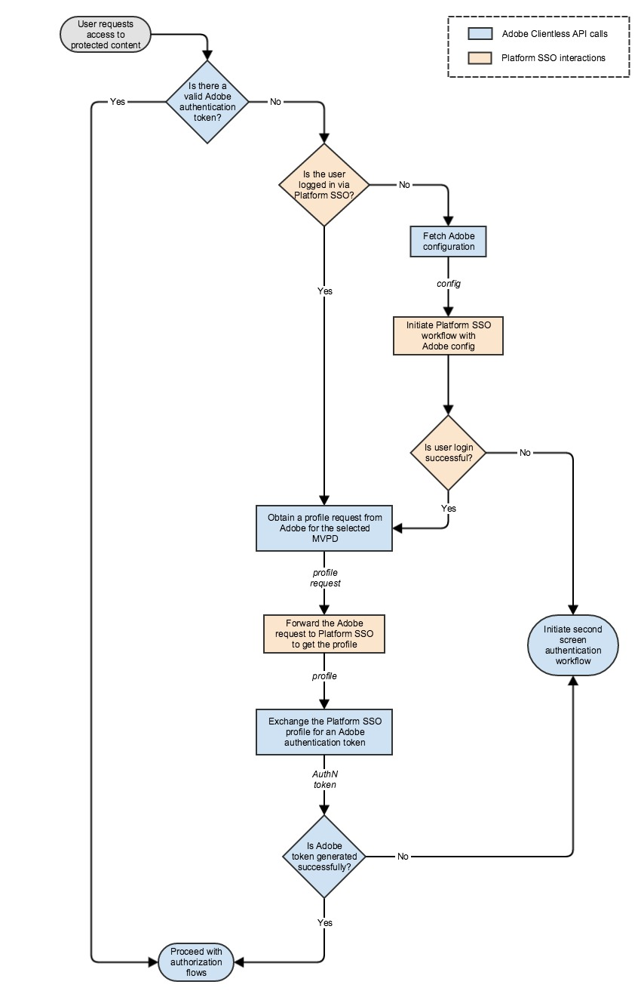

# Apple SSO Cookbook (REST API V1) {#apple-sso-cookbook-rest-api-v1}

>[!IMPORTANT]
>
>이 페이지의 컨텐츠는 정보용으로만 제공됩니다. 이 API를 사용하려면 Adobe의 현재 라이선스가 필요합니다. 허가되지 않은 사용은 허용되지 않습니다.

Adobe Pass 인증 REST API V1은 iOS, iPadOS 또는 tvOS에서 실행되는 클라이언트 애플리케이션의 최종 사용자를 위한 Partner SSO(Single Sign-On)를 지원합니다.

이 문서는 [여기](/help/authentication/integration-guide-programmers/legacy/rest-api-v1/rest-api-reference.md)에서 찾을 수 있는 기존 REST API V1 설명서에 대한 확장 역할을 합니다.

## Cookbook {#apple-sso-cookbook-rest-api-v1-cookbook}

Apple SSO 사용자 환경을 활용하려면 Apple에서 개발한 [비디오 구독자 계정 프레임워크](https://developer.apple.com/documentation/videosubscriberaccount)를 응용 프로그램에 통합해야 하지만 Adobe Pass 인증 REST API V1 통신의 경우 아래 제시된 단계를 따라야 합니다.

### 권한 {#apple-sso-cookbook-rest-api-v1-permission}

>[!TIP]
>
> **<u>Pro 팁:</u>** 스트리밍 응용 프로그램은 장치 수준에서 저장된 사용자의 구독 정보에 대한 액세스를 요청해야 합니다. 이 경우 사용자는 응용 프로그램에 장치의 카메라 또는 마이크에 대한 액세스를 제공하는 것과 유사하게 진행할 수 있는 권한을 부여해야 합니다. 이 권한은 Apple의 [비디오 구독자 계정 프레임워크](https://developer.apple.com/documentation/videosubscriberaccount)를 사용하여 응용 프로그램별로 요청해야 하며 장치에서 사용자 선택을 저장합니다.

>[!TIP]
>
> **<u>Pro 팁:</u>** Apple SSO(Single Sign-On) 사용자 환경의 이점을 설명하여 구독 정보에 액세스할 수 있는 권한을 부여하지 않으려는 사용자에게 인센티브를 제공하는 것이 좋습니다. 하지만 사용자가 iOS 및 iPadOS의 응용 프로그램 설정(TV 공급자 권한 액세스) 또는 *`Settings -> TV Provider`* 또는 tvOS의 *`Settings -> Accounts -> TV Provider`*(으)로 이동하여 결정을 변경할 수 있음을 알고 있어야 합니다.

>[!TIP]
>
> **<u>Pro 팁:</u>** 응용 프로그램이 전경 상태로 전환되면 사용자 인증을 요구하기 전에 언제든지 [액세스 권한](https://developer.apple.com/documentation/videosubscriberaccount/vsaccountmanager/1949763-checkaccessstatus)을 확인할 수 있으므로 사용자의 권한을 요청하는 것이 좋습니다.

### 인증 {#apple-sso-cookbook-rest-api-v1-authentication}

* [유효한 Adobe 인증 토큰이 있습니까?](#step1)
* [사용자가 Partner SSO를 통해 로그인되어 있습니까?](#step2)
* [Adobe 구성 가져오기](#step3)
* [Adobe 구성으로 파트너 SSO 워크플로 시작](#step4)
* [사용자 로그인에 성공했습니까?](#step5)
* [Adobe에서 선택한 MVPD에 대한 프로필 요청 얻기](#step6)
* [프로필을 가져오려면 Adobe 요청을 파트너 SSO로 전달하십시오.](#step7)
* [파트너 SSO 프로필을 Adobe 인증 토큰으로 교환](#step8)
* [Adobe 토큰이 생성되었습니까?](#step9)
* [일반 인증 워크플로 시작](#step10)
* [인증 흐름 진행](#step11)



#### 단계: &quot;유효한 Adobe 인증 토큰이 있습니까?&quot; {#step1}

>[!TIP]
>
> **<u>팁:</u>** Adobe Pass 인증 [인증 토큰 확인](/help/authentication/integration-guide-programmers/legacy/rest-api-v1/apis/check-authentication-token.md) API 서비스를 통해 구현하십시오.

#### 단계: &quot;사용자가 파트너 SSO를 통해 로그인했습니까?&quot; {#step2}

>[!TIP]
>
> **<u>팁:</u>** [비디오 구독자 계정 프레임워크](https://developer.apple.com/documentation/videosubscriberaccount)를 통해 이를 구현합니다.

* 응용 프로그램은 사용자의 구독 정보에 액세스할 수 있는 [권한](https://developer.apple.com/documentation/videosubscriberaccount/vsaccountmanager/1949763-checkaccessstatus)을 확인하고 사용자가 이를 허용한 경우에만 진행해야 합니다.
* 응용 프로그램에서 구독자 계정 정보에 대한 [요청](https://developer.apple.com/documentation/videosubscriberaccount/vsaccountmetadatarequest)을 제출해야 합니다.
* 응용 프로그램은 [메타데이터](https://developer.apple.com/documentation/videosubscriberaccount/vsaccountmetadata) 정보를 대기 및 처리해야 합니다.

>[!TIP]
>
> **<u>Pro 팁:</u>** 코드 조각을 따라 댓글에 각별히 주의하십시오.

```swift
...
let videoSubscriberAccountManager: VSAccountManager = VSAccountManager();

videoSubscriberAccountManager.checkAccessStatus(options: [VSCheckAccessOption.prompt: true]) { (accessStatus, error) -> Void in
            switch (accessStatus) {
            // The user allows the application to access subscription information.
            case VSAccountAccessStatus.granted:
                    // Construct the request for subscriber account information.
                    let vsaMetadataRequest: VSAccountMetadataRequest = VSAccountMetadataRequest();

                    // This is actually the SAML Issuer not the channel ID.
                    vsaMetadataRequest.channelIdentifier = "https://saml.sp.auth.adobe.com";
    
                    // This is the subscription account information needed at this step.
                    vsaMetadataRequest.includeAccountProviderIdentifier = true;
                    
                    // This is the subscription account information needed at this step.
                    vsaMetadataRequest.includeAuthenticationExpirationDate = true;
                    
                    // This is going to make the Video Subscriber Account Framework to refrain from prompting the user with the providers picker at this step. 
                    vsaMetadataRequest.isInterruptionAllowed = false;
                    
                    // Submit the request for subscriber account information - accountProviderIdentifier.
                    videoSubscriberAccountManager.enqueue(vsaMetadataRequest) { vsaMetadata, vsaError in        
                        if (vsaMetadata != nil && vsaMetadata!.accountProviderIdentifier != nil) {
                            // The vsaMetadata!.authenticationExpirationDate will contain the expiration date for current authentication session.
                            // The vsaMetadata!.authenticationExpirationDate should be compared against current date.
                            ...
                            // The vsaMetadata!.accountProviderIdentifier will contain the provider identifier as it is known for the platform configuration.
                            // The vsaMetadata!.accountProviderIdentifier represents the platformMappingId in terms of Adobe Pass Authentication configuration.
                            ...
                            // The application must determine the MVPD id property value based on the platformMappingId property value obtained above.
                            // The application must use the MVPD id further in its communication with Adobe Pass Authentication services.
                            ...
                            // Continue with the "Obtain a profile request from Adobe for the selected MVPD" step.
                            ...
                            // Continue with the "Forward the Adobe request to Partner SSO to obtain the profile" step.
                            ...
                        } else {
                            // The user is not authenticated at platform level, continue with the "Fetch Adobe configuration" step.
                            ...
                        }
                    }
        
            // The user has not yet made a choice or does not allow the application to access subscription information.
            default:
                // Continue with the "Initiate regular authentication workflow" step.
                ...
            }
}
...  
```

#### 단계: &quot;Adobe 구성 가져오기&quot; {#step3}

>[!TIP]
>
> **<u>팁:</u>** Adobe Pass 인증을 통해 구현합니다. [MVPD 목록 제공](/help/authentication/integration-guide-programmers/legacy/rest-api-v1/apis/provide-mvpd-list.md) API 서비스.

>[!TIP]
>
> **<u>프로 팁:</u>** MVPD 속성: *`enablePlatformServices`*, *`boardingStatus`*, *`displayInPlatformPicker`*, *`platformMappingId`*, *`requiredMetadataFields`*&#x200B;을(를) 알고 있으며 다른 단계의 코드 조각에 표시된 댓글에 각별히 주의하십시오.

#### &quot;Adobe 구성으로 파트너 SSO 워크플로 시작&quot; 단계 {#step4}

>[!TIP]
>
> **<u>팁:</u>** [비디오 구독자 계정 프레임워크](https://developer.apple.com/documentation/videosubscriberaccount)를 통해 이를 구현합니다.

* 응용 프로그램은 사용자의 구독 정보에 액세스할 수 있는 [권한](https://developer.apple.com/documentation/videosubscriberaccount/vsaccountmanager/1949763-checkaccessstatus)을 확인하고 사용자가 이를 허용한 경우에만 진행해야 합니다.
* 응용 프로그램에서 VSAccountManager에 대해 [위임](https://developer.apple.com/documentation/videosubscriberaccount/vsaccountmanagerdelegate)을 제공해야 합니다.
* 응용 프로그램에서 구독자 계정 정보에 대한 [요청](https://developer.apple.com/documentation/videosubscriberaccount/vsaccountmetadatarequest)을 제출해야 합니다.
* 응용 프로그램은 [메타데이터](https://developer.apple.com/documentation/videosubscriberaccount/vsaccountmetadata) 정보를 대기 및 처리해야 합니다.

>[!TIP]
>
> **<u>Pro 팁:</u>** 코드 조각을 따라 댓글에 각별히 주의하십시오.

```swift
    ...
    let videoSubscriberAccountManager: VSAccountManager = VSAccountManager();
    
    // This must be a class implementing the VSAccountManagerDelegate protocol.
    let videoSubscriberAccountManagerDelegate: VideoSubscriberAccountManagerDelegate = VideoSubscriberAccountManagerDelegate();
    
    videoSubscriberAccountManager.delegate = videoSubscriberAccountManagerDelegate;
    
    videoSubscriberAccountManager.checkAccessStatus(options: [VSCheckAccessOption.prompt: true]) { (accessStatus, error) -> Void in
                switch (accessStatus) {
                // The user allows the application to access subscription information.
                case VSAccountAccessStatus.granted:
                        // Construct the request for subscriber account information.
                        let vsaMetadataRequest: VSAccountMetadataRequest = VSAccountMetadataRequest();
    
                        // This is actually the SAML Issuer not the channel ID.
                        vsaMetadataRequest.channelIdentifier = "https://saml.sp.auth.adobe.com";
        
                        // This is the subscription account information needed at this step.
                        vsaMetadataRequest.includeAccountProviderIdentifier = true;
                        
                        // This is the subscription account information needed at this step.
                        vsaMetadataRequest.includeAuthenticationExpirationDate = true;
                        
                        // This is going to make the Video Subscriber Account Framework to prompt the user with the providers picker at this step. 
                        vsaMetadataRequest.isInterruptionAllowed = true;
                        
                        // This can be computed from the [Adobe Pass Authentication](/help/authentication/provide-mvpd-list.md) service response in order to filter the TV providers from the Apple picker.
                        vsaMetadataRequest.supportedAccountProviderIdentifiers = supportedAccountProviderIdentifiers;
    
                        // This can be computed from the [Adobe Pass Authentication](/help/authentication/provide-mvpd-list.md) service response in order to sort the TV providers from the Apple picker.
                        if #available(iOS 11.0, tvOS 11, *) {
                            vsaMetadataRequest.featuredAccountProviderIdentifiers = featuredAccountProviderIdentifiers;
                        }
                        
                        // Submit the request for subscriber account information - accountProviderIdentifier.
                        videoSubscriberAccountManager.enqueue(vsaMetadataRequest) { vsaMetadata, vsaError in                        
                            // This represents the checks for the "Is user login successful?" step.
                            if (vsaMetadata != nil && vsaMetadata!.accountProviderIdentifier != nil) {
                                // The vsaMetadata!.authenticationExpirationDate will contain the expiration date for current authentication session.
                                // The vsaMetadata!.authenticationExpirationDate should be compared against current date.
                                ...
                                // The vsaMetadata!.accountProviderIdentifier will contain the provider identifier as it is known for the platform configuration.
                                // The vsaMetadata!.accountProviderIdentifier represents the platformMappingId in terms of Adobe Pass Authentication configuration.
                                ...
                                // The application must determine the MVPD id property value based on the platformMappingId property value obtained above.
                                // The application must use the MVPD id further in its communication with Adobe Pass Authentication services.
                                ...
                                // Continue with the "Obtain a profile request from Adobe for the selected MVPD" step.
                                ...
                                // Continue with the "Forward the Adobe request to Partner SSO to obtain the profile" step.
                                ...
                            } else {
                                // The user is not authenticated at platform level.
                                if (vsaError != nil) {
                                    // The application can check to see if the user selected a provider which is present in Apple picker, but the provider is not onboarded in platform SSO.
                                    if let error: NSError = (vsaError! as NSError), error.code == 1, let appleMsoId = error.userInfo["VSErrorInfoKeyUnsupportedProviderIdentifier"] as! String? {
                                        var mvpd: Mvpd? = nil;
    
                                        // The requestor.mvpds must be computed during the "Fetch Adobe configuration" step. 
                                        for provider in requestor.mvpds {
                                            if provider.platformMappingId == appleMsoId {
                                                mvpd = provider;
                                                break;
                                            }
                                        }
                                        
                                        if mvpd != nil {
                                            // Continue with the "Initiate regular authentication workflow" step, but you can skip prompting the user with your MVPD picker and use the mvpd selection, therefore creating a better UX.
                                            ...
                                        } else {
                                            // Continue with the "Initiate regular authentication workflow" step.
                                            ...
                                        }
                                    } else {
                                        // Continue with the "Initiate regular authentication workflow" step.
                                        ...
                                    }
                                } else {
                                    // Continue with the "Initiate regular authentication workflow" step.
                                    ...
                                }
                            }
                        }
            
                // The user has not yet made a choice or does not allow the application to access subscription information.
                default:
                    // Continue with the "Initiate regular authentication workflow" step.
                    ...
                }
    }
    ...
```

#### 단계: &quot;사용자 로그인이 성공했습니까?&quot; {#step5}

>[!TIP]
>
> **<u>Pro 팁:</u>** [&quot;Adobe 구성을 사용하여 파트너 SSO 워크플로 시작&quot;](#step4) 단계의 코드 스니펫에 유의하십시오. *`vsaMetadata!.accountProviderIdentifier`*&#x200B;에 유효한 값이 들어 있고 현재 날짜가 *`vsaMetadata!.authenticationExpirationDate`* 값을 지나지 않은 경우 사용자 로그인이 성공했습니다.

#### 단계 &quot;선택한 MVPD에 대한 Adobe에서 프로필 요청 얻기&quot; {#step6}

>[!TIP]
>
> **<u>팁:</u>** Adobe Pass 인증 [프로필 요청](/help/authentication/integration-guide-programmers/legacy/rest-api-v1/apis/retrieve-profilerequest.md) API 서비스를 통해 구현하십시오.

>[!TIP]
>
> **<u>Pro 팁:</u>** 비디오 구독자 계정 프레임워크에서 가져온 공급자 식별자는 Adobe Pass 인증 구성 측면에서 *`platformMappingId`*&#x200B;을(를) 나타냅니다. 따라서 응용 프로그램은 Adobe Pass 인증 [MVPD 목록 제공](/help/authentication/integration-guide-programmers/legacy/rest-api-v1/apis/provide-mvpd-list.md) API 서비스를 통해 *`platformMappingId`* 값을 사용하여 MVPD ID 속성 값을 결정해야 합니다.

#### 단계: &quot;프로필을 가져오기 위해 Adobe 요청을 파트너 SSO로 전달&quot; {#step7}

>[!TIP]
>
> **<u>팁:</u>** [비디오 구독자 계정 프레임워크](https://developer.apple.com/documentation/videosubscriberaccount)를 통해 이를 구현합니다.


* 응용 프로그램은 사용자의 구독 정보에 액세스할 수 있는 [권한](https://developer.apple.com/documentation/videosubscriberaccount/vsaccountmanager/1949763-checkaccessstatus)을 확인하고 사용자가 이를 허용한 경우에만 진행해야 합니다.
* 응용 프로그램에서 구독자 계정 정보에 대한 [요청](https://developer.apple.com/documentation/videosubscriberaccount/vsaccountmetadatarequest)을 제출해야 합니다.
* 응용 프로그램은 [메타데이터](https://developer.apple.com/documentation/videosubscriberaccount/vsaccountmetadata) 정보를 대기 및 처리해야 합니다.

>[!TIP]
>
> **<u>Pro 팁:</u>** 코드 조각을 따라 댓글에 각별히 주의하십시오.

```swift
    ...
    let videoSubscriberAccountManager: VSAccountManager = VSAccountManager();
    
    videoSubscriberAccountManager.checkAccessStatus(options: [VSCheckAccessOption.prompt: true]) { (accessStatus, error) -> Void in
                switch (accessStatus) {
                // The user allows the application to access subscription information.
                case VSAccountAccessStatus.granted:
                        // Construct the request for subscriber account information.
                        let vsaMetadataRequest: VSAccountMetadataRequest = VSAccountMetadataRequest();
    
                        // This is actually the SAML Issuer not the channel ID.
                        vsaMetadataRequest.channelIdentifier = "https://saml.sp.auth.adobe.com";
        
                        // This is going to include subscription account information which should match the provider determined in a previous step.
                        vsaMetadataRequest.includeAccountProviderIdentifier = true;
                        
                        // This is going to include subscription account information which should match the provider determined in a previous step.
                        vsaMetadataRequest.includeAuthenticationExpirationDate = true;
                        
                        // This is going to make the Video Subscriber Account Framework to refrain from prompting the user with the providers picker at this step. 
                        vsaMetadataRequest.isInterruptionAllowed = false;
    
                        // This are the user metadata fields expected to be available on a successful login and are determined from the [Adobe Pass Authentication](/help/authentication/provide-mvpd-list.md) service. Look for the requiredMetadataFields associated with the provider determined in a previous step.
                        vsaMetadataRequest.attributeNames = requiredMetadataFields;
    
                        // This is the payload from [Adobe Pass Authentication](/help/authentication/retrieve-profilerequest.md) service.
                        vsaMetadataRequest.verificationToken = profileRequestPayload;
                        
                        // Submit the request for subscriber account information.
                        videoSubscriberAccountManager.enqueue(vsaMetadataRequest) { vsaMetadata, vsaError in
                            if (vsaMetadata != nil && vsaMetadata!.samlAttributeQueryResponse != nil) {
                                var samlResponse: String? = vsaMetadata!.samlAttributeQueryResponse!;
                                
                                // Remove new lines, new tabs and spaces.
                                samlResponse = samlResponse?.replacingOccurrences(of: "[ \\t]+", with: " ", options: String.CompareOptions.regularExpression);
                                samlResponse = samlResponse?.components(separatedBy: CharacterSet.newlines).joined(separator: "");
                                samlResponse = samlResponse?.trimmingCharacters(in: CharacterSet.whitespacesAndNewlines);
                                
                                // Base64 encode.
                                samlResponse = samlResponse?.data(using: .utf8)?.base64EncodedString(options: []);
                                
                                // URL encode. Please be aware not to double URL encode it further.
                                samlResponse = samlResponse?.addingPercentEncoding(withAllowedCharacters: CharacterSet.init(charactersIn: "!*'();:@&=+$,/?%#[]").inverted);
                                
                                // Continue with the "Exchange the Partner SSO profile for an Adobe authentication token" step.
                                ...
                            } else {
                                // Continue with the "Initiate regular authentication workflow" step.
                                ...
                            }
                        }
                        
                // The user has not yet made a choice or does not allow the application to access subscription information.
                default:
                    // Continue with the "Initiate regular authentication workflow" step.
                    ...
                }
    }
    ...
```

#### 단계: &quot;파트너 SSO 프로필을 Adobe 인증 토큰으로 교환&quot; {#step8}

>[!TIP]
>
> **<u>팁:</u>** Adobe Pass 인증 [토큰 교환](/help/authentication/integration-guide-programmers/legacy/rest-api-v1/apis/token-exchange.md) API 서비스를 통해 구현하십시오.

>[!TIP]
>
> **<u>Pro 팁:</u>** [의 코드 스니펫에 유의하십시오.&quot;Adobe 요청을 파트너 SSO로 전달하여 프로필 &quot;](#step7) 단계를 획득하십시오. 이 *`vsaMetadata!.samlAttributeQueryResponse!`*&#x200B;은(는) *`SAMLResponse`*&#x200B;을(를) 나타냅니다. [토큰 교환](/help/authentication/integration-guide-programmers/legacy/rest-api-v1/apis/token-exchange.md)에 전달해야 하며 호출하기 전에 문자열 조작 및 인코딩(*Base64*&#x200B;로 인코딩되고 이후에 *URL*&#x200B;로 인코딩됨)이 필요합니다.

#### 단계: &quot;Adobe 토큰이 생성되었습니까?&quot; {#step9}

>[!TIP]
>
> **<u>팁:</u>** 토큰을 성공적으로 만들었고 인증 흐름에 사용할 준비가 되었음을 나타내는 *`204 No Content`*&#x200B;이(가) 될 Adobe Pass 인증 [토큰 교환](/help/authentication/integration-guide-programmers/legacy/rest-api-v1/apis/token-exchange.md) 성공 응답을 통해 이 응답을 구현합니다.

#### 단계: &quot;일반 인증 워크플로 시작&quot; {#step10}

>[!TIP]
>
> **<u>팁:</u>** Adobe Pass 인증 [등록 코드 요청](/help/authentication/integration-guide-programmers/legacy/rest-api-v1/apis/registration-code-request.md), [인증 시작](/help/authentication/integration-guide-programmers/legacy/rest-api-v1/apis/initiate-authentication.md) 및 [인증 토큰 검색](/help/authentication/integration-guide-programmers/legacy/rest-api-v1/apis/retrieve-authentication-token.md) 또는 [인증 토큰 확인](/help/authentication/integration-guide-programmers/legacy/rest-api-v1/apis/check-authentication-token.md) API 서비스를 통해 구현하십시오.

>[!TIP]
>
> **<u>Pro 팁:</u>** tvOS 구현을 보려면 아래 단계를 따르십시오.

* 응용 프로그램은 [등록 코드를 가져와서](/help/authentication/integration-guide-programmers/legacy/rest-api-v1/apis/registration-code-request.md) 첫 번째 장치의 최종 사용자에게 제공해야 합니다(화면).
* 등록 코드를 받은 후 응용 프로그램에서 첫 번째 장치(화면)에서 인증 상태를 인식하기 위해 [폴링을 시작해야 합니다](/help/authentication/integration-guide-programmers/legacy/rest-api-v1/apis/retrieve-authentication-token.md).
* 등록 코드를 사용할 때 다른 응용 프로그램은 두 번째 장치(화면)에서 [인증을 시작](/help/authentication/integration-guide-programmers/legacy/rest-api-v1/apis/initiate-authentication.md)해야 합니다.
* 인증 토큰이 생성될 때 응용 프로그램이 첫 번째 장치(화면)에서 [폴링](/help/authentication/integration-guide-programmers/legacy/rest-api-v1/apis/retrieve-authentication-token.md)을 중지해야 합니다.

>[!TIP]
>
> **<u>Pro 팁:</u>** iOS/iPadOS 구현의 경우 아래 단계를 따르십시오.

* 응용 프로그램은 첫 번째 장치(화면)에서 최종 사용자에게 표시되지 않아야 하는 등록 코드를 [획득](/help/authentication/integration-guide-programmers/legacy/rest-api-v1/apis/registration-code-request.md)해야 합니다.
* 응용 프로그램은 등록 코드와 [WKWebView](https://developer.apple.com/documentation/webkit/wkwebview) 또는 [SFSafaariViewController](https://developer.apple.com/documentation/safariservices/sfsafariviewcontroller) 구성 요소를 사용하여 첫 번째 장치(화면)에서 [인증을 시작](/help/authentication/integration-guide-programmers/legacy/rest-api-v1/apis/initiate-authentication.md)해야 합니다.
* [WKWebView](https://developer.apple.com/documentation/webkit/wkwebview) 또는 [SFSafariViewController](https://developer.apple.com/documentation/safariservices/sfsafariviewcontroller) 구성 요소가 닫히면 응용 프로그램에서 첫 번째 장치(화면)에서 인증 상태를 알기 위해 [폴링을 시작해야 합니다](/help/authentication/integration-guide-programmers/legacy/rest-api-v1/apis/retrieve-authentication-token.md).
* 인증 토큰이 생성될 때 응용 프로그램이 첫 번째 장치(화면)에서 [폴링](/help/authentication/integration-guide-programmers/legacy/rest-api-v1/apis/retrieve-authentication-token.md)을 중지해야 합니다.

#### 단계: &quot;인증 흐름 진행&quot; {#step11}

>[!TIP]
>
> **<u>팁:</u>** Adobe Pass 인증 [인증 시작](/help/authentication/integration-guide-programmers/legacy/rest-api-v1/apis/initiate-authorization.md) 및 [짧은 미디어 토큰 받기](/help/authentication/integration-guide-programmers/legacy/rest-api-v1/apis/obtain-short-media-token.md) API 서비스를 통해 구현하십시오.

### 로그아웃 {#apple-sso-cookbook-rest-api-v1-logout}

[비디오 구독자 계정 프레임워크](https://developer.apple.com/documentation/videosubscriberaccount)는 장치 시스템 수준에서 TV 공급자 계정에 로그인한 사용자를 프로그래밍 방식으로 로그아웃할 수 있는 API를 제공하지 않습니다. 따라서 로그아웃을 완전히 적용하려면 최종 사용자가 iOS/iPadOS의 *`Settings -> TV Provider`* 또는 tvOS의 *`Settings -> Accounts -> TV Provider`*&#x200B;에서 명시적으로 로그아웃해야 합니다. 사용자가 가질 수 있는 다른 옵션은 특정 응용 프로그램 설정 섹션(TV 공급자 액세스)에서 사용자의 구독 정보에 액세스할 수 있는 권한을 철회하는 것입니다.

>[!TIP]
>
> **<u>팁:</u>** Adobe Pass 인증 [사용자 메타데이터 호출](/help/authentication/integration-guide-programmers/legacy/rest-api-v1/apis/user-metadata.md) 및 [로그아웃](/help/authentication/integration-guide-programmers/legacy/rest-api-v1/apis/initiate-logout.md) API 서비스를 통해 구현합니다.

>[!TIP]
>
> **<u>Pro 팁:</u>** tvOS 구현을 보려면 아래 단계를 따르십시오.

* 응용 프로그램은 Adobe Pass Authentication 서비스에서 &quot;*tokenSource&quot;* [사용자 메타데이터](/help/authentication/integration-guide-programmers/legacy/rest-api-v1/apis/user-metadata.md)를 사용하여 파트너 SSO를 통해 로그인한 결과로 인증이 발생했는지 여부를 확인해야 합니다.
* *&quot;tokenSource&quot;* 값이 &quot;*Apple&quot;과(와) 같은 경우 응용 프로그램에서 tvOS **only**에서&#x200B;*`Settings -> Accounts -> TV Provider`*에서 명시적으로 로그아웃하도록 사용자에게 지시하거나 프롬프트를 표시해야 합니다.*
* 응용 프로그램은 직접 HTTP 호출을 사용하여 Adobe Pass 인증 서비스에서 로그아웃을 [시작](/help/authentication/integration-guide-programmers/legacy/rest-api-v1/apis/initiate-logout.md)해야 합니다. 이렇게 하면 MVPD 측의 세션 정리가 용이하지 않습니다.

>[!TIP]
>
> **<u>Pro 팁:</u>** iOS/iPadOS 구현의 경우 아래 단계를 따르십시오.

* 응용 프로그램은 Adobe Pass Authentication 서비스에서 &quot;*tokenSource&quot;* [사용자 메타데이터](/help/authentication/integration-guide-programmers/legacy/rest-api-v1/apis/user-metadata.md)를 사용하여 파트너 SSO를 통해 로그인한 결과로 인증이 발생했는지 여부를 확인해야 합니다.
* *&quot;tokenSource&quot;* 값이 *&quot;Apple&quot;*&#x200B;과(와) 같은 경우 응용 프로그램에서 사용자에게 iOS/iPadOS **only**&#x200B;의 *`Settings -> TV Provider`*&#x200B;에서 명시적으로 로그아웃하도록 지시하거나 프롬프트를 표시해야 합니다.
* 응용 프로그램은 [WKWebView](https://developer.apple.com/documentation/webkit/wkwebview) 또는 [SFSafariViewController](https://developer.apple.com/documentation/safariservices/sfsafariviewcontroller) 구성 요소를 사용하여 Adobe Pass 인증 서비스에서 로그아웃을 [시작](/help/authentication/integration-guide-programmers/legacy/rest-api-v1/apis/initiate-logout.md)해야 합니다. 이렇게 하면 MVPD 측의 세션 정리가 용이해집니다.
