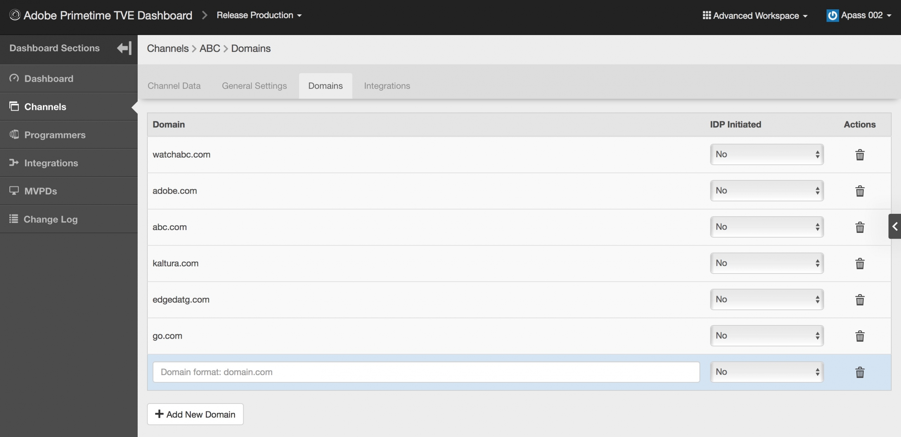

# (기존) Primetime TVE Dashboard 사용 안내서 {#tve-db-user-guide}

>[!NOTE]
>
>이 페이지의 컨텐츠는 정보용으로만 제공됩니다. 이 API를 사용하려면 Adobe의 현재 라이선스가 필요합니다. 허가되지 않은 사용은 허용되지 않습니다.

## 소개 {#tve-db-intro}

[[!DNL Adobe] TVE 대시보드(TVE 대시보드)](https://console.auth.adobe.com/)는 Adobe Pass 인증 제품 팀과 비즈니스 관계가 있는 미디어 회사(프로그래머)에 근무하는 사용자를 대상으로 하는 셀프 서비스 대시보드입니다.

액세스 권한을 얻으려면 기술 계정 관리자(TAM)에게 문의하십시오. 액세스 권한을 얻으려면 Adobe Marketing Cloud 조직에 구성할 두 개의 새 사용자 그룹이 필요합니다.

* TVE Dashboard 읽기-쓰기 - 이 그룹의 멤버는 대시보드의 편집 가능한 모든 섹션에 대해 모든 권한을 갖습니다.
* TVE 대시보드 읽기 전용 - 이 그룹의 멤버는 전체 대시보드에 대한 보기 권한만 갖습니다.

이 사용 안내서로 깊이 들어가기 전에 Adobe Pass 인증 제품 팀에서 제공하는 흐름 및 기능을 잘 이해하고 본 문서에 사용되는 용어를 숙지하려면 다음 리소스를 살펴보는 것이 좋습니다.

* [TVE 기술 문서](/help/authentication/kickstart/technical-paper.md)
* [프로그래머 킥스타트 안내서](/help/authentication/kickstart/programmer-kickstart-guide.md)
* [권한 흐름](/help/authentication/integration-guide-programmers/entitlement-flow.md)
* [용어집](/help/authentication/kickstart/glossary.md)

이 사용 안내서의 다음 섹션에서는 회사의 채널, 프로그래머 또는 채널과 MVPD(다중 채널 비디오 프로그램 배포자) 간의 통합에 대해 다양한 설정을 관리하는 방법에 대해 알아봅니다.

>[!IMPORTANT]
>TVE Dashboard는 기본 및 고급 Workspace 간 전환 옵션을 제공합니다. 오른쪽 상단에 있는 아이콘을 전환하여 이 작업을 수행할 수 있습니다. 고급 Workspace은 Adobe Pass 인증 제품 팀에서 제공하는 기능에 대한 고급 지식뿐만 아니라 상당한 기술 지식을 갖춘 사용자를 대상으로 합니다.

*그림 1: Adobe Primetime TVE 대시보드 &quot;기본/고급 Workspace&quot; 드롭다운*

## 환경 {#authn-environments}

사용자가 수행해야 하는 작업에 따라 Adobe Pass 인증 환경 간을 전환해야 할 수 있습니다. Adobe Pass 인증 환경에 대한 자세한 내용은 다음 문서를 참조하십시오. [Adobe Pass 인증 환경 이해](/help/authentication/notes-technical/environments/understanding-the-adobe-environments.md).

TVE Dashboard는 아래와 같이 Prequal(Prequalification) 및 Release라는 두 개의 환경을 제공하며 각 환경에는 Staging 및 Production이라는 두 개의 프로필이 있습니다.

* [사전 준비 단계](https://console-prequal.auth-staging.adobe.com/)
* [사전 프로덕션](https://console-prequal.auth.adobe.com/)
* [스테이징 릴리스](https://console.auth-staging.adobe.com/)
* [프로덕션 릴리스](https://console.auth.adobe.com/)

환경 간에 전환하려면 사용자는 아래에 표시된 드롭다운 요소의 항목으로 표시되는 원하는 환경을 클릭할 수 있습니다.

*그림 2: Adobe Pass TVE 대시보드 환경 드롭다운*

>[!IMPORTANT]
>
>TVE 대시보드를 통해 Adobe Pass 인증 구성을 관리 변경할 때 기능이 적절히 작동하도록 하려면 아래 시퀀스를 따르는 것이 좋습니다.

TVE 대시보드를 통해 Adobe Pass 인증 구성을 관리적으로 변경하려면 다음을 수행하십시오.

* [릴리스 스테이징에서 변경 내용을 수행하고 유효성을 확인](http://sp.auth-staging.adobe.com/apitest/api.html)합니다.
* [이전 프로덕션에서 변경 내용을 수행하고 유효성을 확인](http://sp.auth-staging.adobe.com/apitest/api.html)합니다.
* [릴리스 프로덕션에서 변경 내용을 수행하고 유효성을 확인](http://sp.auth-staging.adobe.com/apitest/api.html)합니다.

>[!IMPORTANT]
>
>관리 변경 사항이 실시간으로 적용되려면 사용자가 사이드바의 왼쪽 하단에 표시되는 버튼을 선택하여 &quot;변경 사항 검토 및 푸시&quot; 섹션으로 이동하여 변경 사항을 검토하고, 새로 생성된 변경 사항에 대한 설명을 추가하고, &quot;구성 푸시&quot;를 선택하여 구성 업데이트를 확인해야 합니다.

*그림 3: Adobe Primetime TVE 대시보드 검토 및 푸시 변경 알림*

## 섹션 {#sections}

미디어 회사(프로그래머)의 사용자는 사이드바에서 TVE 대시보드의 다음 섹션에 액세스할 수 있습니다.

* **채널** - 콘텐츠 공급자와 관련된 설정을 포함합니다.
* **프로그래머** - 하나 이상의 **채널**&#x200B;을 집계하는 상위 조직과 관련된 설정을 포함합니다.
* **통합** - **채널**&#x200B;과(와) **MVPD** 간의 통합과 관련된 설정이 포함되어 있습니다.
* **MVPD** - 사용 가능한 **MVPD**&#x200B;과(와) 관련된 설정이 포함되어 있습니다.
* **보고서** - AuthN TTL, AuthZ TTL, SSO, 세 가지 유형의 보고서에 대해 집계된 데이터를 포함합니다.
* **변경 로그** - TVE 대시보드 구성에 적용된 최신 수정 사항이 포함되어 있습니다.

*그림 4: Adobe Primetime TVE 대시보드 섹션*

### 채널 {#tve-db-channels-section}

이 섹션에서는 사용 가능한 채널에 대한 설정을 보고 편집하거나 새 채널을 만들 수 있습니다. 사용 가능한 채널 중 하나를 클릭하면 다음 탭이 있는 화면이 반환됩니다.

* **채널 데이터**
   * **채널 ID** - 시스템에서 사용되는 채널의 고유 ID로, &quot;요청자 ID&quot;라고도 합니다.
   * **표시 이름** - 채널의 상호.
* **일반 설정**
   * **Analytics 구성** - Adobe Analytics에 전달할 Adobe Pass 인증 이벤트를 구성합니다. 이 기능을 활성화하기 전에 RSID(보고서 세트 ID)를 구성해야 하는 방법에 대한 자세한 내용은 Adobe에 문의하십시오.
* **인증서**

  발급 조직, 발급 날짜 및 만료 날짜와 함께 인증 흐름에 사용되는 인증서 목록을 포함합니다. 이러한 인증서는 개인/공개 키 역할을 하며 유효성 검사 목적으로 사용됩니다.
* **도메인**

  각 채널이 Adobe Pass 인증과 통신할 도메인 목록을 포함합니다.
* **통합**

  사용 가능한 MVPD와의 통합 목록과 함께 사용 가능한 각 통합의 상태를 포함합니다. 특정 항목을 클릭하면 통합 페이지로 이동할 수 있습니다.
* **등록된 응용 프로그램**

  응용 프로그램 등록 목록을 포함합니다. 자세한 내용은 [Dynamic Client Registration Management](/help/authentication/integration-guide-programmers/rest-apis/rest-api-dcr/dynamic-client-registration-overview.md#dynamic-client-registration-management) 문서를 검토하십시오.

* **사용자 지정 구성표**

  사용자 지정 체계 목록을 포함합니다. 자세한 내용은 [iOS/tvOS 응용 프로그램 등록](/help/authentication/integration-guide-programmers/legacy/sdks/ios-tvos-sdk/iostvos-application-registration.md) 및 [Dynamic Client Registration Management](/help/authentication/integration-guide-programmers/rest-apis/rest-api-dcr/dynamic-client-registration-overview.md#dynamic-client-registration-management)를 참조하십시오.

#### 도메인 추가/삭제 {#add-delete-domains}

선택한 채널에 대해 새 도메인을 추가하는 프로세스를 시작하려면 도메인 목록 아래의 &quot;새 도메인 추가&quot; 버튼을 클릭해야 합니다. 이렇게 하면 도메인 이름을 지정할 수 있는 새 도메인 항목이 만들어집니다. 도메인 목록에 더 일반적인 도메인이 이미 있으면 새 하위 도메인을 추가하지 마십시오.

*그림: 채널의 도메인 탭*

#### 채널 수준에서 등록된 응용 프로그램 만들기 {#create-registered-application-channel-level}

채널 수준에서 등록된 응용 프로그램을 만들려면 &quot;채널&quot; 메뉴로 이동하여 응용 프로그램을 만들 채널을 선택합니다. 그런 다음 &quot;등록된 응용 프로그램&quot; 탭으로 이동한 후 &quot;새 응용 프로그램 추가&quot; 단추를 클릭합니다.

아래 이미지에 표시된 대로 입력해야 하는 필드는 다음과 같습니다.

* **응용 프로그램 이름** - 응용 프로그램 이름

* **채널에 할당됨** - 아래 표시된 대로 프로그래머 수준에서 수행한 동일한 작업과 비교하여 약간 다른 점은 &quot;할당된 채널&quot; 드롭다운이 활성화되지 않았으므로 현재 채널 이외의 채널에 등록된 응용 프로그램을 바인딩할 수 있는 옵션이 없습니다.

* **응용 프로그램 버전** - 기본적으로 &quot;1.0.0&quot;으로 설정되어 있지만 고유한 응용 프로그램 버전으로 수정하는 것이 좋습니다. 가장 좋은 방법은 응용 프로그램의 버전을 변경하기로 결정한 경우 해당 응용 프로그램에 대해 등록된 새 응용 프로그램을 만드는 것입니다.

* **응용 프로그램 플랫폼** - 연결할 응용 프로그램의 플랫폼입니다. 모든 값 또는 여러 값을 선택할 수 있습니다.

* **도메인 이름** - 연결할 응용 프로그램의 도메인입니다. 드롭다운 목록의 도메인은 모든 채널에서 모든 도메인을 통합적으로 선택한 것입니다. 목록에서 여러 도메인을 선택할 수 있습니다. 도메인의 의미는 리디렉션 URL [RFC6749](https://tools.ietf.org/html/rfc6749)입니다. 클라이언트 등록 프로세스에서, 클라이언트 애플리케이션은 인증 흐름의 확정을 위해 리디렉션 URL을 사용하도록 허가되도록 요청할 수 있다. 클라이언트 애플리케이션이 특정 리디렉션 URL을 요청하면 소프트웨어 문과 연결된 이 등록된 애플리케이션에 화이트리스트에 있는 도메인에 대해 유효성이 검사됩니다.

필드에 적절한 값을 입력한 후 &quot;완료&quot;를 클릭해야 구성에 응용 프로그램을 저장할 수 있습니다.

**이미 만들어진 응용 프로그램을 수정하는 옵션이 없습니다**. 작성된 항목이 더 이상 요구 사항을 충족하지 않는 경우 새로운 등록 애플리케이션을 만들어 요구 사항이 충족되는 클라이언트 애플리케이션과 함께 사용해야 합니다.

##### 소프트웨어 구문 다운로드 {#download-software-statement-channel-level}

소프트웨어 문이 필요한 목록 항목의 &quot;다운로드&quot; 단추를 클릭하면 텍스트 파일이 생성됩니다. 이 파일에는 아래 샘플 출력과 유사한 내용이 포함됩니다.

파일 이름은 앞에 &quot;software_statement&quot;를 추가하고 현재 타임스탬프를 추가하여 고유하게 식별됩니다.

등록된 동일한 애플리케이션의 경우 다운로드 버튼을 클릭할 때마다 다른 소프트웨어 명령문이 수신되지만 이는 이 애플리케이션에 대해 이전에 획득한 소프트웨어 명령문을 무효화하지 않습니다. 이 문제는 작업 요청에 따라 즉석에서 생성되기 때문에 발생합니다.

다운로드 작업에 대한 **제한**&#x200B;이 하나 있습니다. 등록된 애플리케이션을 만든 직후 &quot;다운로드&quot; 버튼을 클릭하여 소프트웨어 문에 대한 요청을 받았지만 아직 저장되지 않았으며 구성 json이 동기화되지 않은 경우, 페이지 하단에 다음 오류 메시지가 표시됩니다.

등록된 애플리케이션의 ID가 아직 전파되지 않았으며 코어에서 이에 대한 정보가 없기 때문에 코어에서 받은 HTTP 404 Not Found 오류 코드를 래핑합니다.

등록된 응용 프로그램을 만든 후 구성이 동기화되는 데 최대 2분이 걸릴 때까지 기다리는 것이 해결책입니다. 이 경우 오류 메시지가 더 이상 수신되지 않으며 소프트웨어 문이 있는 텍스트 파일을 다운로드할 수 있습니다.

### 프로그래머 {#tve-db-programmers-section}

이 섹션에서는 사용 가능한 프로그래머의 설정을 보고 편집하거나 새 설정을 만들 수 있습니다. 사용 가능한 프로그래머 중 하나를 클릭하면 다음 탭이 있는 화면이 반환됩니다.

* **프로그래머 데이터**
   * **프로그래머 Id** - 시스템에서 사용되는 프로그래머 고유 ID입니다.
   * **표시 이름** - 프로그래머의 상업 이름입니다.
   * **로고 Url** - 프로그래머의 상업용 로고 URL(uniform resource locator).
   * **로고 미리 보기** - 위의 URL(uniform resource locator)에서 다운로드하여 프로그래머의 상업용 로고 미리 보기.

* **인증서**

  발급 조직, 발급 날짜 및 만료 날짜와 함께 인증 흐름에 사용되는 인증서 목록을 포함합니다. 이러한 인증서는 개인/공개 키 역할을 하며 유효성 검사 목적으로 사용됩니다.

* **채널**

  이 특정 프로그래머에 속하는 채널 목록을 포함합니다. 특정 항목을 클릭하면 채널 섹션으로 이동할 수 있습니다.

* **등록된 응용 프로그램**

  응용 프로그램 등록 목록을 포함합니다. 자세한 내용은 [Dynamic Client Registration Management](/help/authentication/integration-guide-programmers/rest-apis/rest-api-dcr/dynamic-client-registration-overview.md#dynamic-client-registration-management)를 참조하십시오.

* **사용자 지정 구성표**

  사용자 지정 체계 목록을 포함합니다. 자세한 내용은 [iOS/tvOS 응용 프로그램 등록](/help/authentication/integration-guide-programmers/legacy/sdks/ios-tvos-sdk/iostvos-application-registration.md)을 참조하세요.

#### 프로그래머 수준에서 등록된 응용 프로그램 만들기 {#create-registered-application-programmer-level}

**프로그래머** > **등록된 응용 프로그램** 탭으로 이동합니다.

등록된 응용 프로그램 탭에서 **새 응용 프로그램 추가**&#x200B;를 클릭합니다. 새 창에서 필수 필드를 입력합니다.

아래 이미지에 표시된 대로 입력해야 하는 필드는 다음과 같습니다.

* **응용 프로그램 이름** - 응용 프로그램 이름

* **채널에 할당** - 이 응용 프로그램이 연결된 채널의 이름 t입니다. 드롭다운 마스크의 기본 설정은 **모든 채널입니다.** 인터페이스를 사용하면 한 채널 또는 모든 채널을 선택할 수 있습니다.

* **응용 프로그램 버전** - 기본적으로 &quot;1.0.0&quot;으로 설정되어 있지만 고유한 응용 프로그램 버전으로 수정하는 것이 좋습니다. 가장 좋은 방법은 응용 프로그램의 버전을 변경하기로 결정한 경우 해당 응용 프로그램에 대해 등록된 새 응용 프로그램을 만드는 것입니다.

* **응용 프로그램 플랫폼** - 연결할 응용 프로그램의 플랫폼입니다. 모든 값 또는 여러 값을 선택할 수 있습니다.

* **도메인 이름** - 연결할 응용 프로그램의 도메인입니다. 드롭다운 목록의 도메인은 모든 채널에서 모든 도메인을 통합적으로 선택한 것입니다. 목록에서 여러 도메인을 선택할 수 있습니다. 도메인의 의미는 리디렉션 URL [RFC6749](https://tools.ietf.org/html/rfc6749)입니다. 클라이언트 등록 프로세스에서, 클라이언트 애플리케이션은 인증 흐름의 확정을 위해 리디렉션 URL을 사용하도록 허가되도록 요청할 수 있다. 클라이언트 애플리케이션이 특정 리디렉션 URL을 요청하면 소프트웨어 문과 연결된 이 등록된 애플리케이션에 화이트리스트에 있는 도메인에 대해 유효성이 검사됩니다.

필드에 적절한 값을 입력한 후 &quot;완료&quot;를 클릭해야 구성에 응용 프로그램을 저장할 수 있습니다.

**이미 만들어진 응용 프로그램을 수정하는 옵션이 없습니다**. 작성된 항목이 더 이상 요구 사항을 충족하지 않는 경우 새로운 등록 애플리케이션을 만들어 요구 사항이 충족되는 클라이언트 애플리케이션과 함께 사용해야 합니다.

##### 소프트웨어 구문 다운로드 {#download-software-statement-programmer-level}

소프트웨어 문이 필요한 목록 항목의 &quot;다운로드&quot; 단추를 클릭하면 텍스트 파일이 생성됩니다. 이 파일에는 아래 샘플 출력과 유사한 내용이 포함됩니다.

파일 이름은 앞에 &quot;software_statement&quot;를 추가하고 현재 타임스탬프를 추가하여 고유하게 식별됩니다.

등록된 동일한 애플리케이션의 경우 다운로드 버튼을 클릭할 때마다 다른 소프트웨어 명령문이 수신되지만 이는 이 애플리케이션에 대해 이전에 획득한 소프트웨어 명령문을 무효화하지 않습니다. 이 문제는 작업 요청에 따라 즉석에서 생성되기 때문에 발생합니다.

다운로드 작업에 대한 **제한**&#x200B;이 하나 있습니다. 등록된 애플리케이션을 만든 직후 &quot;다운로드&quot; 버튼을 클릭하여 소프트웨어 문에 대한 요청을 받았지만 아직 저장되지 않았으며 구성 json이 동기화되지 않은 경우 페이지 하단에 다음 오류 메시지가 표시됩니다.

등록된 애플리케이션의 ID가 아직 전파되지 않았으며 코어에서 이에 대한 정보가 없기 때문에 코어에서 받은 HTTP 404 Not Found 오류 코드를 래핑합니다.

등록된 응용 프로그램을 만든 후 구성이 동기화되는 데 최대 2분이 걸릴 때까지 기다리는 것이 해결책입니다. 이 경우 오류 메시지가 더 이상 수신되지 않으며 소프트웨어 문이 있는 텍스트 파일을 다운로드할 수 있습니다.

### 통합 {#tve-db-integrations-sec}

이 섹션에서는 채널과 사용 가능한 MVPD 간의 통합 또는 새 채널 만들기에 대한 설정을 보고 편집할 수 있습니다. 사용 가능한 통합 중 하나를 클릭하면 기본 Workspace을 사용할 때에는 단일 페이지가 반환되고, 고급 Workspace을 사용할 때에는 다음 탭이 있는 화면이 반환됩니다.

* **통합 데이터**
   * **통합 ID**- &quot;_&quot; 문자로 구분된 채널의 고유 ID에 MVPD 고유 ID를 추가한 결과.
   * **채널 표시 이름** - 채널의 상호.
   * **채널 ID** - 시스템에서 사용되는 채널의 고유 ID로, &quot;요청자 ID&quot;라고도 합니다.
   * **MVPD 표시 이름** - MVPD의 상호.
   * **MVPD Id** - 시스템에서 사용되는 MVPD의 고유 ID입니다.
* **일반 설정**
   * **사용자 메타데이터 키** - 특정 통합에 사용할 수 있는 메타데이터 키를 구성합니다.
   * **플랫폼별 설정** - 특정 플랫폼에 대해 다른 설정(예: TTL, SSO 및 IFrames)을 구성합니다.

* **인증 설정**
   * Adobe Pass 인증 기능과 관련된 설정이 포함되어 있습니다.
* **인증 설정**
   * Adobe Pass 인증 권한 부여 기능과 관련된 설정을 포함합니다.
* **로그아웃 설정**
   * Adobe Pass 인증 로그아웃 기능과 관련된 설정이 포함되어 있습니다.

#### 통합 만들기 {#create-integration}

새 통합을 만들려면 아래 단계를 따르십시오.

* &quot;새 통합 추가&quot; 버튼 클릭
* 채널 검색 및 선택
* MVPD 검색 및 선택
* tve 대시보드가 &quot;통합 ID&quot;를 계산하고 사용 가능한 MVPD 엔드포인트를 표시할 때까지 기다립니다.
* 인증, 권한 부여 및 로그아웃 끝점을 선택하거나 기본값을 사용하십시오.
* &quot;통합 만들기&quot; 버튼 클릭
* MVPD 설정에 따라 팝업이 나타나고 미리 MVPD에서 제공했어야 하는 추가 속성을 요청할 수 있습니다. 그렇지 않으면 새로 만든 통합 페이지로 리디렉션이 발생합니다

*그림 5. Adobe Primetime TVE 대시보드 새 통합 창*

#### 통합 업데이트 {#update-integration}

기존 통합을 업데이트하려면 통합 섹션 또는 통합 탭이 포함된 채널 섹션에서 해당 특정 통합에 대한 테이블 항목을 클릭합니다.

기본 Workspace 모드를 사용할 때 이 섹션에서는 인증 및 인증 토큰 TTL(time-to-live)과 iFrame 설정 등, 가장 일반적으로 업데이트되는 설정을 보고 편집할 수 있습니다. 동적으로 정의된 토큰 지속성 TTL을 지원하는 MVPD와의 통합에 대해서는 TTL 설정이 누락될 수 있습니다([MVPD 통합 요구 사항](/help/authentication/integration-guide-mvpds/mvpd-integr-features.md)에서 항목 1.19 참조).

고급 Workspace 모드를 사용하는 경우 이 섹션에서는 덜 일반적인 설정을 보고 편집할 수 있습니다.

기본 모드와 고급 Workspace 모드의 경우 이러한 설정은 플랫폼 수준에서 변경할 수 있습니다(예: 다른 모든 플랫폼에서 기본적으로 Android의 인증 TTL 토큰에 대한 사용자 지정 값을 선택).

>[!IMPORTANT]
>MVPD -> MVPD 엔드포인트 -> 통합 -> 플랫폼 -> 상속 체인 설정을 이해하는 것이 중요합니다. 여기서 Platform에는 가장 구체적인 값이 있고 MVPD은 가장 일반적인 기본값입니다.

*그림 6. Adobe Primetime TVE 대시보드 속성 상속 체인 구성 요소*

#### 플랫폼별 설정 {#platform-sp-settings}

이 하위 섹션을 사용하여 특정 플랫폼에 대한 설정을 재정의할 수 있습니다. 사용 가능한 플랫폼은 다음과 같습니다.

* **모든 플랫폼** - 특정 플랫폼에 대해 설정된 다른 값이 없는 경우 프로그래머 구현에 관계없이 모든 플랫폼에 적용되는 값을 설정합니다.
* **Android** - Adobe Pass 인증 Android SDK을 통해 프로그래머 구현에 적용할 값을 설정합니다.
* **클라이언트 없는 REST API** - Adobe Pass 인증 REST API를 통해 프로그래머 구현에 적용할 값을 설정합니다.
* **Fire TV** - Adobe Pass 인증 FireTV SDK을 통해 프로그래머 구현에 적용할 값을 설정합니다.
* **SDK Flash** - 이 플랫폼은 더 이상 사용되지 않습니다. **사용되지 않음**
* **JavaScript SDK** - Adobe Pass 인증 JavaScript SDK을 통해 프로그래머 구현에 적용할 값을 설정합니다.
* **Roku** - Adobe Pass 인증 REST API를 통해 프로그래머 구현에 적용되고 장치 유형으로 &quot;Roku&quot;를 보내는 값을 설정합니다. 이는 Roku 장치의 경우 클라이언트 없는 REST API 플랫폼에 설정된 값보다 우선합니다.
* **Xbox 기본 SDK** - 이 플랫폼은 사용되지 않습니다. **사용되지 않음**
* **Xbox 360 REST API** - Adobe Pass 인증 REST API를 통해 프로그래머 구현에 적용되고 장치 유형으로 &quot;xbox&quot;를 보내는 값을 설정합니다. 이는 Xbox 360 장치의 경우 Clientless REST API 플랫폼에 설정된 값보다 우선합니다.
* **Xbox One REST API** - Adobe Pass 인증 REST API를 통해 프로그래머 구현에 적용되고 장치 유형으로 &quot;xboxOne&quot;을 보내는 값을 설정합니다. 이는 XboxOne 장치의 경우 클라이언트 없는 REST API 플랫폼에 설정된 값보다 우선합니다.
* **iOS** - Adobe Pass 인증 iOS SDK을 통해 프로그래머 구현에 적용할 값을 설정합니다.
* **tvOS** - Adobe Pass 인증 tvOS SDK을 통해 프로그래머 구현에 적용할 값을 설정합니다.

*그림 7. Adobe Primetime TVE 대시보드 플랫폼별 설정*

#### Platform Single Sign On 활성화 {#enable-platform-sso}

특정 통합 및 플랫폼에 대해 단일 사인온을 활성화/비활성화하려면 아래 단계를 따르십시오.

* 고급 Workspace 모드를 사용 중인지 확인합니다.
* 원하는 통합으로 이동합니다
* **일반 설정** 탭으로 이동합니다.
* SSO(Single Sign-On)를 활성화하거나 비활성화할 플랫폼을 선택합니다
* **단일 사인온 사용** 플래그를 원하는 값으로 전환합니다(예/아니요).

  >[!IMPORTANT]
  >**단일 사인온 사용** 플래그는 iOS, tvOS, Roku 및 FireTV 플랫폼에만 사용할 수 있으며 해당 플랫폼에 대한 단일 사인온을 지원하는 MVPD와의 통합에만 사용할 수 있습니다.

* **플랫폼 권한 적용** 플래그를 원하는 값으로 전환합니다(예/아니요).

  >[!IMPORTANT]
  >**플랫폼 권한 적용** 플래그는 사용자가 자신의 TV 공급자 구독에 대한 플랫폼 액세스를 허용 또는 거부하기로 결정한 경우 적용 여부를 제어합니다. **SSO(Single Sign On) 활성화** 플래그가 &quot;예&quot;로 설정되어 있고 **플랫폼 권한 적용** 플래그도 &quot;예&quot;로 설정되어 있으며 사용자가 자신의 TV 공급자 구독에 대한 플랫폼 액세스를 거부하도록 선택한 경우, 각 응용 프로그램(채널)에서 다른 응용 프로그램(채널)이 획득한 Adobe Pass 인증 토큰을 사용할 수 없습니다.

#### 홈 기반 인증 사용 {#enable-hba}

**OAuth2** 기반 MVPD에 대한 홈 기반 인증을 활성화/비활성화하려면 아래 단계를 따르십시오.

* 고급 Workspace 모드를 사용 중인지 확인합니다.
* 원하는 통합으로 이동합니다
* **인증 설정** 탭으로 이동
* **AuthN 동적 규칙** 하위 탭으로 이동
* **HBA 시도** 플래그를 원하는 값으로 전환(예/아니요)

>[!IMPORTANT]
>&quot;HBA AuthN TTL&quot; 값을 재정의하면 안 됩니다. 그렇지 않으면 인증 흐름이 예기치 않게 실패할 수 있습니다.

SAML 기반 MVPD에 대한 홈 기반 인증을 활성화하는 방법에 대한 자세한 내용은 **tve-support@adobe.com**&#x200B;에 문의하십시오.

### MVPD {#tve-db-mvpds-sec}

이 섹션에서는 사용 가능한 MVPD에 대한 설정을 볼 수 있습니다. 사용 가능한 MVPD 중 하나를 클릭하면 다음 탭이 있는 화면이 반환됩니다.

* **MVPD 데이터**
   * **MVPD Id** - 시스템에서 사용되는 MVPD의 고유 ID입니다.
   * **표시 이름** - 사용자 선택기에서 사용할 수 있는 MVPD의 상호.
   * **로고 Url** - MVPD의 상업용 로고 URL(uniform resource locator).
   * **로고 미리 보기** - 위의 URL(uniform resource locator)에서 MVPD의 상업용 로고 미리 보기를 다운로드하여 미리 봅니다.
* **일반 설정**
   * **사용자 메타데이터 키**
      * 특정 MVPD에 사용할 수 있는 메타데이터 키.
   * **클라이언트 데이터 속성**
      * **인증/집계** - &quot;예&quot;로 설정하면 사용자가 액세스하려는 각 새 채널에 대해 새 인증 토큰이 필요합니다.
      * **수동 AuthN 활성화됨** - Auth/Aggregator 플래그가 &quot;예&quot;로 설정되어 있고 수동 AuthN 활성화됨 값이 &quot;예&quot;로 설정되어 있으면 전체 브라우저 리디렉션 및 선택기가 표시되지 않고 백그라운드에서 다른 채널이 포함된 인증 프로세스가 발생합니다.
      * **인증/브라우저 세션** - &quot;예&quot;로 설정하면 사용자가 브라우저를 닫은 후 로그아웃됩니다. &quot;아니요&quot;로 설정하면 사용자가 브라우저를 다시 시작하고 로그인 상태를 유지할 수 있습니다.
      * **IFrame 필요** - &quot;예&quot;로 설정하면 MVPD 로그인 창에 iFrame이 필요함을 나타냅니다. iFrame 너비 및 iFrame 높이 필드는 MVPD 로그인 페이지를 로드하는 iFrame에 필요한 크기를 나타냅니다.
* **인증 설정**
   * **끝점 선택**
      * 이 필드는 MVPD에 의해 노출된 인증 끝점을 나타냅니다. 끝점은 사용된 인증 프로토콜에 따라 다를 수 있습니다.
   * **AuthN 일반 설정**
      * 이 하위 탭에는 MVPD에서 사용하는 인증 프로토콜과 프로토콜 관련 정보가 표시됩니다.
   * **AuthN 인증서**
      * 이 하위 탭에는 발급자 조직, 발급 날짜 및 만료 날짜와 함께 MVPD이 인증 플로우에서 사용하는 인증서가 표시됩니다. 이러한 인증서는 개인/공개 키 역할을 하며 유효성 검사 목적으로 사용됩니다.
   * **AuthN 동적 규칙**
      * 이 하위 탭에는 인증 프로세스에 적용되는 규칙이 표시됩니다. 다이어그램의 요청/응답/토큰을 누르면 인증 흐름의 해당 부분에 적용된 매개 변수를 강조 표시된 대로 볼 수 있습니다.
* **인증 설정**
   * **끝점 선택**
      * 이 필드는 MVPD에 의해 노출된 인증 끝점을 나타냅니다. 끝점은 사용된 인증 프로토콜에 따라 다를 수 있습니다. 사용 가능한 인증 프로토콜은 SOAP, REST(클라이언트 없는 장치의 경우), SAML, XACML 및 OAUTH입니다.
   * **AuthZ 일반 설정**
      * 이 하위 탭에는 MVPD에서 사용하는 인증 프로토콜과 프로토콜 관련 정보가 표시됩니다.
      * **Preflight 구성**
         * 한 번의 호출로 MVPD에서 사전 승인할 수 있는 리소스 수, 사용된 PreFlight 모델 및 시간 초과 임계값에 대해 설명합니다. 경우에 따라 특정 통합에 대해 리소스 수가 다를 수 있습니다. 일반 설정 탭에서 사용할 수 있는 &quot;**최대 Preflight 리소스 수**&quot; 속성을 편집하여 관리할 수 있습니다. 이 속성은 지정된 통합에만 사용할 수 있으며, 설정된 경우 권한 부여 설정 -> PreFlight 구성 -> PreFlight 최대 리소스에 정의된 값 대신 사용됩니다.
      * **DOS 보호**
         * MVPD 인증 끝점의 서비스 거부 보호에 대해 설명합니다. 각 필드에 대한 정확한 설명은 DOS 보호 필드 위로 마우스를 가져간 후 도구 설명을 참조하십시오.
      * MVPD이 **TempPass**&#x200B;인 경우 **AuthZ 일반 설정**&#x200B;에도 TempPass 기간에 대한 정보가 포함됩니다.
      * MVPD이 **FlexibleTempPass**&#x200B;인 경우 **AuthZ 일반 설정**&#x200B;에는 TempPass 기간, 최대 리소스 수 및 식별 필드에 대한 정보도 포함됩니다(아래 이미지 참조).
   * **AuthZ 인증서**
      * 이 하위 탭에는 MVPD이 발급자 조직, 발급 날짜 및 만료 날짜와 함께 인증 플로우에서 사용하는 인증서가 표시됩니다. 이러한 인증서는 개인/공개 키 역할을 하며 유효성 검사 목적으로 사용됩니다.
   * **AuthZ 동적 규칙**
      * 이 하위 탭에는 인증 프로세스에 적용되는 규칙이 표시됩니다. 다이어그램의 **요청/응답/토큰**&#x200B;을 누르면 인증 흐름의 해당 부분에 적용된 매개 변수가 강조 표시된 것처럼 표시됩니다.
* **로그아웃 설정**
   * **끝점 선택**
      * 이 필드는 MVPD에 의해 노출된 로그아웃 끝점을 나타냅니다. 제공된 프로토콜은 SAML 또는 OAuth2일 수 있습니다.
      * **로그아웃 일반 설정**
         * 이 하위 탭에는 MVPD에서 사용하는 로그아웃 프로토콜 및 프로토콜 관련 정보가 표시됩니다.
         * **서명된 로그아웃 응답 필요** - &quot;예&quot;로 설정된 경우 신뢰할 수 있는 인증서로 응답을 서명해야 합니다.
      * **인증서 로그아웃**
         * 이 하위 탭에는 발급자 조직, 발급 날짜 및 만료 날짜와 함께 MVPD이 로그아웃 플로우에서 사용하는 인증서가 표시됩니다. 이러한 인증서는 개인/공개 키 역할을 하며 유효성 검사 목적으로 사용됩니다.
      * **동적 규칙 로그아웃**
         * 이 하위 탭에는 로그아웃 프로세스에 적용되는 규칙이 표시됩니다. 다이어그램의 **요청/응답/토큰**&#x200B;을 누르면 로그아웃 흐름의 해당 부분에 적용된 매개 변수가 강조 표시된 대로 표시됩니다.

### 보고서 {#tve-db-reports-sec}

이 섹션으로 이동하려면 &quot;[대시보드 섹션](#sections)&quot; 메뉴에서 &quot;보고서&quot;를 클릭하십시오. 다음 하위 섹션에 자세히 표시되는 3개의 탭이 있는 화면으로 이동합니다. [AuthN TTL 보고서](#authn-ttl-reports), [AuthZ TTL 보고서](#authz-ttl-reports), [SSO 보고서](#sso-reports).

이 섹션에서는 모든 플랫폼에서 다양한 MVPD를 사용하여 채널/s 통합에 대한 여러 유형의 보고서에 대해 집계된 데이터를 보고 내보낼 수 있습니다.

#### 플랫폼 {#report-platforms}

모든 보고서는 다음 플랫폼에 걸쳐 값을 집계합니다.

**브라우저**
Adobe Pass 인증 JavaScript SDK을 통해 프로그래머 구현에 적용할 값을 표시합니다.

**모바일: IOS**
Adobe Pass 인증 iOS SDK을 통해 프로그래머 구현에 적용할 값을 표시합니다.

**모바일: ANDROID**
Adobe Pass 인증 Android SDK을 통해 프로그래머 구현에 적용할 값을 표시합니다.

**모바일: 기타**
모바일 디바이스용으로 개발된 Adobe Pass 인증 REST API를 통해 프로그래머 구현에 적용되는 값을 표시합니다.

**TVCD: ROKU**
Adobe Pass 인증 REST API를 통해 프로그래머 구현에 적용되고 장치 유형으로 &quot;Roku&quot;를 전송하는 값을 표시합니다.

**TVCD: FIRETV**
Adobe Pass 인증 FireTV SDK을 통해 프로그래머 구현에 적용할 값을 표시합니다.

**TVCD: APPLETV**
Adobe Pass 인증 tvOS SDK을 통해 프로그래머 구현에 적용할 값을 표시합니다.

**TVCD: 기타**
TV 연결 장치용으로 개발된 Adobe Pass 인증 REST API를 통해 프로그래머 구현에 적용되는 값을 표시합니다.

**플랫폼: 알 수 없음**
Adobe Pass 인증 서비스가 알 수 없는 장치 유형을 감지하는 프로그래머 구현에 적용되는 값을 표시합니다.

원하는 장치 유형(예: &quot;Roku&quot;)을 보내는 방법에 대한 자세한 내용은 Adobe Pass 인증 REST API 또는 SDK에 [클라이언트 정보를 전달](/help/authentication/integration-guide-programmers/legacy/client-information/passing-client-information-device-connection-and-application.md)하는 메커니즘을 검토하십시오.

모든 보고서는 각 Adobe Pass 인증 환경에 맞는 구성을 기반으로 계산된 값을 집계합니다. 따라서 서로 다른 TVE 대시보드 환경 간에 전환할 때 서로 다른 보고 데이터를 기대할 수 있습니다.

Adobe Pass 인증 사용 가능한 환경과 관련된 자세한 내용은 [환경](#authn-environments) 섹션을 검토하십시오.

##### 특정 채널/MVPD 선택 {#selecting-specific-channels-mvpds}

모든 보고서는 특정 채널을 선택하거나 결과 보고서에 포함할 특정 MVPD를 선택하여 필터를 사용할 수 있습니다.

하나 이상의 채널을 선택하려면 &quot;보고서를 위해 선택한 채널&quot; 레이블 뒤에 있는 **드롭다운 목록**&#x200B;을 사용하십시오. 그림 8 을 참조하십시오./9./10. 아래로부터의 이미지입니다.

하나 이상의 MVPD을 선택하려면 &quot;보고서에 대해 선택한 MVPD&quot; 레이블 뒤에 있는 **드롭다운 목록**&#x200B;을 사용하십시오. 그림 8 을 참조하십시오./9./10. 아래로부터의 이미지입니다.

기본적으로 데이터는 회사의 모든 채널(&quot;모든 채널&quot;)과 통합된 MVPD(&quot;모든 MVPD&quot;)에 걸쳐 집계됩니다.

특정 옵션을 선택하지 않고 &quot;모든 채널&quot; 또는 &quot;모든 MVPD&quot;를 선택 취소하는 경우 UI에 &quot;사용 가능한 데이터 없음&quot; 자리 표시자가 표시됩니다.

##### 보고서 내보내기 {#export-report}

모든 보고서를 사용하여 데이터를 CSV(쉼표로 구분된 값) 형식 파일로 내보낼 수 있습니다.

데이터를 내보내려면 창의 오른쪽 상단에 있는 &quot;보고서 내보내기&quot; 버튼을 사용하십시오. 그림 8 을 참조하십시오./9./10. 아래로부터의 이미지입니다.

이름이 **Report.csv**&#x200B;인 파일이 컴퓨터에 자동으로 다운로드됩니다. 따라서 브라우저의 설정이 파일 다운로드를 허용하는지 확인하십시오.

Report.csv 파일이 계산되는 동안 &quot;데이터 내보내기&quot; 로딩 아이콘이 화면에 표시됩니다. 이 아이콘은 내보낼 데이터의 크기에 따라 **에서 2분 정도** 정도 걸릴 수 있습니다.

#### AuthN TTL 보고서(#authn-ttl-reports)

이 보고서는 모든 플랫폼에서 다양한 MVPD와 채널 통합을 위해 구성된 인증 토큰의 TTL(Time-To-Live)을 표시합니다.

**AuthN TTL**&#x200B;이라고도 하는 인증 토큰 Time-To-Live는 사람이 인식할 수 있는 값(예: **일, 시간, 분, 초**)으로 표시됩니다.

사용자 경험 측면에서 AuthN TTL 보고서를 사용하면 특정 MVPD 및 특정 플랫폼을 고려하여 사용자가 인증될 시간을 시각적으로 검사할 수 있습니다.

이 유형의 보고서로 이동하려면 &quot;보고서&quot; 섹션에서 &quot;AuthN TTL 보고서&quot; 탭을 클릭하십시오.

*그림 8: Adobe Primetime TVE 대시보드 AuthN TTL 보고서 탭*

AuthN TTL 보고서 테이블은 페이지를 포함하며 화면 크기에 따라 가로 및 세로로 스크롤할 수 있습니다.

AuthN TTL 값을 변경하는 것을 고려하는 경우 [통합](#tve-db-integrations-sec) 섹션을 검토하십시오.

>[!IMPORTANT]
>MVPD이 AuthN TTL 값을 적용하는 자리이며 Adobe Pass 인증 구성이 아닌 경우 &quot;**MVPD에서 설정**&quot; 자리 표시자가 사용됩니다.

#### AuthZ TTL 보고서 {#authz-ttl-reports}

이 보고서는 모든 플랫폼에서 다양한 MVPD와 채널/s 통합에 대해 구성된 인증 토큰의 TTL(Time-To-Live)을 표시합니다.

**AuthZ TTL**&#x200B;이라고도 하는 인증 토큰 Time-To-Live는 사람이 인식할 수 있는 값(예: **일, 시간, 분, 초**)으로 표시됩니다.

사용자 경험 측면에서 AuthZ TTL 보고서를 사용하면 특정 MVPD 및 특정 플랫폼을 고려하여 사용자에게 권한이 부여되는 시간을 시각적으로 검사할 수 있습니다.

이 유형의 보고서로 이동하려면 &quot;보고서&quot; 섹션에서 &quot;AuthZ TTL 보고서&quot; 탭을 클릭하십시오.

*그림 9. Adobe Primetime TVE 대시보드 AuthZ TTL 보고서 탭*

AuthZ TTL 보고서 테이블은 페이지를 포함하며 화면 크기에 따라 가로 및 세로로 스크롤할 수 있습니다.

AuthZ TTL 값을 변경하는 것을 고려하는 경우 [통합](#tve-db-integrations-sec) 섹션을 참조하십시오.

>[!IMPORTANT]
>&quot;**MVPD에서 설정**&quot; 자리 표시자는 MVPD이 AuthZ TTL 값을 적용하는 자리 표시자이고 Adobe Pass 인증 구성이 적용되지 않는 경우에 사용됩니다.

#### SSO 보고서 {#sso-reports}

이 보고서는 모든 플랫폼의 다양한 MVPD와 채널 통합에 대해 구성된 SSO(Single Sign-On) 상태를 표시합니다.

SSO 상태 **SSO 상태**&#x200B;라고도 하는 SSO 상태가 가능한 값 **SSO 사용 안 함, SSO 사용, SSO 불확실**&#x200B;을 가진 세 가지 상태로 표시됩니다.

사용자 경험 측면에서는 SSO 보고서를 통해 특정 MVPD 및 특정 플랫폼을 고려하여 예상되는 사용자 인증 SSO 경험을 시각적으로 검사할 수 있습니다.

이 유형의 보고서로 이동하려면 &quot;**보고서**&quot; 섹션에서 &quot;**SSO 보고서**&quot; 탭을 클릭하십시오.

*그림 10: Adobe Primetime TVE 대시보드 SSO 보고서 탭*

SSO 보고서 표에는 페이지가 포함되어 있으며 화면 크기에 따라 가로 및 세로 방향으로 스크롤할 수 있습니다.

SSO 상태를 변경하는 것이 고려되는 경우 [통합](#tve-db-integrations-sec) 섹션을 검토하십시오.

>[!IMPORTANT]
>&quot;**SSO 불확실한**&quot; 자리 표시자는 SSO가 활성화되어 있을 수 있지만 사용자 플랫폼 설정/사용자 결정(예: 서드파티 쿠키를 차단하는 사용자 브라우저 옵션, 사용자의 TV 공급자 구독에 대한 플랫폼 액세스를 거부하는 사용자 선택) 또는 MVPD 설정(예: 각 채널에 대해 인증 수행을 요청하는 MVPD)으로 인해 SSO가 수행되지 않을 수 있습니다.

### 변경 로그 {#tve-db-changelog-sec}

이 섹션에는 TVE 대시보드를 통해 Adobe Pass 인증 환경 및 구성으로 푸시된 모든 수정 사항 목록이 표시됩니다.

푸시 날짜, 수정 작업을 수행한 사용자 및 푸시 상태를 나타내는 열이 있습니다.

이 섹션에서는 검사할 특정 수정 사항을 좁히고 비교를 메일 항목으로 공유하기 위해 두 테이블 항목을 비교할 수도 있습니다.

### 피드백 {#tve-db-feedback-sec}

이 섹션에서는 사용자가 피드백을 보낼 수 있습니다. 다음 단계에 따라 Adobe Pass 인증 제품 팀에 피드백을 제공합니다.

* 화면 오른쪽에 있는 &quot;피드백&quot; 버튼을 클릭합니다.
* 제목 입력
* 메시지 입력
* 필요한 경우 &quot;Upload Screenshot&quot; 버튼을 클릭하여 메시지에 스크린샷을 업로드합니다.
* &quot;Submit&quot; 단추 클릭

*그림 11: Adobe Primetime TVE 대시보드 피드백 섹션*

스크린샷을 캡처하는 방법에 대한 지침은 아래 링크를 참조하십시오.

* [Windows에서 스크린샷을 캡처하는 방법](https://support.microsoft.com/en-us/windows/use-snipping-tool-to-capture-screenshots-00246869-1843-655f-f220-97299b865f6b#1TC=windows-7)

* [Mac에서 스크린샷을 캡처하는 방법](https://support.apple.com/en-us/HT201361)

## 문제 해결 {#tve-db-troubleshoot}

### 유지 관리 모드 {#maintenance-mode}

*그림: 유지 관리 모드의 TVE 앱*

TVE 대시보드가 &quot;유지 관리 모드&quot;인 경우 사용자가 새 항목을 보거나 변경할 수 없습니다.

이 경우 Adobe Pass 인증 엔지니어링 팀이 TVE 대시보드에서 유지 관리 작업을 완료할 때까지 기다려야 합니다.

### 저하된 상태 {#degraded-state}

*그림: 성능이 저하된 상태의 TVE 앱*

TVE 대시보드가 &quot;저하된 상태&quot;인 경우 사용자는 검색 및 정렬 기능이 없지만 새로운 변경 사항을 보거나 변경할 수 있습니다.

이 경우 Adobe Pass 인증 엔지니어링 팀이 TVE 대시보드에서 유지 관리 작업을 완료할 때까지 기다려야 합니다.
