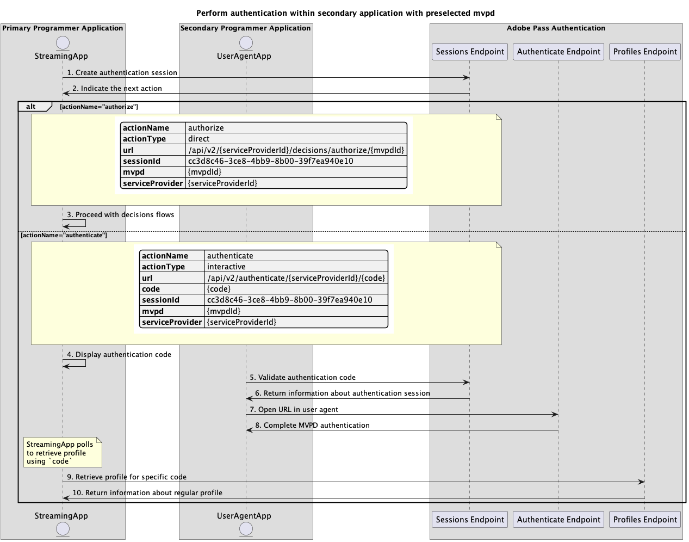

# 보조 애플리케이션 내에서 수행되는 기본 인증 흐름 {#basic-authentication-flow-performed-within-secondary-application}

>[!IMPORTANT]
>
> 이 페이지의 컨텐츠는 정보용으로만 제공됩니다. 이 API를 사용하려면 Adobe의 현재 라이선스가 필요합니다. 허가되지 않은 사용은 허용되지 않습니다.

>[!IMPORTANT]
>
> REST API V2 구현은 [조절 메커니즘](/help/authentication/integration-guide-programmers/throttling-mechanism.md) 설명서에 의해 제한됩니다.

Adobe Pass 인증 권한 내의 **인증 흐름**&#x200B;을 사용하면 스트리밍 응용 프로그램에서 사용자에게 올바른 MVPD 계정이 있는지 확인할 수 있습니다. 이 프로세스를 수행하려면 사용자에게 활성 MVPD 계정이 있어야 하며 MVPD 로그인 페이지에 올바른 로그인 자격 증명을 입력해야 합니다.

다음과 같은 경우 인증 흐름이 필요합니다.

* 사용자가 응용 프로그램을 처음 여는 경우입니다.
* 사용자의 이전 인증이 만료된 경우.
* 사용자가 MVPD 계정에서 로그아웃할 때.
* 사용자가 다른 MVPD로 인증하려는 경우.

이러한 모든 경우, 프로필 끝점 중 하나를 호출하는 애플리케이션은 서로 다른 MVPD에 대해 빈 응답 또는 하나 이상의 프로필을 수신합니다.

**인증 흐름**&#x200B;을 사용하려면 사용자 에이전트(브라우저)가 응용 프로그램에서 Adobe Pass 백엔드로, MVPD 로그인 페이지로, 마지막으로 응용 프로그램으로 일련의 호출을 완료해야 합니다. 이 흐름에는 MVPD 시스템으로 리디렉션하는 몇 가지가 포함될 수 있으며, 각 도메인에 대해 저장된 쿠키 또는 세션을 관리할 수 있으므로 사용자 에이전트 없이 이를 달성하고 보안하기가 어려울 수 있습니다.

사용자 에이전트에서 MVPD를 선택하고 선택한 MVPD로 인증하기 위해 사용자 상호 작용을 지원하는 기본 애플리케이션(스트리밍 애플리케이션) 기능을 기반으로 하는 인증 시나리오는 다음과 같습니다.

* [기본 응용 프로그램 내에서 인증 수행](rest-api-v2-basic-authentication-primary-application-flow.md)
* [사전 선택된 mvpd로 보조 응용 프로그램 내에서 인증 수행](./rest-api-v2-basic-authentication-secondary-application-flow.md)
* [미리 선택된 mvpd 없이 보조 응용 프로그램 내에서 인증 수행](./rest-api-v2-basic-authentication-secondary-application-flow.md)

## 사전 선택된 mvpd로 보조 응용 프로그램 내에서 인증 수행 {#perform-authentication-within-secondary-application-with-preselected-mvpd}

### 전제 조건 {#prerequisites-perform-authentication-within-secondary-application-with-preselected-mvpd}

기본 애플리케이션 내에서 인증 흐름을 시작하고 보조 애플리케이션 내에서 사용자 상호 작용을 통해 완료하기 전에 다음 전제 조건을 충족하는지 확인하십시오.

* 스트리밍 애플리케이션은 MVPD를 선택해야 합니다.
* 스트리밍 애플리케이션은 선택한 MVPD로 로그인하려면 인증 세션을 시작해야 합니다.
* 보조 응용 프로그램은 사용자 에이전트에서 선택한 MVPD로 인증해야 합니다.

>[!IMPORTANT]
>
> 가정
>
>  
> 
> * 스트리밍 애플리케이션은 MVPD를 선택하기 위한 사용자 상호 작용을 지원한다.
> * 보조 애플리케이션(일반적으로 보조 디바이스)은 사용자 에이전트에서 선택된 MVPD로 인증하기 위한 사용자 상호 작용을 지원합니다.

### 워크플로 {#workflow-perform-authentication-within-secondary-application-with-preselected-mvpd}

다음 다이어그램에 표시된 대로 사전 선택된 MVPD로 보조 응용 프로그램 내에서 수행되는 기본 인증 흐름을 구현하려면 주어진 단계를 따르십시오.

*미리 선택된 mvpd를 사용하여 보조 응용 프로그램 내에서 인증을 수행합니다*

1. **인증 세션 만들기:** 스트리밍 응용 프로그램은 세션 끝점을 호출하여 인증 세션을 시작하는 데 필요한 모든 데이터를 수집합니다.

   >[!IMPORTANT]
   >
   > 자세한 내용은 [인증 세션 만들기](../../apis/sessions-apis/rest-api-v2-sessions-apis-create-authentication-session.md) API 설명서를 참조하십시오.
   > 
   > * `serviceProvider`, `mvpd`, `domainName` 및 `redirectUrl`과(와) 같은 모든 _필수_ 매개 변수
   > * `Authorization`, `AP-Device-Identifier`과(와) 같은 모든 _required_ 헤더
   > * 모든 _선택적_ 매개 변수 및 헤더
   >
   >  
   > 
   > 스트리밍 애플리케이션은 인증 세션을 생성할 때 필요한 모든 매개 변수를 단일 호출로 제공해야 합니다.

1. **다음 작업을 나타냅니다.** 세션 끝점 응답에는 스트리밍 응용 프로그램에서 다음 작업에 대해 안내하는 데 필요한 데이터가 포함되어 있습니다.

   >[!IMPORTANT]
   >
   > 세션 응답에 제공된 정보에 대한 자세한 내용은 [인증 세션 만들기](../../apis/sessions-apis/rest-api-v2-sessions-apis-create-authentication-session.md) API 설명서를 참조하십시오.
   > 
   >  
   > 
   > 세션 끝점은 요청 데이터를 확인하여 기본 조건이 충족되는지 확인합니다.
   >
   > * _required_ 매개 변수와 헤더가 유효해야 합니다.
   > * 입력한 `serviceProvider`과(와) `mvpd` 간의 통합이 활성화되어 있어야 합니다.
   >
   >  
   > 
   > 유효성 검사가 실패하면 오류 응답이 생성되고 [향상된 오류 코드](../../../../features-standard/error-reporting/enhanced-error-codes.md) 설명서를 준수하는 추가 정보가 제공됩니다.

1. **결정 흐름을 진행합니다.** 세션 끝점 응답에 다음 데이터가 포함되어 있습니다.
   * `actionName` 특성이 &quot;authorize&quot;로 설정되어 있습니다.
   * `actionType` 특성이 &quot;direct&quot;로 설정되어 있습니다.

   Adobe Pass 백엔드가 유효한 프로필을 식별하는 경우 스트리밍 애플리케이션은 이미 후속 결정 흐름에 사용할 수 있는 프로필이 있으므로 선택한 MVPD로 다시 인증할 필요가 없습니다.

1. **인증 코드 표시:** 세션 끝점 응답에 다음 데이터가 포함되어 있습니다.
   * 보조 응용 프로그램 내에서 인증 세션을 다시 시작하는 데 사용할 수 있는 `code`입니다.
   * `actionName` 특성이 &quot;authenticate&quot;로 설정되어 있습니다.
   * `actionType` 특성이 &quot;interactive&quot;로 설정되어 있습니다.

   Adobe Pass 백엔드가 올바른 프로필을 식별하지 않는 경우 스트리밍 응용 프로그램은 보조 응용 프로그램 내에서 인증 세션을 다시 시작하는 데 사용할 수 있는 `code`을(를) 표시합니다.

1. **인증 코드 유효성 검사:** 보조 응용 프로그램에서 사용자 에이전트에서 MVPD 인증을 계속 진행할 수 있도록 `code`을(를) 제공한 사용자의 유효성을 검사합니다.

   >[!IMPORTANT]
   >
   > 자세한 내용은 [인증 세션 정보 가져오기](../../apis/sessions-apis/rest-api-v2-sessions-apis-retrieve-authentication-session-information-using-code.md) API 설명서를 참조하십시오.
   >
   > * `serviceProvider` 및 `code`과(와) 같은 모든 _필수_ 매개 변수
   > * `Authorization`과(와) 같은 모든 _required_ 헤더
   > * 모든 _선택적_ 매개 변수 및 헤더

1. **인증 세션에 대한 정보를 반환합니다.** 세션 끝점 응답에 다음 데이터가 포함되어 있습니다.
   * `existing` 특성에 이미 제공된 기존 매개 변수가 포함되어 있습니다.
   * `missing` 특성에 인증 흐름을 완료하기 위해 제공해야 하는 매개 변수가 없습니다.

   >[!IMPORTANT]
   >
   > 세션 유효성 검사 응답에 제공된 정보에 대한 자세한 내용은 [인증 세션 정보 검색](../../apis/sessions-apis/rest-api-v2-sessions-apis-retrieve-authentication-session-information-using-code.md) API 설명서를 참조하십시오.
   >
   >  
   >
   > 세션 끝점은 요청 데이터를 확인하여 기본 조건이 충족되는지 확인합니다.
   >
   > * _required_ 매개 변수와 헤더가 유효해야 합니다.
   >
   >  
   >
   > 유효성 검사가 실패하면 오류 응답이 생성되고 [향상된 오류 코드](../../../../features-standard/error-reporting/enhanced-error-codes.md) 설명서를 준수하는 추가 정보가 제공됩니다.

   >[!TIP]
   >
   > 제안: 보조 응용 프로그램은 누락된 인증 세션을 나타내는 오류 응답 이벤트에서 사용된 `code`이(가) 잘못되었음을 사용자에게 알리고 새 세션을 사용하여 다시 시도하도록 사용자에게 알릴 수 있습니다.

1. **사용자 에이전트에서 URL 열기:** 보조 응용 프로그램에서 사용자 에이전트를 열어 자체 계산된 `url`을(를) 로드하고 인증 끝점에 요청합니다. 이 플로우는 여러 리디렉션을 포함할 수 있으며, 궁극적으로 사용자를 MVPD 로그인 페이지로 유도하고 유효한 자격 증명을 제공합니다.

   >[!IMPORTANT]
   >
   > 자세한 내용은 [사용자 에이전트에서 인증 수행](../../apis/sessions-apis/rest-api-v2-sessions-apis-perform-authentication-in-user-agent.md) API 설명서를 참조하십시오.
   >
   > * `serviceProvider` 및 `code`과(와) 같은 모든 _필수_ 매개 변수
   > * 모든 _선택적_ 매개 변수 및 헤더

1. **MVPD 인증 완료:** 인증 흐름이 성공하면 사용자 에이전트 상호 작용이 Adobe Pass 백엔드에 일반 프로필을 저장하고 제공된 `redirectUrl`에 도달합니다.

1. **특정 코드에 대한 프로필 검색:** 스트리밍 응용 프로그램은 프로필 끝점에 요청을 보내 프로필 정보를 검색하는 데 필요한 모든 데이터를 수집합니다.

   >[!IMPORTANT]
   >
   > 다음에 대한 자세한 내용은 [특정 코드에 대한 프로필 검색](../../apis/profiles-apis/rest-api-v2-profiles-apis-retrieve-profile-for-specific-code.md) API 설명서를 참조하십시오.
   > 
   > * `serviceProvider` 및 `code`과(와) 같은 모든 _필수_ 매개 변수
   > * `Authorization`, `AP-Device-Identifier`과(와) 같은 모든 _required_ 헤더
   > * 모든 _선택적_ 매개 변수 및 헤더

   >[!TIP]
   >
   > 제안: 스트리밍 응용 프로그램에서 `code`을(를) 사용하여 폴링 메커니즘을 구현하여 일반 프로필이 정상적으로 생성 및 저장되었는지 확인할 수 있습니다.

1. **일반 프로필에 대한 정보를 반환합니다.** Profiles 끝점 응답에는 받은 매개 변수 및 헤더와 연결된 일반 프로필에 대한 정보가 포함되어 있습니다.

   >[!IMPORTANT]
   >
   > 프로필 응답에 제공된 정보에 대한 자세한 내용은 [특정 코드에 대한 프로필 검색](../../apis/profiles-apis/rest-api-v2-profiles-apis-retrieve-profile-for-specific-code.md) API 설명서를 참조하십시오.
   > 
   >  
   > 
   > 프로필 끝점은 요청 데이터의 유효성을 검사하여 기본 조건이 충족되는지 확인합니다.
   >
   > * _required_ 매개 변수와 헤더가 유효해야 합니다.
   >
   >  
   > 
   > 유효성 검사가 실패하면 오류 응답이 생성되고 [향상된 오류 코드](../../../../features-standard/error-reporting/enhanced-error-codes.md) 설명서를 준수하는 추가 정보가 제공됩니다.

## 미리 선택된 mvpd 없이 보조 응용 프로그램 내에서 인증 수행 {#perform-authentication-within-secondary-application-without-preselected-mvpd}

### 전제 조건 {#prerequisites-perform-authentication-within-secondary-application-without-preselected-mvpd}

기본 애플리케이션 내에서 인증 흐름을 시작하고 보조 애플리케이션 내에서 사용자 상호 작용을 통해 완료하기 전에 다음 전제 조건을 충족하는지 확인하십시오.

* 스트리밍 애플리케이션은 로그인해야 하는 경우 인증 세션을 시작해야 합니다.
* 보조 응용 프로그램에서 MVPD를 선택해야 합니다.
* 보조 응용 프로그램은 사용자 에이전트에서 선택한 MVPD로 인증해야 합니다.

>[!IMPORTANT]
>
> 가정
>
>  
> 
> * 보조 애플리케이션(보통 보조 디바이스 상)은 MVPD를 선택하는 사용자 상호 작용을 지원한다.
> * 보조 애플리케이션(일반적으로 보조 디바이스)은 사용자 에이전트에서 선택된 MVPD로 인증하기 위한 사용자 상호 작용을 지원합니다.

### 워크플로 {#workflow-perform-authentication-within-secondary-application-without-preselected-mvpd}

다음 다이어그램과 같이 사전 선택된 MVPD 없이 보조 응용 프로그램 내에서 수행되는 기본 인증 흐름을 구현하려면 주어진 단계를 따르십시오.

*미리 선택된 mvpd 없이 보조 응용 프로그램 내에서 인증 수행*

1. **인증 세션 만들기:** 스트리밍 응용 프로그램은 세션 끝점을 호출하여 인증 세션을 시작하는 데 필요한 일부 데이터를 수집합니다.

   >[!IMPORTANT]
   >
   > 자세한 내용은 [인증 세션 만들기](../../apis/sessions-apis/rest-api-v2-sessions-apis-create-authentication-session.md) API 설명서를 참조하십시오.
   >
   > * `serviceProvider`과(와) 같은 모든 _필수_ 매개 변수
   > * `Authorization`, `AP-Device-Identifier`과(와) 같은 모든 _required_ 헤더
   > * 모든 _선택적_ 매개 변수 및 헤더
   >
   >  
   > 
   > 스트리밍 애플리케이션은 인증 세션을 생성할 때 단일 호출에 필요한 모든 매개 변수를 제공할 수 없습니다.

1. **다음 작업을 나타냅니다.** 세션 끝점 응답에는 다음 작업에 대해 스트리밍 응용 프로그램을 안내하는 데 필요한 데이터가 포함됩니다.
   * 보조 응용 프로그램 내에서 인증 세션을 다시 시작하는 데 사용할 수 있는 `code`입니다.
   * `actionName` 특성이 &quot;resume&quot;으로 설정되어 있습니다.
   * `actionType` 특성이 &quot;direct&quot;로 설정되어 있습니다.

   >[!IMPORTANT]
   >
   > 세션 응답에 제공된 정보에 대한 자세한 내용은 [인증 세션 만들기](../../apis/sessions-apis/rest-api-v2-sessions-apis-create-authentication-session.md) API 설명서를 참조하십시오.
   > 
   >  
   > 
   > 세션 끝점은 요청 데이터를 확인하여 기본 조건이 충족되는지 확인합니다.
   >
   > * _required_ 매개 변수와 헤더가 유효해야 합니다.
   >
   >  
   > 
   > 유효성 검사가 실패하면 오류 응답이 생성되고 [향상된 오류 코드](../../../../features-standard/error-reporting/enhanced-error-codes.md) 설명서를 준수하는 추가 정보가 제공됩니다.

1. **인증 코드 표시:** 스트리밍 응용 프로그램에서 보조 응용 프로그램 내에서 인증 세션을 다시 시작하는 데 사용할 수 있는 `code`을(를) 표시합니다.

1. **인증 세션 누락 매개 변수 제공:** 보조 응용 프로그램이 인증 세션을 다시 시작하는 데 필요한 누락 데이터를 모두 수집하고 세션 끝점을 호출합니다.

   >[!IMPORTANT]
   >
   > 자세한 내용은 [인증 세션 다시 시작](../../apis/sessions-apis/rest-api-v2-sessions-apis-resume-authentication-session.md) API 설명서를 참조하십시오.
   >
   > * `serviceProvider`, `mvpd`, `domainName` 및 `redirectUrl`과(와) 같은 모든 _필수_ 매개 변수
   > * `Authorization`, `AP-Device-Identifier`과(와) 같은 모든 _required_ 헤더
   > * 모든 _선택적_ 매개 변수 및 헤더

1. **다음 작업을 나타냅니다.** 세션 끝점 응답에는 스트리밍 응용 프로그램에서 다음 작업에 대해 안내하는 데 필요한 데이터가 포함되어 있습니다.

   >[!IMPORTANT]
   >
   > 세션 응답에 제공된 정보에 대한 자세한 내용은 [인증 세션 다시 시작](../../apis/sessions-apis/rest-api-v2-sessions-apis-resume-authentication-session.md) API 설명서를 참조하십시오.
   > 
   >  
   > 
   > 세션 끝점은 요청 데이터를 확인하여 기본 조건이 충족되는지 확인합니다.
   >
   > * _required_ 매개 변수와 헤더가 유효해야 합니다.
   > * 입력한 `serviceProvider`과(와) `mvpd` 간의 통합이 활성화되어 있어야 합니다.
   >
   >  
   > 
   > 유효성 검사가 실패하면 오류 응답이 생성되고 [향상된 오류 코드](../../../../features-standard/error-reporting/enhanced-error-codes.md) 설명서를 준수하는 추가 정보가 제공됩니다.

   >[!TIP]
   >
   > 제안: 보조 응용 프로그램은 누락된 인증 세션을 나타내는 오류 응답 이벤트에서 사용된 `code`이(가) 잘못되었음을 사용자에게 알리고 새 세션을 사용하여 다시 시도하도록 사용자에게 알릴 수 있습니다.

1. **기존 프로필 표시:** 세션 끝점 응답에 다음 데이터가 포함되어 있습니다.
   * `actionName` 특성이 &quot;authorize&quot;로 설정되어 있습니다.
   * `actionType` 특성이 &quot;direct&quot;로 설정되어 있습니다.

   Adobe Pass 백엔드가 유효한 프로필을 식별하는 경우 스트리밍 애플리케이션은 이미 후속 결정 흐름에 사용할 수 있는 프로필이 있으므로 선택한 MVPD로 다시 인증할 필요가 없습니다.

1. **사용자 에이전트에서 URL 열기:** 세션 끝점 응답에 다음 데이터가 포함되어 있습니다.
   * MVPD 로그인 페이지 내에서 대화형 인증을 시작하는 데 사용할 수 있는 `url`입니다.
   * `actionName` 특성이 &quot;authenticate&quot;로 설정되어 있습니다.
   * `actionType` 특성이 &quot;interactive&quot;로 설정되어 있습니다.

   Adobe Pass 백엔드가 올바른 프로필을 식별하지 않는 경우 보조 응용 프로그램에서 사용자 에이전트를 열어 제공된 `url`을(를) 로드하고 인증 끝점에 요청합니다. 이 플로우는 여러 리디렉션을 포함할 수 있으며, 궁극적으로 사용자를 MVPD 로그인 페이지로 유도하고 유효한 자격 증명을 제공합니다.

1. **MVPD 인증 완료:** 인증 흐름이 성공하면 사용자 에이전트 상호 작용이 Adobe Pass 백엔드에 일반 프로필을 저장하고 제공된 `redirectUrl`에 도달합니다.

1. **특정 코드에 대한 프로필 검색:** 스트리밍 응용 프로그램은 프로필 끝점에 요청을 보내 프로필 정보를 검색하는 데 필요한 모든 데이터를 수집합니다.

   >[!IMPORTANT]
   >
   > 다음에 대한 자세한 내용은 [특정 코드에 대한 프로필 검색](../../apis/profiles-apis/rest-api-v2-profiles-apis-retrieve-profile-for-specific-code.md) API 설명서를 참조하십시오.
   >
   > * `serviceProvider` 및 `code`과(와) 같은 모든 _필수_ 매개 변수
   > * `Authorization`, `AP-Device-Identifier`과(와) 같은 모든 _required_ 헤더
   > * 모든 _선택적_ 매개 변수 및 헤더

   >[!TIP]
   >
   > 제안: 스트리밍 응용 프로그램에서 `code`을(를) 사용하여 폴링 메커니즘을 구현하여 일반 프로필이 정상적으로 생성 및 저장되었는지 확인할 수 있습니다.

1. **일반 프로필에 대한 정보를 반환합니다.** Profiles 끝점 응답에는 받은 매개 변수 및 헤더와 연결된 일반 프로필에 대한 정보가 포함되어 있습니다.

   >[!IMPORTANT]
   >
   > 프로필 응답에 제공된 정보에 대한 자세한 내용은 [특정 코드에 대한 프로필 검색](../../apis/profiles-apis/rest-api-v2-profiles-apis-retrieve-profile-for-specific-code.md) API 설명서를 참조하십시오.
   > 
   >  
   > 
   > 프로필 끝점은 요청 데이터의 유효성을 검사하여 기본 조건이 충족되는지 확인합니다.
   >
   > * _required_ 매개 변수와 헤더가 유효해야 합니다.
   >
   >  
   > 
   > 유효성 검사가 실패하면 오류 응답이 생성되고 [향상된 오류 코드](../../../../features-standard/error-reporting/enhanced-error-codes.md) 설명서를 준수하는 추가 정보가 제공됩니다.
