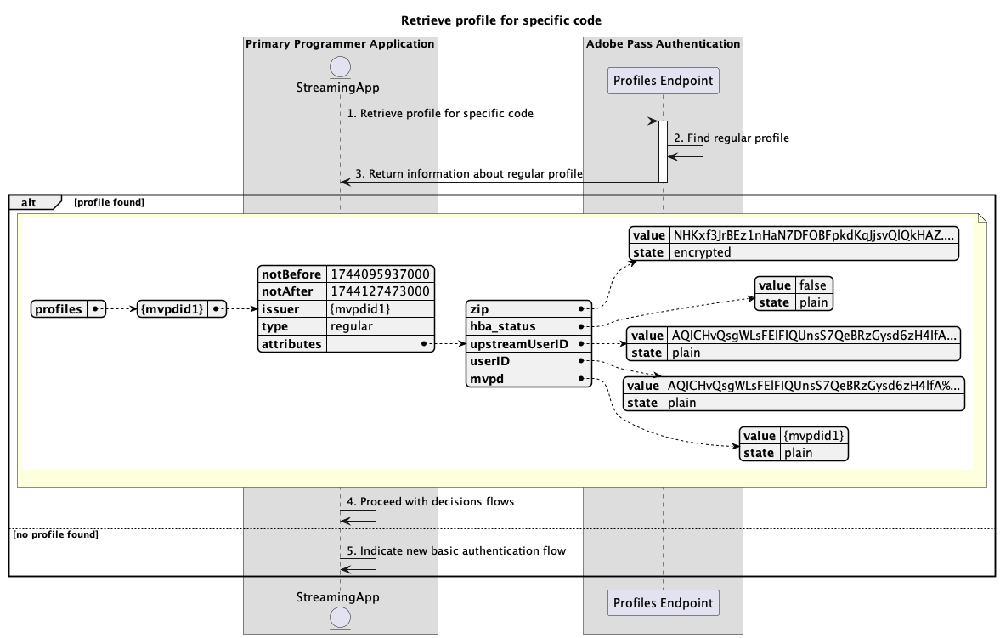

# 기본 애플리케이션 내에서 수행되는 기본 프로필 흐름 {#basic-profiles-flow-primary-application}

>[!IMPORTANT]
>
> 이 페이지의 컨텐츠는 정보용으로만 제공됩니다. 이 API를 사용하려면 Adobe의 현재 라이선스가 필요합니다. 허가되지 않은 사용은 허용되지 않습니다.

>[!IMPORTANT]
>
> REST API V2 구현은 [조절 메커니즘](/help/authentication/integration-guide-programmers/throttling-mechanism.md) 설명서에 의해 제한됩니다.

>[!MORELIKETHIS]
>
> [REST API V2 FAQ](/help/authentication/integration-guide-programmers/rest-apis/rest-api-v2/rest-api-v2-faqs.md#authentication-phase-faqs-general)도 방문하십시오.

Adobe Pass 인증 권한 내의 **프로필 흐름**&#x200B;을 사용하면 스트리밍 응용 프로그램에서 활성 사용자 로그인에 대한 정보에 액세스할 수 있습니다.

기본 프로필 흐름을 사용하면 다음 시나리오를 쿼리할 수 있습니다.

* [프로필 검색](#retrieve-profiles)
* [특정 mvpd에 대한 프로필 검색](#retrieve-profile-for-specific-mvpd)
* [특정 코드에 대한 프로필 검색](#retrieve-profile-for-specific-code)

## 프로필 검색 {#retrieve-profiles}

### 사전 요구 사항 {#prerequisites-retrieve-profiles}

프로필을 검색하기 전에 다음 전제 조건이 충족되는지 확인하십시오.

* 스트리밍 애플리케이션은 모든 일반 프로필을 검색하려고 합니다.

### 워크플로 {#workflow-retrieve-profiles}

다음 다이어그램과 같이 기본 응용 프로그램 내에서 수행되는 기본 프로필 검색 플로우를 구현하려면 주어진 단계를 따르십시오.

*프로필 검색*

1. **프로필 검색:** 스트리밍 애플리케이션은 프로필 끝점에 요청을 보내 모든 프로필 정보를 검색하는 데 필요한 모든 데이터를 수집합니다.

   >[!IMPORTANT]
   >
   > 자세한 내용은 [프로필 검색](../../apis/profiles-apis/rest-api-v2-profiles-apis-retrieve-profiles.md) API 설명서를 참조하십시오.
   >
   > * _과(와) 같은 모든_&#x200B;필수`serviceProvider` 매개 변수
   > * _,_&#x200B;과(와) 같은 모든 `Authorization`required`AP-Device-Identifier` 헤더
   > * 모든 _선택적_ 매개 변수 및 헤더

1. **일반 프로필 찾기:** Adobe Pass 서버는 수신된 매개 변수와 헤더를 기반으로 모든 유효한 프로필을 식별합니다.

1. **일반 프로필에 대한 정보를 반환합니다.** Profiles 끝점 응답에는 받은 매개 변수 및 헤더와 연결된 찾은 프로필에 대한 정보가 포함되어 있습니다.

   >[!IMPORTANT]
   >
   > 프로필 응답에 제공된 정보에 대한 자세한 내용은 [프로필 검색](../../apis/profiles-apis/rest-api-v2-profiles-apis-retrieve-profiles.md) API 설명서를 참조하십시오.
   > 
   >  
   > 
   > 프로필 끝점은 요청 데이터의 유효성을 검사하여 기본 조건이 충족되는지 확인합니다.
   >
   > * _required_ 매개 변수와 헤더가 유효해야 합니다.
   >
   >  
   >
   > 유효성 검사가 실패하면 오류 응답이 생성되고 [향상된 오류 코드](../../../../features-standard/error-reporting/enhanced-error-codes.md) 설명서를 준수하는 추가 정보가 제공됩니다.

1. **프로필을 선택하고 결정 흐름을 진행합니다.** 프로필 끝점 응답에 프로필이 포함되어 있으면 스트리밍 응용 프로그램은 내부 논리(최종 사용자와 상호 작용하여)를 사용하여 사용 가능한 프로필 중 하나를 선택하여 후속 결정 흐름을 계속합니다.

1. **새 기본 인증 흐름을 나타냅니다.** Profiles 끝점 응답에 프로필이 포함되어 있지 않으면 스트리밍 응용 프로그램에서 사용자에게 새 기본 인증 흐름을 시작하도록 지시합니다.

## 특정 mvpd에 대한 프로필 검색 {#retrieve-profile-for-specific-mvpd}

### 사전 요구 사항 {#prerequisites-retrieve-profile-for-specific-mvpd}

특정 MVPD에 대한 프로필을 검색하기 전에 다음 전제 조건이 충족되는지 확인하십시오.

* `mvpd` 식별자가 선택되었거나 캐시된 스트리밍 응용 프로그램에서 특정 MVPD에 대한 일반 프로필을 검색하려고 합니다.

### 워크플로 {#workflow-retrieve-profile-for-specific-mvpd}

다음 다이어그램에서와 같이 특정 MVPD에 대해 기본 프로필 검색 플로우를 구현하려면 주어진 단계를 따르십시오.

*특정 mvpd에 대한 프로필 검색*

1. **특정 mvpd에 대한 프로필 검색:** 스트리밍 응용 프로그램은 프로필 끝점에 요청을 보내 해당 특정 MVPD에 대한 프로필 정보를 검색하는 데 필요한 모든 데이터를 수집합니다.

   >[!IMPORTANT]
   >
   > 자세한 내용은 [특정 mvpd에 대한 프로필 검색](../../apis/profiles-apis/rest-api-v2-profiles-apis-retrieve-profile-for-specific-mvpd.md) API 설명서를 참조하십시오.
   >
   > * _및_&#x200B;과(와) 같은 모든 `serviceProvider`필수`mvpd` 매개 변수
   > * _,_&#x200B;과(와) 같은 모든 `Authorization`required`AP-Device-Identifier` 헤더
   > * 모든 _선택적_ 매개 변수 및 헤더

1. **일반 프로필 찾기:** Adobe Pass 서버는 받은 매개 변수와 헤더를 기반으로 올바른 프로필을 식별합니다.

1. **일반 프로필에 대한 정보를 반환합니다.** Profiles 끝점 응답에는 받은 매개 변수 및 헤더와 연결된 찾은 프로필에 대한 정보가 포함되어 있습니다.

   >[!IMPORTANT]
   >
   > 프로필 응답에 제공된 정보에 대한 자세한 내용은 [특정 mvpd에 대한 프로필 검색](../../apis/profiles-apis/rest-api-v2-profiles-apis-retrieve-profile-for-specific-mvpd.md) API 설명서를 참조하십시오.
   > 
   >  
   > 
   > 프로필 끝점은 요청 데이터의 유효성을 검사하여 기본 조건이 충족되는지 확인합니다.
   >
   > * _required_ 매개 변수와 헤더가 유효해야 합니다.
   > * 입력한 `serviceProvider`과(와) `mvpd` 간의 통합이 활성화되어 있어야 합니다.
   >
   >  
   > 
   > 유효성 검사가 실패하면 오류 응답이 생성되고 [향상된 오류 코드](../../../../features-standard/error-reporting/enhanced-error-codes.md) 설명서를 준수하는 추가 정보가 제공됩니다.

1. **의사 결정 흐름을 진행합니다.** 프로필 끝점 응답에 프로필이 포함되어 있으면 스트리밍 응용 프로그램에서 프로필 정보를 사용하여 후속 의사 결정 흐름을 계속합니다.

1. **새 기본 인증 흐름을 나타냅니다.** Profiles 끝점 응답에 프로필이 포함되어 있지 않으면 스트리밍 응용 프로그램에서 사용자에게 새 기본 인증 흐름을 시작하도록 지시합니다.

## 특정 코드에 대한 프로필 검색 {#retrieve-profile-for-specific-code}

### 사전 요구 사항 {#prerequisites-retrieve-profile-for-specific-code}

특정 인증 코드에 대한 프로필을 검색하기 전에 다음 전제 조건이 충족되는지 확인하십시오.

* MVPD과의 대화형 인증을 수행하는 데 사용되는 `code`이(가) 있는 스트리밍 응용 프로그램에서 특정 인증 코드에 대한 프로필을 검색하려고 합니다.

### 워크플로 {#workflow-retrieve-profile-for-specific-code}

다음 다이어그램과 같이 기본 애플리케이션 내에서 수행되는 특정 인증 코드에 대한 기본 프로필 검색 플로우를 구현하려면 주어진 단계를 따르십시오.

*특정 코드에 대한 프로필 검색*

1. **특정 코드에 대한 프로필 검색:** 스트리밍 응용 프로그램은 프로필 끝점에 요청을 보내 해당 특정 인증 코드에 대한 프로필 정보를 검색하는 데 필요한 모든 데이터를 수집합니다.

   >[!IMPORTANT]
   >
   > 다음에 대한 자세한 내용은 [특정 코드에 대한 프로필 검색](../../apis/profiles-apis/rest-api-v2-profiles-apis-retrieve-profile-for-specific-code.md) API 설명서를 참조하십시오.
   >
   > * _및_&#x200B;과(와) 같은 모든 `serviceProvider`필수`code` 매개 변수
   > * _과(와) 같은 모든_ required`Authorization` 헤더
   > * 모든 _선택적_ 매개 변수 및 헤더

1. **일반 프로필 찾기:** Adobe Pass 서버는 받은 매개 변수와 헤더를 기반으로 올바른 프로필을 식별합니다.

1. **일반 프로필에 대한 정보를 반환합니다.** Profiles 끝점 응답에는 받은 매개 변수 및 헤더와 연결된 찾은 프로필에 대한 정보가 포함되어 있습니다.

   >[!IMPORTANT]
   >
   > 프로필 응답에 제공된 정보에 대한 자세한 내용은 [특정 코드에 대한 프로필 검색](../../apis/profiles-apis/rest-api-v2-profiles-apis-retrieve-profile-for-specific-code.md) API 설명서를 참조하십시오.
   > 
   >  
   > 
   > 프로필 끝점은 요청 데이터의 유효성을 검사하여 기본 조건이 충족되는지 확인합니다.
   >
   > * _required_ 매개 변수와 헤더가 유효해야 합니다.
   >
   >  
   >
   > 유효성 검사가 실패하면 오류 응답이 생성되고 [향상된 오류 코드](../../../../features-standard/error-reporting/enhanced-error-codes.md) 설명서를 준수하는 추가 정보가 제공됩니다.

1. **의사 결정 흐름을 진행합니다.** 프로필 끝점 응답에 프로필이 포함되어 있으면 스트리밍 응용 프로그램에서 프로필 정보를 사용하여 후속 의사 결정 흐름을 계속합니다.

1. **새 기본 인증 흐름을 나타냅니다.** Profiles 끝점 응답에 프로필이 없으면 기본 응용 프로그램에서 사용자가 새 기본 인증 흐름을 시작하도록 지시합니다.
