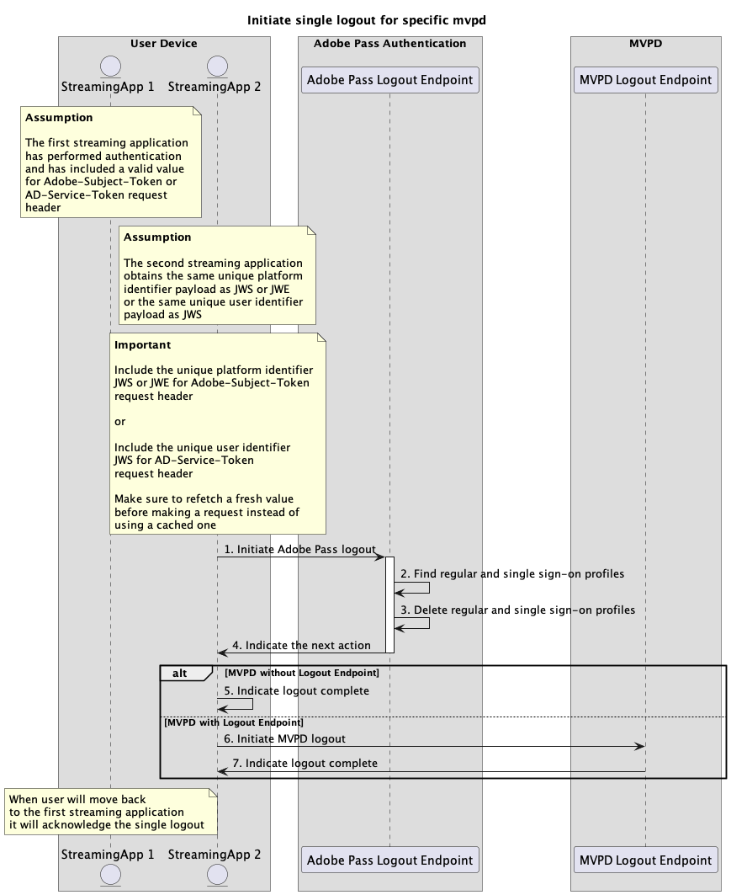

# 단일 로그아웃 흐름 {#single-logout-flow}

>[!IMPORTANT]
>
> 이 페이지의 컨텐츠는 정보용으로만 제공됩니다. 이 API를 사용하려면 Adobe의 현재 라이선스가 필요합니다. 허가되지 않은 사용은 허용되지 않습니다.

>[!IMPORTANT]
>
> REST API V2 구현은 [조절 메커니즘](/help/authentication/integration-guide-programmers/throttling-mechanism.md) 설명서에 의해 제한됩니다.

>[!MORELIKETHIS]
>
> [REST API V2 FAQ](/help/authentication/integration-guide-programmers/rest-apis/rest-api-v2/rest-api-v2-faqs.md#authentication-phase-faqs-general)도 방문하십시오.

## 특정 mvpd에 대한 단일 로그아웃 시작 {#initiate-single-logout-for-specific-mvpd}

### 사전 요구 사항 {#prerequisites-initiate-single-logout-for-specific-mvpd}

특정 MVPD에 대한 단일 로그아웃을 시작하기 전에 다음 전제 조건이 충족되는지 확인하십시오.

* 두 번째 스트리밍 애플리케이션에는 Single Sign-On 인증 흐름 중 하나를 사용하여 MVPD에 대해 성공적으로 생성된 유효한 Single Sign-On 프로필이 있어야 합니다.
   * [플랫폼 ID를 사용하여 SSO(Single Sign-On)를 통한 인증 수행](rest-api-v2-single-sign-on-platform-identity-flows.md)
   * [서비스 토큰을 사용하여 SSO(Single Sign-On)를 통한 인증 수행](rest-api-v2-single-sign-on-service-token-flows.md)
* 두 번째 스트리밍 애플리케이션은 MVPD에서 로그아웃해야 하는 경우 단일 로그아웃 흐름을 시작해야 합니다.

>[!IMPORTANT]
> 
> 가정
>
>  
> 
> * 첫 번째 및 두 번째 스트리밍 애플리케이션은 `JWS` 또는 `JWE`과(와) 동일한 고유한 플랫폼 식별자 페이로드 또는 `JWS`과(와) 동일한 고유한 사용자 식별자 페이로드를 얻습니다.

### 워크플로 {#workflow-initiate-single-logout-for-specific-mvpd}

다음 다이어그램과 같이 특정 MVPD에 대한 단일 로그아웃 플로우를 구현하려면 주어진 단계를 수행하십시오.

*특정 mvpd에 대한 단일 로그아웃 시작*

1. **Adobe Pass 로그아웃 시작:** 스트리밍 애플리케이션은 Adobe Pass 로그아웃 끝점을 호출하여 로그아웃 흐름을 시작하는 데 필요한 모든 데이터를 수집합니다.

   >[!IMPORTANT]
   >
   > 자세한 내용은 [특정 mvpd에 대한 로그아웃 시작](../../apis/logout-apis/rest-api-v2-logout-apis-initiate-logout-for-specific-mvpd.md) API 설명서를 참조하십시오.
   >
   > * _,_ 및 `serviceProvider`과(와) 같은 모든 `mvpd`필수`redirectUrl` 매개 변수
   > * _,_&#x200B;과(와) 같은 모든 `Authorization`required`AP-Device-Identifier` 헤더
   > * 모든 _선택적_ 매개 변수 및 헤더
   >
   >  
   >
   > 스트리밍 애플리케이션은 요청을 하기 전에 고유 플랫폼 식별자 또는 고유 사용자 식별자에 대한 유효한 값이 포함되어 있는지 확인해야 합니다.
   >
   >  
   > 
   > `Adobe-Subject-Token` 헤더에 대한 자세한 내용은 [Adobe-Subject-Token](../../appendix/headers/rest-api-v2-appendix-headers-adobe-subject-token.md) 설명서를 참조하십시오.
   > 
   >  
   > 
   > `AD-Service-Token` 헤더에 대한 자세한 내용은 [AD-Service-Token](../../appendix/headers/rest-api-v2-appendix-headers-ad-service-token.md) 설명서를 참조하십시오.

1. **일반 및 SSO(Single Sign-On) 프로필 찾기:** Adobe Pass 서버는 수신된 매개 변수와 헤더를 기반으로 일반 및 SSO(Single Sign-On) 유효한 프로필을 모두 식별합니다.

1. **일반 및 SSO(Single Sign-On) 프로필 삭제:** Adobe Pass 서버가 식별된 일반 및 SSO(Single Sign-On) 프로필을 Adobe Pass 백엔드에서 삭제합니다.

1. **다음 작업을 나타냅니다.** Adobe Pass Logout 끝점 응답에는 다음 작업에 대해 스트리밍 응용 프로그램을 안내하는 데 필요한 데이터가 포함되어 있습니다.

   >[!IMPORTANT]
   >
   > 로그아웃 응답에 제공된 정보에 대한 자세한 내용은 [특정 mvpd에 대한 로그아웃 시작](../../apis/logout-apis/rest-api-v2-logout-apis-initiate-logout-for-specific-mvpd.md) API 설명서를 참조하십시오.
   > 
   >  
   > 
   > Adobe Pass Logout 끝점은 요청 데이터를 확인하여 기본 조건이 충족되는지 확인합니다.
   >
   > * _required_ 매개 변수와 헤더가 유효해야 합니다.
   > * 입력한 `serviceProvider`과(와) `mvpd` 간의 통합이 활성화되어 있어야 합니다.
   >
   >  
   > 
   > 유효성 검사가 실패하면 오류 응답이 생성되고 [향상된 오류 코드](../../../../features-standard/error-reporting/enhanced-error-codes.md) 설명서를 준수하는 추가 정보가 제공됩니다.

1. **로그아웃 완료 표시:** MVPD에서 로그아웃 흐름을 지원하지 않는 경우 스트리밍 애플리케이션은 응답을 처리하고 이 응답을 사용하여 사용자 인터페이스에 특정 메시지를 선택적으로 표시할 수 있습니다.

1. **MVPD 로그아웃 시작:** MVPD이 로그아웃 흐름을 지원하지 않으면 스트리밍 애플리케이션은 응답을 처리하고 사용자 에이전트를 사용하여 MVPD으로 로그아웃 흐름을 시작합니다. 이 흐름에는 MVPD 시스템으로의 몇 가지 리디렉션이 포함될 수 있습니다. 여전히 그 결과는 MVPD이 내부 정리를 수행하고 최종 로그아웃 확인을 Adobe Pass 백엔드로 다시 보내는 것입니다.

1. **로그아웃 완료 표시:** 스트리밍 응용 프로그램은 사용자 에이전트가 제공된 `redirectUrl`에 도달할 때까지 기다릴 수 있으며 선택적으로 사용자 인터페이스에 특정 메시지를 표시하는 신호로 사용할 수 있습니다.

>[!NOTE]
>
> 단일 로그아웃 흐름에 대한 단계는 첫 번째 스트리밍 애플리케이션에서 시작하는 경우 위와 동일합니다.
