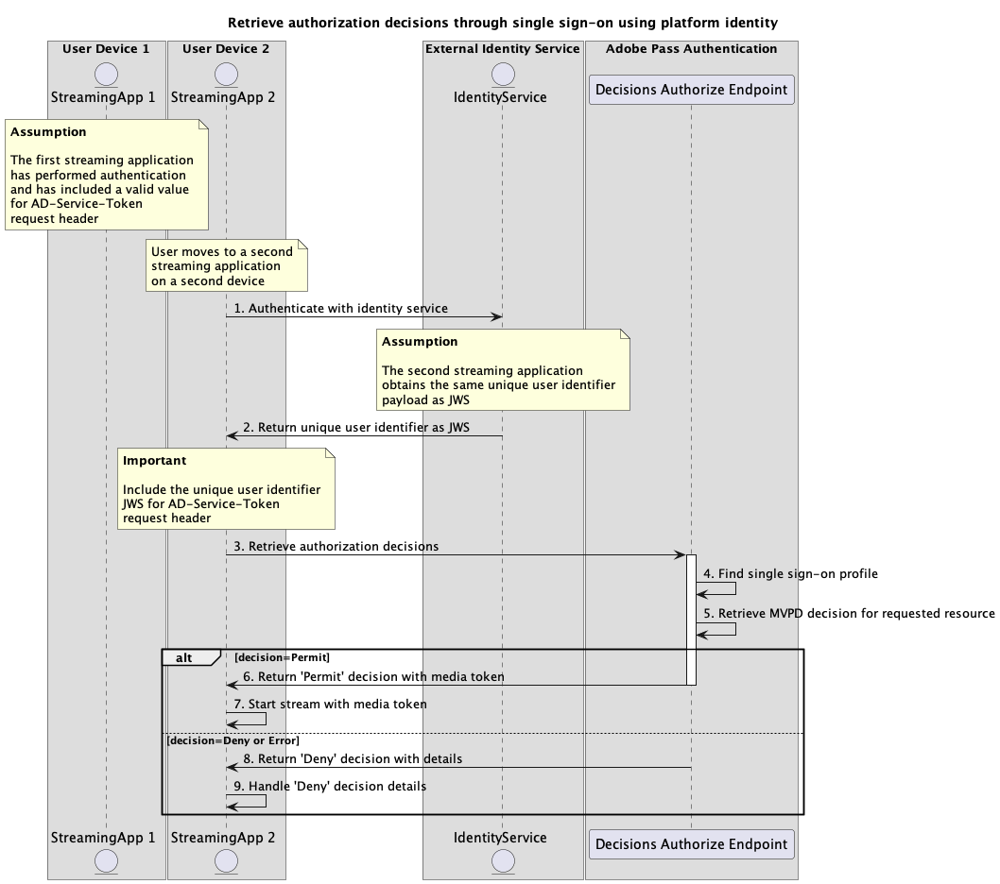

# 서비스 토큰 흐름을 사용한 SSO(Single Sign-On){#single-sign-on-service-token-full-flows}

>[!IMPORTANT]
>
> 이 페이지의 컨텐츠는 정보용으로만 제공됩니다. 이 API를 사용하려면 Adobe의 현재 라이선스가 필요합니다. 허가되지 않은 사용은 허용되지 않습니다.

>[!IMPORTANT]
>
> REST API V2 구현은 [조절 메커니즘](/help/authentication/integration-guide-programmers/throttling-mechanism.md) 설명서에 의해 제한됩니다.

>[!MORELIKETHIS]
>
> [REST API V2 FAQ](/help/authentication/integration-guide-programmers/rest-apis/rest-api-v2/rest-api-v2-faqs.md#authentication-phase-faqs-general)도 방문하십시오.

서비스 토큰 방법을 사용하면 Adobe Pass 서비스를 사용할 때 여러 애플리케이션에서 고유한 사용자 식별자를 사용하여 여러 디바이스 및 플랫폼에서 SSO(Single Sign-On)를 수행할 수 있습니다.

애플리케이션은 다음과 같은 Adobe Pass 시스템 외부에서 외부 ID 서비스를 사용하여 고유 사용자 식별자 페이로드를 검색합니다.

* 사용자가 동일한 자격 증명을 사용하여 각 장치에 로그인하고 동일한 사용자 ID 또는 사용자 계정 이름과 연결되는 DTC(Direct-to-Consumer) 서비스.
* 사용자가 동일한 자격 증명을 사용하여 각 장치에 로그인하고 동일한 이메일 주소와 연결되는 Google 또는 Facebook과 같은 서드파티 인증 서비스.

응용 프로그램은 이 고유 사용자 식별자 페이로드를 지정하는 모든 요청에 대해 `AD-Service-Token` 헤더의 일부로 포함합니다.

`AD-Service-Token` 헤더에 대한 자세한 내용은 [AD-Service-Token](../../appendix/headers/rest-api-v2-appendix-headers-ad-service-token.md) 설명서를 참조하십시오.

## 서비스 토큰을 사용하여 SSO(Single Sign-On)를 통한 인증 수행 {#performing-authentication-flow-using-service-token-single-sign-on-method}

### 전제 조건 {#prerequisites-scenario-performing-authentication-flow-using-service-token-single-sign-on-method}

서비스 토큰을 사용하여 SSO(Single Sign-On)를 통한 인증 흐름을 수행하기 전에 다음 전제 조건이 충족되는지 확인하십시오.

* 외부 ID 서비스는 여러 장치 및 플랫폼의 모든 응용 프로그램에서 일관된 정보를 `JWS` 페이로드로 반환해야 합니다.
* 첫 번째 스트리밍 응용 프로그램은 고유한 사용자 식별자를 검색하고 이를 지정하는 모든 요청에 대해 `JWS` 페이로드를 [AD-Service-Token](../../appendix/headers/rest-api-v2-appendix-headers-ad-service-token.md) 헤더의 일부로 포함해야 합니다.
* 첫 번째 스트리밍 애플리케이션은 MVPD을 선택해야 합니다.
* 첫 번째 스트리밍 애플리케이션은 선택한 MVPD으로 로그인하기 위한 인증 세션을 시작해야 합니다.
* 첫 번째 스트리밍 애플리케이션은 사용자 에이전트에서 선택한 MVPD을 인증해야 합니다.
* 두 번째 스트리밍 응용 프로그램은 고유한 사용자 식별자를 검색하고 이를 지정하는 모든 요청에 대해 `JWS` 페이로드를 [AD-Service-Token](../../appendix/headers/rest-api-v2-appendix-headers-ad-service-token.md) 헤더의 일부로 포함해야 합니다.

>[!IMPORTANT]
>
> 가정
> 
>  
> 
> * 상기 제1 스트리밍 애플리케이션은 MVPD 선택을 위한 사용자 인터랙션을 지원한다.
> * 제1 스트리밍 애플리케이션은 사용자 에이전트에서 선택된 MVPD을 인증하기 위한 사용자 상호작용을 지원한다.

### 워크플로 {#workflow-steps-scenario-performing-authentication-flow-using-service-token-single-sign-on-method}

다음 다이어그램과 같이 서비스 토큰을 사용하여 SSO(Single Sign-On)를 통해 인증 흐름을 구현하려면 주어진 단계를 수행하십시오.

*서비스 토큰을 사용하여 SSO(Single Sign-On)를 통한 인증 수행*

1. **ID 서비스로 인증:** 첫 번째 스트리밍 애플리케이션은 Adobe Pass 시스템 외부의 ID 서비스를 호출하여 고유한 사용자 ID와 연결된 `JWS` 페이로드를 가져옵니다.

1. **고유 사용자 식별자를 JWS로 반환:** 첫 번째 스트리밍 응용 프로그램이 응답 데이터의 유효성을 검사하여 기본 보안 조건이 충족되는지 확인합니다.
   * 페이로드가 만료되지 않았습니다.
   * 페이로드에 서명이 있습니다.

1. **인증 세션 만들기:** 첫 번째 스트리밍 응용 프로그램은 세션 끝점을 호출하여 인증 세션을 시작하는 데 필요한 모든 데이터를 수집합니다.

   >[!IMPORTANT]
   >
   > 자세한 내용은 [인증 세션 만들기](../../apis/sessions-apis/rest-api-v2-sessions-apis-create-authentication-session.md) API 설명서를 참조하십시오.
   >
   > * `serviceProvider`, `mvpd`, `domainName` 및 `redirectUrl`과(와) 같은 모든 _필수_ 매개 변수
   > * `Authorization`, `AP-Device-Identifier`과(와) 같은 모든 _required_ 헤더
   > * 모든 _선택적_ 매개 변수 및 헤더
   >
   >  
   > 
   > 스트리밍 애플리케이션은 요청을 하기 전에 고유 사용자 식별자에 대한 유효한 값이 포함되어 있는지 확인해야 합니다.
   >
   >  
   > 
   > `AD-Service-Token` 헤더에 대한 자세한 내용은 [AD-Service-Token](../../appendix/headers/rest-api-v2-appendix-headers-ad-service-token.md) 설명서를 참조하십시오.

1. **다음 작업을 나타냅니다.** 세션 끝점 응답에는 다음 작업에 대해 첫 번째 스트리밍 응용 프로그램을 안내하는 데 필요한 데이터가 포함됩니다.

   >[!IMPORTANT]
   >
   > 세션 응답에 제공된 정보에 대한 자세한 내용은 [인증 세션 만들기](../../apis/sessions-apis/rest-api-v2-sessions-apis-create-authentication-session.md) API 설명서를 참조하십시오.
   >
   >  
   > 
   > 세션 끝점은 요청 데이터를 확인하여 기본 조건이 충족되는지 확인합니다.
   >
   > * _required_ 매개 변수와 헤더가 유효해야 합니다.
   > * 입력한 `serviceProvider`과(와) `mvpd` 간의 통합이 활성화되어 있어야 합니다.
   >
   >  
   > 
   > 유효성 검사가 실패하면 오류 응답이 생성되고 [향상된 오류 코드](../../../../features-standard/error-reporting/enhanced-error-codes.md) 설명서를 준수하는 추가 정보가 제공됩니다.

1. **사용자 에이전트에서 URL 열기:** 세션 끝점 응답에 다음 데이터가 포함되어 있습니다.
   * MVPD 로그인 페이지 내에서 대화형 인증을 시작하는 데 사용할 수 있는 `url`입니다.
   * `actionName` 특성이 &quot;authenticate&quot;로 설정되어 있습니다.
   * `actionType` 특성이 &quot;interactive&quot;로 설정되어 있습니다.

   Adobe Pass 백엔드가 올바른 프로필을 식별하지 않는 경우 첫 번째 스트리밍 애플리케이션은 사용자 에이전트를 열어 제공된 `url`을(를) 로드하고 인증 끝점에 요청합니다. 이 흐름에는 여러 리디렉션이 포함될 수 있으므로 궁극적으로 사용자를 MVPD 로그인 페이지로 유도하고 유효한 자격 증명을 제공합니다.

1. **MVPD 인증 완료:** 인증 흐름이 성공하면 사용자 에이전트 상호 작용이 Adobe Pass 백엔드에 일반 프로필을 저장하고 제공된 `redirectUrl`에 도달합니다.

1. **특정 코드에 대한 프로필 검색:** 첫 번째 스트리밍 애플리케이션은 프로필 끝점에 요청을 보내 프로필 정보를 검색하는 데 필요한 모든 데이터를 수집합니다.

   >[!IMPORTANT]
   >
   > 다음에 대한 자세한 내용은 [특정 코드에 대한 프로필 검색](../../apis/profiles-apis/rest-api-v2-profiles-apis-retrieve-profile-for-specific-code.md) API 설명서를 참조하십시오.
   > 
   > * `serviceProvider`, `code`과(와) 같은 모든 _필수_ 매개 변수
   > * `Authorization`, `AP-Device-Identifier`과(와) 같은 모든 _required_ 헤더
   > * 모든 _선택적_ 매개 변수 및 헤더

   >[!TIP]
   >
   > 제안: 스트리밍 응용 프로그램은 사용자 에이전트가 제공된 `redirectUrl`에 도달할 때까지 기다렸다가 일반 프로필이 정상적으로 생성 및 저장되었는지 확인할 수 있습니다.

1. **일반 프로필 찾기:** Adobe Pass 서버는 받은 매개 변수와 헤더를 기반으로 올바른 프로필을 식별합니다.

1. **일반 프로필에 대한 정보를 반환합니다.** Profiles 끝점 응답에는 받은 매개 변수 및 헤더와 연결된 찾은 프로필에 대한 정보가 포함되어 있습니다.

   >[!IMPORTANT]
   >
   > 프로필 응답에 제공된 정보에 대한 자세한 내용은 [특정 코드에 대한 프로필 검색](../../apis/profiles-apis/rest-api-v2-profiles-apis-retrieve-profile-for-specific-code.md) API 설명서를 참조하십시오.
   >
   >  
   > 
   > 프로필 끝점은 요청 데이터의 유효성을 검사하여 기본 조건이 충족되는지 확인합니다.
   >
   > * _required_ 매개 변수와 헤더가 유효해야 합니다.
   >
   >  
   > 
   > 유효성 검사가 실패하면 오류 응답이 생성되고 [향상된 오류 코드](../../../../features-standard/error-reporting/enhanced-error-codes.md) 설명서를 준수하는 추가 정보가 제공됩니다.

1. **의사 결정 흐름을 진행합니다.** 첫 번째 스트리밍 응용 프로그램은 후속 의사 결정 흐름을 계속할 수 있습니다.

   >[!IMPORTANT]
   >
   > 스트리밍 애플리케이션은 요청을 하기 전에 고유 사용자 식별자에 대한 유효한 값이 포함되어 있는지 확인해야 합니다.
   >
   >  
   > 
   > `AD-Service-Token` 헤더에 대한 자세한 내용은 [AD-Service-Token](../../appendix/headers/rest-api-v2-appendix-headers-ad-service-token.md) 설명서를 참조하십시오.

1. **ID 서비스로 인증:** 두 번째 스트리밍 애플리케이션은 Adobe Pass 시스템 외부의 ID 서비스를 호출하여 고유한 사용자 ID와 연결된 `JWS` 페이로드를 가져옵니다.

1. **고유 사용자 식별자를 JWS로 반환:** 두 번째 스트리밍 응용 프로그램은 기본 보안 조건이 충족되는지 확인하기 위해 응답 데이터의 유효성을 검사합니다.
   * 페이로드가 만료되지 않았습니다.
   * 페이로드에 서명이 있습니다.

1. **프로필 검색:** 두 번째 스트리밍 애플리케이션은 프로필 끝점에 요청을 보내 모든 프로필 정보를 검색하는 데 필요한 모든 데이터를 수집합니다.

   >[!IMPORTANT]
   >
   > 자세한 내용은 [프로필 검색](../../apis/profiles-apis/rest-api-v2-profiles-apis-retrieve-profiles.md) API 설명서를 참조하십시오.
   >
   > * `serviceProvider`과(와) 같은 모든 _필수_ 매개 변수
   > * `Authorization`, `AP-Device-Identifier`과(와) 같은 모든 _required_ 헤더
   > * 모든 _선택적_ 매개 변수 및 헤더
   >
   >  
   > 
   > 스트리밍 애플리케이션은 요청을 하기 전에 고유 사용자 식별자에 대한 유효한 값이 포함되어 있는지 확인해야 합니다.
   >
   >  
   > 
   > `AD-Service-Token` 헤더에 대한 자세한 내용은 [AD-Service-Token](../../appendix/headers/rest-api-v2-appendix-headers-ad-service-token.md) 설명서를 참조하십시오.

1. **SSO(Single Sign-On) 프로필 찾기:** Adobe Pass 서버는 수신된 매개 변수 및 헤더를 기반으로 올바른 SSO(Single Sign-On) 프로필을 식별합니다.

1. **Single Sign-On 프로필에 대한 정보를 반환합니다.** Profiles 끝점 응답에는 받은 매개 변수 및 헤더와 연결된 찾은 프로필에 대한 정보가 들어 있습니다.

   >[!IMPORTANT]
   >
   > 프로필 응답에 제공된 정보에 대한 자세한 내용은 [프로필 검색](../../apis/profiles-apis/rest-api-v2-profiles-apis-retrieve-profiles.md) API 설명서를 참조하십시오.
   > 
   >  
   > 
   > 프로필 끝점은 요청 데이터의 유효성을 검사하여 기본 조건이 충족되는지 확인합니다.
   >
   > * _required_ 매개 변수와 헤더가 유효해야 합니다.
   >
   >  
   > 
   > 유효성 검사가 실패하면 오류 응답이 생성되고 [향상된 오류 코드](../../../../features-standard/error-reporting/enhanced-error-codes.md) 설명서를 준수하는 추가 정보가 제공됩니다.

1. **결정 흐름을 진행합니다.** 두 번째 스트리밍 응용 프로그램은 후속 결정 흐름을 계속할 수 있습니다.

   >[!IMPORTANT]
   >
   > 스트리밍 애플리케이션은 요청을 하기 전에 고유 사용자 식별자에 대한 유효한 값이 포함되어 있는지 확인해야 합니다.
   >
   >  
   > 
   > `AD-Service-Token` 헤더에 대한 자세한 내용은 [AD-Service-Token](../../appendix/headers/rest-api-v2-appendix-headers-ad-service-token.md) 설명서를 참조하십시오.

## 서비스 토큰을 사용하여 SSO(Single Sign-On)를 통해 인증 결정 검색 {#performing-authorization-flow-using-service-token-single-sign-on-method}

### 전제 조건 {#prerequisites-scenario-performing-authorization-flow-using-service-token-single-sign-on-method}

서비스 토큰을 사용하여 SSO(Single Sign-On)를 통한 인증 흐름을 수행하기 전에 다음 전제 조건이 충족되는지 확인하십시오.

* 외부 ID 서비스는 여러 장치 및 플랫폼의 모든 응용 프로그램에서 일관된 정보를 `JWS` 페이로드로 반환해야 합니다.
* 첫 번째 스트리밍 응용 프로그램은 고유한 사용자 식별자를 검색하고 이를 지정하는 모든 요청에 대해 `JWS` 페이로드를 [AD-Service-Token](../../appendix/headers/rest-api-v2-appendix-headers-ad-service-token.md) 헤더의 일부로 포함해야 합니다.
* 두 번째 스트리밍 애플리케이션은 사용자가 선택한 리소스를 재생하기 전에 인증 결정을 검색해야 합니다.

>[!IMPORTANT]
>
> 가정
>
>  
> 
> * 첫 번째 스트리밍 응용 프로그램에서 인증을 수행했으며 [AD-Service-Token](../../appendix/headers/rest-api-v2-appendix-headers-ad-service-token.md) 요청 헤더에 올바른 값을 포함했습니다.

### 워크플로 {#workflow-steps-scenario-performing-authorization-flow-using-service-token-single-sign-on-method}

다음 다이어그램과 같이 서비스 토큰을 사용하여 단일 사인온을 통해 인증 흐름을 구현하려면 주어진 단계를 수행하십시오.

*서비스 토큰을 사용하여 SSO(Single Sign-On)를 통해 인증 결정을 검색합니다*

1. **ID 서비스로 인증:** 두 번째 스트리밍 애플리케이션은 Adobe Pass 시스템 외부의 ID 서비스를 호출하여 고유한 사용자 ID와 연결된 `JWS` 페이로드를 가져옵니다.

1. **고유 사용자 식별자를 JWS로 반환:** 두 번째 스트리밍 응용 프로그램은 기본 보안 조건이 충족되는지 확인하기 위해 응답 데이터의 유효성을 검사합니다.
   * 페이로드가 만료되지 않았습니다.
   * 페이로드에 서명이 있습니다.

1. **권한 부여 결정 검색:** 두 번째 스트리밍 애플리케이션은 결정 권한 부여 끝점을 호출하여 특정 리소스에 대한 권한 부여 결정을 얻는 데 필요한 모든 데이터를 수집합니다.

   >[!IMPORTANT]
   >
   > 자세한 내용은 [특정 mvpd를 사용하여 권한 부여 결정 검색](../../apis/decisions-apis/rest-api-v2-decisions-apis-retrieve-authorization-decisions-using-specific-mvpd.md) API 설명서를 참조하십시오.
   >
   > * `serviceProvider`, `mvpd` 및 `resources`과(와) 같은 모든 _필수_ 매개 변수
   > * `Authorization` 및 `AP-Device-Identifier`과(와) 같은 모든 _required_ 헤더
   > * 모든 _선택적_ 매개 변수 및 헤더
   >
   >  
   > 
   > 스트리밍 애플리케이션은 요청을 하기 전에 고유 사용자 식별자에 대한 유효한 값이 포함되어 있는지 확인해야 합니다.
   >
   >  
   > 
   > `AD-Service-Token` 헤더에 대한 자세한 내용은 [AD-Service-Token](../../appendix/headers/rest-api-v2-appendix-headers-ad-service-token.md) 설명서를 참조하십시오.

1. **SSO(Single Sign-On) 프로필 찾기:** Adobe Pass 서버는 수신된 매개 변수 및 헤더를 기반으로 올바른 SSO(Single Sign-On) 프로필을 식별합니다.

1. **요청된 리소스에 대한 MVPD 결정 검색:** Adobe Pass 서버가 MVPD 인증 끝점을 호출하여 스트리밍 응용 프로그램에서 받은 특정 리소스에 대한 `Permit` 또는 `Deny` 결정을 가져옵니다.

1. **미디어 토큰이 있는 `Permit` 결정을 반환합니다.** Decisions Authorize 끝점 응답에 `Permit` 결정 및 미디어 토큰이 포함되어 있습니다.

   >[!IMPORTANT]
   >
   > 의사 결정 응답에 제공된 정보에 대한 자세한 내용은 [특정 mvpd를 사용하여 인증 결정 검색](../../apis/decisions-apis/rest-api-v2-decisions-apis-retrieve-authorization-decisions-using-specific-mvpd.md) API 설명서를 참조하십시오.
   > 
   >  
   > 
   > 결정 권한 부여 끝점은 기본 조건이 충족되는지 확인하기 위해 요청 데이터를 확인합니다.
   >
   > * _required_ 매개 변수와 헤더가 유효해야 합니다.
   > * 입력한 `serviceProvider`과(와) `mvpd` 간의 통합이 활성화되어 있어야 합니다.
   >
   >  
   > 
   > 유효성 검사가 실패하면 오류 응답이 생성되고 [향상된 오류 코드](../../../../features-standard/error-reporting/enhanced-error-codes.md) 설명서를 준수하는 추가 정보가 제공됩니다.

1. **미디어 토큰으로 스트림 시작:** 두 번째 스트리밍 애플리케이션은 미디어 토큰을 사용하여 콘텐츠를 재생합니다.

1. **세부 정보가 포함된 `Deny` 결정 반환:** Decisions Authorize Endpoint 응답에 `Deny` 결정 및 [향상된 오류 코드](../../../../features-standard/error-reporting/enhanced-error-codes.md) 설명서를 준수하는 오류 페이로드가 포함되어 있습니다.

   >[!IMPORTANT]
   >
   > 의사 결정 응답에 제공된 정보에 대한 자세한 내용은 [특정 mvpd를 사용하여 인증 결정 검색](../../apis/decisions-apis/rest-api-v2-decisions-apis-retrieve-authorization-decisions-using-specific-mvpd.md) API 설명서를 참조하십시오.
   > 
   >  
   > 
   > 결정 권한 부여 끝점은 기본 조건이 충족되는지 확인하기 위해 요청 데이터를 확인합니다.
   >
   > * _required_ 매개 변수와 헤더가 유효해야 합니다.
   > * 입력한 `serviceProvider`과(와) `mvpd` 간의 통합이 활성화되어 있어야 합니다.
   >
   >  
   > 
   > 유효성 검사가 실패하면 오류 응답이 생성되고 [향상된 오류 코드](../../../../features-standard/error-reporting/enhanced-error-codes.md) 설명서를 준수하는 추가 정보가 제공됩니다.

1. **`Deny` 결정 세부 정보 처리:** 두 번째 스트리밍 응용 프로그램은 응답의 오류 정보를 처리하고 이를 사용하여 사용자 인터페이스에 특정 메시지를 선택적으로 표시할 수 있습니다.

>[!NOTE]
>
> 사전 인증 흐름의 단계는 사용된 끝점이 [특정 mvpd를 사용하여 사전 인증 결정 검색](../../apis/decisions-apis/rest-api-v2-decisions-apis-retrieve-preauthorization-decisions-using-specific-mvpd.md) 설명서에 설명된 끝점이라는 점을 제외하고 인증 흐름의 단계와 동일합니다.
