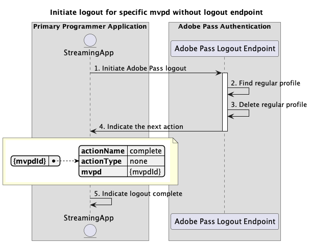

# 기본 애플리케이션 내에서 수행되는 기본 로그아웃 흐름 {#basic-logout-flow-performed-within-primary-application}

Adobe Pass 인증 권한 내의 **로그아웃 흐름**&#x200B;을(를) 사용하면 스트리밍 응용 프로그램에서 두 가지 기본 단계를 수행할 수 있습니다.

* Adobe Pass 백엔드에 저장된 일반 프로필을 삭제합니다.
* 사용자 에이전트(브라우저)를 사용하여 MVPD 로그아웃 끝점으로 이동하여 MVPD 백엔드에서 정리가 트리거됩니다.

기본 로그아웃 흐름을 사용하면 다음 시나리오를 쿼리할 수 있습니다.

* [로그아웃 끝점을 사용하여 특정 mvpd에 대한 로그아웃 시작](#initiate-logout-for-specific-mvpd-with-logout-endpoint)
* [로그아웃 끝점을 사용하지 않고 특정 mvpd에 대한 로그아웃 시작](#initiate-logout-for-specific-mvpd-without-logout-endpoint)

## 로그아웃 끝점이 있는 특정 mvpd에 대한 로그아웃 시작 {#initiate-logout-for-specific-mvpd-with-logout-endpoint}

### 전제 조건 {#prerequisites-initiate-logout-for-specific-mvpd-with-logout-endpoint}

로그아웃 끝점이 있는 특정 MVPD에 대한 로그아웃을 시작하기 전에 다음 전제 조건이 충족되는지 확인하십시오.

* 스트리밍 애플리케이션에는 기본 인증 흐름 중 하나를 사용하여 MVPD에 대해 성공적으로 생성된 올바른 일반 프로필이 있어야 합니다.
   * [기본 응용 프로그램 내에서 인증 수행](../basic-flows/rest-api-v2-basic-authentication-primary-application-flow.md)
   * [사전 선택된 mvpd로 보조 응용 프로그램 내에서 인증 수행](../basic-flows/rest-api-v2-basic-authentication-secondary-application-flow.md)
   * [미리 선택된 mvpd 없이 보조 응용 프로그램 내에서 인증 수행](../basic-flows/rest-api-v2-basic-authentication-secondary-application-flow.md)
* 스트리밍 애플리케이션은 MVPD에서 로그아웃해야 할 때 로그아웃 흐름을 시작해야 합니다.

>[!IMPORTANT]
>
> 가정
>
>  
> 
> * MVPD가 로그아웃 흐름을 지원하고 로그아웃 끝점이 있습니다.

### 워크플로 {#workflow-initiate-logout-for-specific-mvpd-with-logout-endpoint}

다음 다이어그램과 같이 기본 애플리케이션 내에서 로그아웃 끝점이 수행된 특정 MVPD에 대한 기본 로그아웃 흐름을 구현하려면 주어진 단계를 따르십시오.

*로그아웃 끝점이 있는 특정 mvpd에 대한 로그아웃 시작*

1. **Adobe Pass 로그아웃 시작:** 스트리밍 애플리케이션은 Adobe Pass 로그아웃 끝점을 호출하여 로그아웃 흐름을 시작하는 데 필요한 모든 데이터를 수집합니다.

   자세한 내용은 [특정 mvpd에 대한 로그아웃 시작](../../apis/logout-apis/rest-api-v2-logout-apis-initiate-logout-for-specific-mvpd.md) API 설명서를 참조하십시오.
   * `serviceProvider`, `mvpd` 및 `redirectUrl`과(와) 같은 모든 _필수_ 매개 변수
   * `Authorization`, `AP-Device-Identifier`과(와) 같은 모든 _required_ 헤더
   * 모든 _선택적_ 매개 변수 및 헤더

1. **일반 프로필 찾기:** Adobe Pass 서버는 받은 매개 변수와 헤더를 기반으로 올바른 프로필을 식별합니다.

1. **일반 프로필 삭제:** Adobe Pass 서버는 Adobe Pass 백엔드에서 식별된 일반 프로필을 삭제합니다.

1. **다음 작업을 나타냅니다.** Adobe Pass Logout 끝점 응답에는 다음 작업에 대해 스트리밍 응용 프로그램을 안내하는 데 필요한 데이터가 포함되어 있습니다.
   * MVPD가 로그아웃 흐름을 지원하므로 `url` 특성이 있습니다.
   * `actionName` 특성이 &quot;logout&quot;으로 설정되어 있습니다.
   * `actionType` 특성이 &quot;interactive&quot;로 설정되어 있습니다.

   로그아웃 응답에 제공된 정보에 대한 자세한 내용은 [특정 mvpd에 대한 로그아웃 시작](../../apis/logout-apis/rest-api-v2-logout-apis-initiate-logout-for-specific-mvpd.md) API 설명서를 참조하십시오.

   >[!IMPORTANT]
   >
   > Adobe Pass Logout 끝점은 요청 데이터를 확인하여 기본 조건이 충족되는지 확인합니다.
   >
   > * _required_ 매개 변수와 헤더가 유효해야 합니다.
   > * 입력한 `serviceProvider`과(와) `mvpd` 간의 통합이 활성화되어 있어야 합니다.
   >
   >  
   > 
   > 유효성 검사가 실패하면 오류 응답이 생성되고 [향상된 오류 코드](../../../enhanced-error-codes.md) 설명서를 준수하는 추가 정보가 제공됩니다.

1. **MVPD 로그아웃 시작:** 스트리밍 응용 프로그램에서 `url`을(를) 읽고 사용자 에이전트를 사용하여 MVPD로 로그아웃 흐름을 시작합니다. 플로우는 MVPD 시스템으로의 몇 가지 리디렉션을 포함할 수 있다. 여전히, 그 결과는 MVPD가 내부 정리를 수행하고 최종 로그아웃 확인을 다시 Adobe Pass 백엔드로 보내는 것입니다.

1. **로그아웃 완료 표시:** 스트리밍 응용 프로그램은 사용자 에이전트가 제공된 `redirectUrl`에 도달할 때까지 기다릴 수 있으며 선택적으로 사용자 인터페이스에 특정 메시지를 표시하는 신호로 사용할 수 있습니다.

## 로그아웃 끝점을 사용하지 않고 특정 mvpd에 대한 로그아웃 시작 {#initiate-logout-for-specific-mvpd-without-logout-endpoint}

### 전제 조건 {#prerequisites-initiate-logout-for-specific-mvpd-without-logout-endpoint}

로그아웃 끝점이 없는 특정 MVPD에 대한 로그아웃을 시작하기 전에 다음 전제 조건이 충족되는지 확인하십시오.

* 스트리밍 애플리케이션에는 기본 인증 흐름 중 하나를 사용하여 MVPD에 대해 성공적으로 생성된 올바른 일반 프로필이 있어야 합니다.
   * [기본 응용 프로그램 내에서 인증 수행](../basic-flows/rest-api-v2-basic-authentication-primary-application-flow.md)
   * [사전 선택된 mvpd로 보조 응용 프로그램 내에서 인증 수행](../basic-flows/rest-api-v2-basic-authentication-secondary-application-flow.md)
   * [미리 선택된 mvpd 없이 보조 응용 프로그램 내에서 인증 수행](../basic-flows/rest-api-v2-basic-authentication-secondary-application-flow.md)
* 스트리밍 애플리케이션은 MVPD에서 로그아웃해야 할 때 로그아웃 흐름을 시작해야 합니다.

>[!IMPORTANT]
>
> 가정
>
>  
> 
> * MVPD는 로그아웃 흐름을 지원하지 않으며 로그아웃 끝점이 없습니다.

### 워크플로 {#workflow-initiate-logout-for-specific-mvpd-without-logout-endpoint}

다음 다이어그램과 같이 기본 응용 프로그램 내에서 로그아웃 끝점이 수행되지 않고 특정 MVPD에 대한 기본 로그아웃 흐름을 구현하려면 지정된 단계를 따르십시오.

*로그아웃 끝점이 없는 특정 mvpd에 대한 로그아웃 시작*

1. **Adobe Pass 로그아웃 시작:** 스트리밍 애플리케이션은 Adobe Pass 로그아웃 끝점을 호출하여 로그아웃 흐름을 시작하는 데 필요한 모든 데이터를 수집합니다.

   자세한 내용은 [특정 mvpd에 대한 로그아웃 시작](../../apis/logout-apis/rest-api-v2-logout-apis-initiate-logout-for-specific-mvpd.md) API 설명서를 참조하십시오.
   * `serviceProvider`, `mvpd` 및 `redirectUrl`과(와) 같은 모든 _필수_ 매개 변수
   * `Authorization`, `AP-Device-Identifier`과(와) 같은 모든 _required_ 헤더
   * 모든 _선택적_ 매개 변수 및 헤더

1. **일반 프로필 찾기:** Adobe Pass 서버는 받은 매개 변수와 헤더를 기반으로 올바른 프로필을 식별합니다.

1. **일반 프로필 삭제:** Adobe Pass 서버가 식별된 일반 프로필을 삭제합니다.

1. **다음 작업을 나타냅니다.** Adobe Pass Logout 끝점 응답에는 다음 작업에 대해 스트리밍 응용 프로그램을 안내하는 데 필요한 데이터가 포함되어 있습니다.
   * MVPD가 로그아웃 흐름을 지원하지 않으므로 `url` 특성이 없습니다.
   * `actionName` 특성이 &quot;complete&quot;로 설정되어 있습니다.
   * `actionType` 특성이 &quot;none&quot;으로 설정되어 있습니다.

   로그아웃 응답에 제공된 정보에 대한 자세한 내용은 [특정 mvpd에 대한 로그아웃 시작](../../apis/logout-apis/rest-api-v2-logout-apis-initiate-logout-for-specific-mvpd.md) API 설명서를 참조하십시오.

   >[!IMPORTANT]
   >
   > Adobe Pass Logout 끝점은 요청 데이터를 확인하여 기본 조건이 충족되는지 확인합니다.
   >
   > * _required_ 매개 변수와 헤더가 유효해야 합니다.
   > * 입력한 `serviceProvider`과(와) `mvpd` 간의 통합이 활성화되어 있어야 합니다.
   >
   >  
   > 
   > 유효성 검사가 실패하면 오류 응답이 생성되고 [향상된 오류 코드](../../../enhanced-error-codes.md) 설명서를 준수하는 추가 정보가 제공됩니다.

1. **로그아웃 완료 표시:** 스트리밍 응용 프로그램에서 응답을 처리하고, 이 응답을 사용하여 사용자 인터페이스에 특정 메시지를 선택적으로 표시할 수 있습니다.
