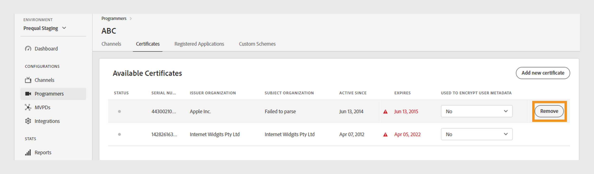

# 프로그래머 {#programmers}

>[!NOTE]
>
>이 페이지의 컨텐츠는 정보용으로만 제공됩니다. 이 API를 사용하려면 Adobe의 현재 라이선스가 필요합니다. 허가되지 않은 사용은 허용되지 않습니다.

다음 **프로그래머** TVE 대시보드 섹션에서 다음에 대한 설정을 보고 관리할 수 있습니다. [프로그래머](/help/authentication/glossary.md#programmer) 계정 권한에 연결되었습니다. 다음을 수행할 수도 있습니다. [새 프로그래머 추가](#add-new-programmer) 귀하의 요구 사항에 따라.

다음 **프로그래머** 왼쪽 패널의 탭에는 다음 세부 정보가 포함된 기존 프로그래머 목록이 표시됩니다.

* **프로그래머 ID**: 시스템 내의 미디어 회사 식별자입니다.
* **채널**: 프로그래머에 연결된 관련 채널 수

*기존 프로그래머 목록*

에 프로그래머의 이름을 입력합니다. **검색** 프로그래머에 대해 자세히 알아보려면 목록 위에 표시하십시오.

## 프로그래머 구성 관리 {#manage-programmer-conf}

특정 프로그래머의 다양한 설정을 관리하려면 다음 단계를 따르십시오.

1. 다음 항목 선택 **프로그래머** 왼쪽 패널의 탭입니다.
1. 목록에서 프로그래머를 선택하십시오.
1. 다음 탭 중 하나를 선택하여 선택한 프로그래머의 해당 설정을 보고 편집합니다.

   * [채널](#channels)
   * [인증서](#certificates)
   * [등록된 응용 프로그램](#registered-applications)
   * [사용자 지정 체계](#custom-schemes)

   

   *프로그래머 설정*

>[!IMPORTANT]
>
> 보기 [변경 사항 검토 및 푸시](/help/authentication/tve-dashboard-review-push-changes.md) 구성 변경 사항 활성화에 대한 자세한 내용은 을 참조하십시오.

### 채널 {#channels}

이 탭에는 현재 프로그래머와 연결된 채널 목록이 표시됩니다. 이 목록에서 특정 채널을 선택하여 의 세부 정보에 액세스합니다. [채널](/help/authentication/tve-dashboard-channels.md) 섹션.

선택한 프로그래머에 대해 새 채널을 추가하려면 **새 채널 추가** 의 오른쪽 위 모서리에서 **사용 가능한 채널** 섹션. 학습 [새 채널을 추가하는 방법](/help/authentication/tve-dashboard-channels.md#add-new-channel).

*새 채널 추가*

### 인증서 {#certificates}

이 탭에는 다음 목록이 표시됩니다. [사용 가능한 인증서](#available-certificates) 사용자 메타데이터 암호화 흐름에 사용됩니다. 다음을 포함하는 각 인증서에 대한 세부 정보가 표시됩니다.

* 상태(활성화 여부) **사용자 메타데이터 암호화** 사용 여부)
* 시리얼 번호
* 발급자 조직의 이름
* 주체 조직의 이름
* 발행 날짜
* 만료일
* 사용자 메타데이터를 암호화하는 드롭다운 메뉴(선택하는 경우) **예**&#x200B;를 입력하면 인증서는 우편 번호 값과 같은 중요한 사용자 정보를 암호화합니다.

#### 사용 가능한 인증서 {#available-certificates}

이러한 인증서는 개인 또는 공개 키 역할을 하며 사용자 메타데이터 암호화에 사용됩니다. 동일한 미디어 회사와 연결된 모든 채널은 이 인증서를 사용할 수 있습니다.

사용 가능한 인증서에 대해 다음과 같이 변경할 수 있습니다.

* [새 인증서 추가](#add-new-certificate)
* [인증서 삭제](#delete-certificate)

##### 새 인증서 추가 {#add-new-certificate}

새 인증서를 추가하려면 다음 단계를 따르십시오.

1. 선택 **새 인증서 추가** 의 오른쪽 위 모서리 **사용 가능한 인증서** 섹션.

   

   *새 인증서 추가*

1. 인증서의 공개 키를 **새 인증서** 대화 상자.
1. 선택 **인증서 추가**.

   새 구성 변경이 생성되었으며 서버를 업데이트할 준비가 되었습니다. 다음에 나열된 새 인증서를 사용하려면 **사용 가능한 인증서** 섹션, 다음 작업을 계속 [변경 사항 검토 및 푸시](/help/authentication/tve-dashboard-review-push-changes.md) 흐름.

1. 목록에서 새 인증서 찾기 **사용 가능한 인증서**.

   >[!IMPORTANT]
   >
   > 시스템이 최신 상태이고 새 인증서를 사용할 준비가 되었는지 확인하십시오.

1. 선택 **예** 출처: **암호화된 사용자 메타데이터에 사용됨** 드롭다운 메뉴를 사용하여 새 인증서를 활성화합니다.

##### 인증서 삭제 {#delete-certificate}

인증서를 삭제하려면 다음 단계를 따르십시오.

1. 다음 목록에서 삭제할 인증서를 마우스로 가리킵니다. **사용 가능한 인증서**.
1. 선택 **제거**.

   

   *선택한 인증서 제거*

1. 선택 **삭제** 다음에 있음 **인증서 삭제** 대화 상자.

새 구성 변경이 생성되었으며 서버를 업데이트할 준비가 되었습니다. 인증서가 다음에서 삭제됩니다 **사용 가능한 인증서** 다음 이후에만 섹션 추가 [변경 사항 검토 및 푸시](/help/authentication/tve-dashboard-review-push-changes.md).

### 등록된 응용 프로그램 {#registered-applications}

이 탭에는 응용 프로그램 등록 목록이 제공됩니다. 보기 [동적 클라이언트 등록 관리](/help/authentication/dynamic-client-registration-management.md)를 참조하십시오.

### 사용자 지정 체계 {#custom-schemes}

이 탭에는 사용자 지정 체계 목록이 표시됩니다. 보기 [iOS/tvOS 애플리케이션 등록](/help/authentication/iostvos-application-registration.md) 및 [동적 클라이언트 등록 관리](/help/authentication/dynamic-client-registration-management.md)를 참조하십시오.

## 새 프로그래머 추가 {#add-new-programmer}

새 프로그래머 엔티티를 추가하려면 다음 단계를 따르십시오.

1. 다음 항목 선택 **프로그래머** 왼쪽 패널의 탭입니다.
1. 선택 **새 프로그래머 추가** 의 오른쪽 위 모서리 **프로그래머** 섹션.

   

   *새 프로그래머 추가*

1. 에 미디어 회사 식별자 입력 **프로그래머 ID** 다음에서 **새 프로그래머** 대화 상자.
1. 아래 콘솔에 표시할 상용 브랜드 이름을 입력합니다. **표시 이름**.
1. 선택 **프로그래머 추가**.

새 구성 변경이 생성되었으며 서버를 업데이트할 준비가 되었습니다. 다음에 나열된 새 프로그래머를 사용하려면 **프로그래머** 섹션, 다음 작업을 계속 [변경 사항 검토 및 푸시](/help/authentication/tve-dashboard-review-push-changes.md) 흐름.

