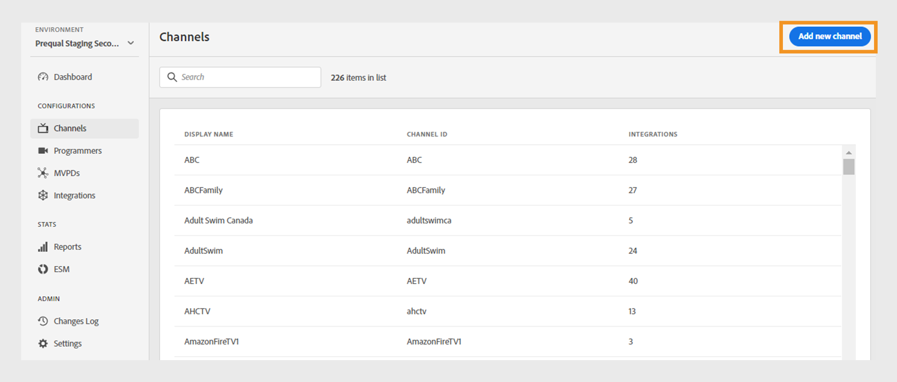

# 채널 {#channels}

>[!NOTE]
>
>이 페이지의 컨텐츠는 정보용으로만 제공됩니다. 이 API를 사용하려면 Adobe의 현재 라이선스가 필요합니다. 허가되지 않은 사용은 허용되지 않습니다.

TVE 대시보드의 **채널** 섹션에서 특정 프로그래머와 연결된 채널의 설정을 보고 관리할 수 있습니다. 필요에 따라 [새 채널을 추가](#add-new-channel)할 수도 있습니다.

왼쪽 패널의 **채널** 탭에는 다음 세부 정보와 함께 연결된 채널 목록이 표시됩니다.

* **표시 이름**: 상업용으로 사용되는 채널의 브랜드 이름입니다.
* **채널 ID**: 요청자 ID라고도 하는 고유 식별자입니다.
* **통합**: [MVPD](/help/authentication/glossary.md#mvpd)에 설정된 연결 수

*기존 채널 목록*

채널에 대해 자세히 알아보려면 목록 위의 **검색** 막대에 채널 이름을 입력하십시오.

## 채널 구성 관리 {#manage-channel-conf}

특정 채널의 다양한 설정을 관리하려면 단계를 따르십시오.

1. 왼쪽 패널에서 **채널** 탭을 선택합니다.

1. 사용 가능한 목록에서 채널을 선택합니다.

1. 다음 탭 중 하나를 선택하여 선택한 채널의 해당 설정을 보고 편집합니다.

   * [일반 설정](#general-settings)
   * [통합](#integrations)
   * [인증서](#certificates)
   * [도메인](#domains)
   * [등록된 응용 프로그램](#registered-applications)
   * [사용자 지정 체계](#custom-schemes)

   

   *채널 설정*

>[!IMPORTANT]
>
> 구성 변경 내용을 활성화하는 방법에 대한 자세한 내용은 [변경 내용 검토 및 푸시](/help/authentication/tve-dashboard/new-tve-dashboard/tve-dashboard-review-push-changes.md)를 참조하십시오.

### 일반 설정 {#general-settings}

이 탭에는 **채널 정보** 및 **Analytics 구성**&#x200B;이 표시됩니다.

#### 채널 정보 {#channel-information}

이 섹션에서는 다음 세부 정보를 편집할 수 있습니다.

* **표시 이름**: 상업용으로 사용되는 채널의 브랜드 이름입니다.

* **기본 리디렉션 URL**: 인증 및 로그아웃용 백업 리디렉션 URL입니다.

* **오류 보고**: **예**&#x200B;를 선택하면 Adobe Pass SDK에서 분석을 위해 Adobe Pass 백엔드로 오류 보고서를 보냅니다.

*채널 정보 편집*

#### Analytics 구성 {#analytics-configuration}

이 섹션에서는 Adobe Pass 인증 이벤트를 Adobe Analytics에 전달하도록 구성할 수 있습니다.

**Analytics 구성**&#x200B;을(를) 사용하려면 RSID(보고서 세트 ID) 설정에 대한 자세한 내용을 기술 계정 관리자(TAM)에게 문의하십시오.

*Analytics 구성 사용*

**새 분석 구성 추가**&#x200B;를 선택하여 여러 구성을 추가합니다.

새 구성 변경이 생성되었으며 서버를 업데이트할 준비가 되었습니다. **Analytics 구성** 섹션에서 새 Analytics 구성을 사용하려면 [변경 내용 검토 및 푸시](/help/authentication/tve-dashboard/new-tve-dashboard/tve-dashboard-review-push-changes.md) 흐름을 진행하십시오.

### 통합 {#integrations}

이 탭에는 현재 선택한 채널과 MVPD 간의 사용 가능한 통합 목록이 표시됩니다. 이 목록에는 각 통합이 활성화 여부를 나타내는 상태와 함께 표시됩니다. [통합](tve-dashboard-integrations.md) 섹션의 자세한 정보에 액세스하려면 이 목록에서 특정 통합을 선택하십시오.

*사용 가능한 통합 목록*

### 인증서 {#certificates}

이 탭에는 사용자 메타데이터 암호화 흐름에 사용된 [사용 가능한 인증서](#available-certificates) 및 [상속된 사용 가능한 인증서](#inherited-avail-certificates) 목록이 표시됩니다. 다음을 포함하는 각 인증서에 대한 세부 정보가 표시됩니다.

* 상태(**사용자 메타데이터 암호화** 사용에 대해 사용할지 여부)
* 시리얼 번호
* 발급자 조직의 이름
* 주체 조직의 이름
* 발행 날짜
* 만료일
* 사용자 메타데이터를 암호화하기 위한 드롭다운 메뉴(**예**&#x200B;를 선택하는 경우, 인증서는 우편 번호 값과 같은 중요한 사용자 정보를 암호화합니다).

#### 사용 가능한 인증서 {#available-certificates}

이러한 인증서는 개인 또는 공개 키 역할을 하며 사용자 메타데이터 암호화에 사용됩니다.
사용 가능한 인증서 섹션에서 다음과 같이 변경할 수 있습니다.

* [새 인증서 추가](#add-new-certificate)
* [인증서 삭제](#delete-certificate)

##### 새 인증서 추가 {#add-new-certificate}

새 인증서를 추가하려면 다음 단계를 따르십시오.

1. **사용 가능한 인증서** 섹션 맨 위에서 **새 인증서 추가**&#x200B;를 선택합니다.

   

   *새 인증서 추가*

1. 인증서의 공개 키를 **새 인증서** 대화 상자에 붙여 넣으십시오.

1. **인증서 추가**&#x200B;를 선택합니다.

1. **사용 가능한 인증서** 목록에서 새 인증서를 찾습니다.

   >[!IMPORTANT]
   >
   > 시스템이 최신 상태이고 새 인증서를 사용할 준비가 되었는지 확인하십시오.

1. **사용자 메타데이터를 암호화하는데 사용** 드롭다운 메뉴에서 **예**&#x200B;를 선택하여 새 인증서를 활성화합니다.

새 구성 변경이 생성되었으며 서버를 업데이트할 준비가 되었습니다. **사용 가능한 인증서** 섹션에 나열된 새 인증서를 사용하려면 [변경 내용 검토 및 푸시](/help/authentication/tve-dashboard/new-tve-dashboard/tve-dashboard-review-push-changes.md) 흐름을 진행하십시오.

##### 인증서 삭제 {#delete-certificate}

인증서를 삭제하려면 다음 단계를 따르십시오.

1. **사용 가능한 인증서** 목록에서 삭제할 인증서를 마우스로 가리킵니다.

1. **제거**&#x200B;를 선택합니다.

   

   *선택한 인증서 제거*

1. **활성 인증서 삭제** 대화 상자에서 **삭제**&#x200B;을(를) 선택합니다.

새 구성 변경이 생성되었으며 서버를 업데이트할 준비가 되었습니다. [변경 내용 검토 및 푸시](/help/authentication/tve-dashboard/new-tve-dashboard/tve-dashboard-review-push-changes.md)한 후에만 **사용 가능한 인증서** 섹션에서 인증서가 삭제됩니다.

#### 상속된 사용 가능한 인증서 {#inherited-avail-certificates}

미디어 회사들은 이러한 인증서를 자체 수준에서 정의합니다. 동일한 미디어 회사와 연결된 모든 채널은 이 인증서를 사용할 수 있습니다.

*상속된 사용 가능한 인증서*

### 도메인 {#domains}

이 탭에는 각 채널이 Adobe Pass 인증과 통신하는 데 사용할 수 있는 도메인 목록이 표시됩니다.

도메인을 다음과 같이 변경할 수 있습니다.

* [새 도메인 추가](#add-domains)
* [도메인 삭제](#delete-domain)

>[!TIP]
>
> 목록에 더 일반적인 도메인이 있는 경우 새 하위 도메인을 추가하지 마십시오.

#### 새 도메인 추가 {#add-domains}

도메인을 추가하려면 다음 단계를 따르십시오.

1. **사용 가능한 도메인** 섹션의 오른쪽 상단 모서리에서 **새 도메인 추가**&#x200B;를 선택합니다.

   

   *새 도메인 추가*

1. **새 도메인** 대화 상자에 도메인 이름을 입력하십시오.

1. **도메인 추가**&#x200B;를 선택하여 선택한 채널에 대한 새 도메인을 추가합니다.

새 구성 변경이 생성되었으며 서버를 업데이트할 준비가 되었습니다. **사용 가능한 도메인** 섹션에 나열된 새 도메인을 사용하려면 [변경 내용 검토 및 푸시](/help/authentication/tve-dashboard/new-tve-dashboard/tve-dashboard-review-push-changes.md) 흐름을 진행하십시오.

#### 도메인 삭제 {#delete-domain}

도메인을 삭제하려면 다음 단계를 따르십시오.

1. **사용 가능한 도메인** 목록에서 삭제할 도메인을 마우스로 가리킵니다.

1. **제거**&#x200B;를 선택합니다.

   

   *선택한 도메인 제거*

1. **도메인 삭제** 대화 상자에서 **삭제**&#x200B;을(를) 선택합니다.

새 구성 변경이 생성되었으며 서버를 업데이트할 준비가 되었습니다. [변경 내용 검토 및 푸시](/help/authentication/tve-dashboard/new-tve-dashboard/tve-dashboard-review-push-changes.md)한 후에만 **사용 가능한 도메인** 섹션에서 도메인이 삭제됩니다.

선택한 도메인은 더 이상 사용할 수 없습니다. 따라서 이 도메인과 연결된 애플리케이션은 Adobe Pass 인증 서비스에 액세스할 수 없게 됩니다.

### 등록된 응용 프로그램 {#registered-applications}

이 탭에는 사용자 지정 체계 목록이 표시됩니다. [iOS/tvOS 응용 프로그램 등록](/help/authentication/iostvos-application-registration.md) 보기

## 새 채널 추가 {#add-new-channel}

다음 단계에 따라 새 채널을 추가합니다.

1. 왼쪽 패널에서 **채널** 탭을 선택합니다.

1. **채널** 섹션의 오른쪽 상단 모서리에서 **새 채널 추가**&#x200B;를 선택합니다.

   

   *새 채널 추가*

1. **새 채널** 대화 상자의 드롭다운 메뉴에서 **프로그래머 ID**&#x200B;을(를) 선택합니다.

1. **채널 ID**&#x200B;에 고유 식별자를 입력하십시오.

1. 상업용으로 사용되는 채널의 브랜드 이름을 **표시 이름**&#x200B;에 입력하십시오.

1. **채널 추가**&#x200B;를 선택합니다.

새 구성 변경이 생성되었으며 서버를 업데이트할 준비가 되었습니다. **채널** 섹션에 나열된 새 채널을 사용하려면 [변경 내용 검토 및 푸시](/help/authentication/tve-dashboard/new-tve-dashboard/tve-dashboard-review-push-changes.md) 흐름을 진행하십시오.
