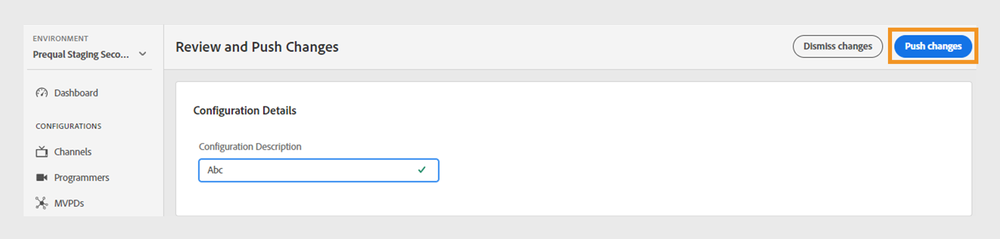

# 변경 사항 검토 및 푸시

>[!NOTE]
>
>이 페이지의 컨텐츠는 정보용으로만 제공됩니다. 이 API를 사용하려면 Adobe의 현재 라이선스가 필요합니다. 허가되지 않은 사용은 허용되지 않습니다.

TVE Dashboard를 사용하면 현재 구성에 대한 변경 사항을 검토한 다음 서버에 배포할 수 있습니다. 현재 구성을 수정할 때마다 이러한 변경 사항을 검토하고 푸시하라는 알림이 화면에 표시됩니다.

다음 단계에 따라 변경 사항을 검토하고 푸시합니다.

1. 화면 하단에서 검토 및 변경 사항 푸시 알림을 찾습니다.

   

   *변경 내용 검토 및 푸시 알림 상자*

1. **변경 내용 검토 및 푸시** 알림 상자에서 **변경 내용 검토**&#x200B;를 선택합니다.

1. 각 변경 내용을 효과적으로 추적하고 이해하려면 **구성 설명**&#x200B;에 변경 내용에 대한 간단한 설명을 입력하십시오.

   

   *구성 설명 추가*

1. 변경 내용 요약을 보려면 **구성 변경 내용** 섹션으로 이동하십시오.

1. 검토할 변경 사항을 마우스로 가리킵니다.

1. 구성 변경과 관련된 이전 값과 새 값을 검토하려면 **보기**&#x200B;를 선택하십시오.

   

   *구성 변경 내용 보기*

1. 모든 변경 내용을 검토한 후 모든 내용이 올바르게 보이면 **변경 내용 푸시**&#x200B;를 선택하여 업데이트된 구성을 서버에 적용합니다.

   >[!NOTE]
   >
   >**구성 설명**&#x200B;을 추가한 후에만 **변경 사항 푸시** 단추가 활성화됩니다.

   

   *변경 내용 푸시*

   또는 나열된 구성 변경 내용을 모두 되돌리려면 **변경 내용 취소**&#x200B;를 선택할 수 있습니다.
