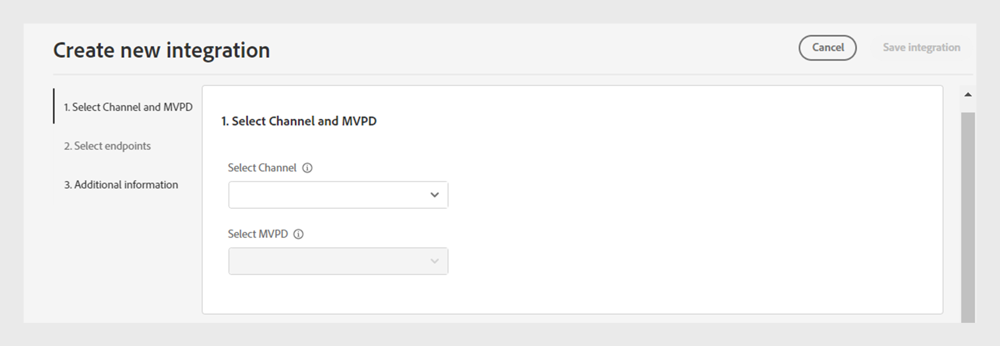
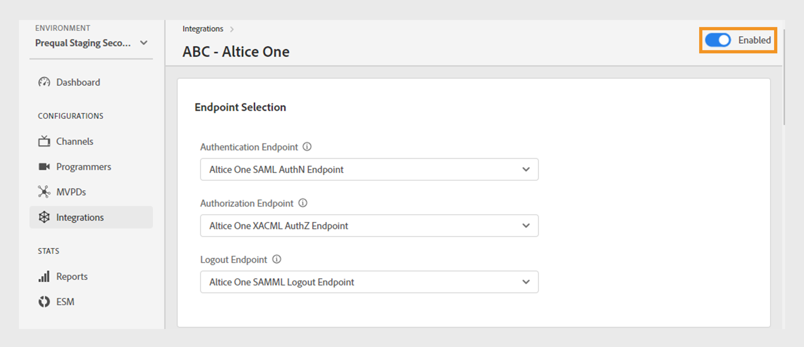

# 통합

>[!NOTE]
>
>이 페이지의 컨텐츠는 정보용으로만 제공됩니다. 이 API를 사용하려면 Adobe의 현재 라이선스가 필요합니다. 허가되지 않은 사용은 허용되지 않습니다.

TVE 대시보드의 **통합** 섹션에서 채널과 MVPD 간의 통합에 대한 설정을 보고 관리할 수 있습니다. 필요에 따라 [새 통합을 만들](#create-new-integration)수도 있습니다.

왼쪽 패널의 **통합** 탭에는 다음 세부 정보가 포함된 기존 통합 목록이 표시됩니다.

* 통합이 현재 활성 또는 비활성 상태인지 나타내는 상태
* 특정 채널을 각 MVPD와 연결하는 통합
* 채널 ID가 있는 채널 이름
* MVPD 표시 이름 및 MVPD ID

*기존 통합 목록*

통합에 대해 자세히 알아보려면 목록 위의 **검색** 막대에 채널 또는 MVPD 이름을 입력하십시오.

## 통합 구성 관리 {#manage-integration-conf}

특정 통합을 관리하려면 다음 단계를 따르십시오.

1. 왼쪽 패널에서 **통합** 탭을 선택합니다.
1. 제공된 목록에서 통합을 선택하여 다음 섹션에서 다양한 설정을 보고 편집합니다.

   * [끝점 선택](#endpoint-selection)
   * [플랫폼 설정](#platform-settings)
   * [사용자 메타데이터](#user-metadata)

>[!IMPORTANT]
>
> 구성 변경 내용을 활성화하는 방법에 대한 자세한 내용은 [변경 내용 검토 및 푸시](/help/authentication/user-guide-tve-dashboard/tve-dashboard-review-push-changes.md)를 참조하십시오.

### 끝점 선택 {#endpoint-selection}

이 섹션에서는 각 드롭다운 메뉴에서 인증, 권한 부여 및 로그아웃 흐름에 사용되는 MVPD의 끝점을 선택할 수 있습니다.

*인증, 권한 부여 및 로그아웃 흐름을 위한 끝점*

>[!NOTE]
>
>MVPD는 각 흐름에 대해 하나 또는 여러 끝점을 제공할 수 있습니다. 새 채널을 통합할 때 MVPD은 각 흐름에 대해 선호하는 끝점을 지정해야 합니다.

>[!IMPORTANT]
>
>끝점을 변경하면 통합의 전체 동작에 영향을 줍니다. 이러한 변경 사항은 MVPD의 확인을 받은 후에만 구현해야 합니다.

### 플랫폼 설정 {#platform-settings}

이 섹션에서는 모든 [플랫폼](/help/authentication/user-guide-tve-dashboard/tve-dashboard-reports.md#platforms)에서 통합 설정을 보고 편집할 수 있습니다. 개별 플랫폼에 따라 이러한 설정을 변경할 수 있습니다. 예를 들어 다른 플랫폼에 대한 기본값을 유지하면서 Android에서 인증 TTL 기간을 조정할 수 있습니다.

플랫폼 설정의 각 속성은 MVPD에서 설정한 기본값을 상속하지만 필요한 경우 조정할 수 있습니다.

>[!IMPORTANT]
>
>플랫폼 설정의 각 속성에 대해 설정된 값을 결정하려면 MVPD과의 계약이 필요합니다.

>[!IMPORTANT]
>
> 설정 상속은 가장 일반적인 MVPD 설정, MVPD 끝점, 통합, 플랫폼 범주 및 플랫폼(가장 구체적인 값을 보유함)에서 시작하는 체인을 따릅니다.

**플랫폼 설정**&#x200B;은(는) 상속 체인의 각 수준에 대한 설정을 재정의하는 데 사용됩니다. 체인의 사용 가능한 레벨은 다음과 같이 그룹화됩니다.

* **모두를 위한 기본값**: 특정 플랫폼 값이 정의되지 않은 경우 프로그래머의 구현에 관계없이 모든 플랫폼에서 전체적으로 적용할 수 있는 속성의 값을 설정합니다.

* **데스크톱 장치**: 프로그래밍 방법(JS SDK 또는 REST API)에 관계없이 모든 데스크톱 및 랩톱 컴퓨터에 적용할 수 있는 속성 값을 설정합니다.

* **모바일 장치**: 프로그래밍 방법(SDK 또는 REST API)에 관계없이 **iOS**, **Android** 등을 포함하여 모든 모바일 장치에 적용할 수 있는 속성의 값을 설정합니다.

* **TV 연결 장치**: 프로그래밍 방법(SDK 또는 REST API)에 관계없이 **tvOS**, **Roku**, **FireTV** 등을 포함하여 모든 TV 연결 장치에 적용할 수 있는 속성 값을 설정합니다.

* **알 수 없는 장치**: 현재 메커니즘이 플랫폼을 정확하게 식별할 수 없는 모든 장치에 적용할 수 있는 속성의 값을 설정합니다. 이러한 경우 MVPD에서 정의한 가장 제한적인 규칙을 적용합니다.

  

  *플랫폼 및 해당 장치의 범주*

선택 위에서 설명한 각 상속 수준에 사용되는 속성을 살펴보기 위해 각 속성의 오른쪽에 있는  아이콘

#### 가장 많이 사용되는 비즈니스 플로우 {#most-used-flows}

**플랫폼 설정** 섹션은 다양한 비즈니스 흐름에서 사용되는 다양한 속성을 제공합니다. 실제 속성들은 특정 통합에서 선택된 MVPD들에 따라 변할 수 있다. 다음은 가장 많이 사용되는 흐름입니다.

모든 플랫폼에서 **AuthN TTL 및 AuthZ TTL**

>[!IMPORTANT]
>
>인증(AuthN) TTL 및 권한 부여(AuthZ) TTL 값은 MVPD 설정과 일관되게 일치해야 합니다.

특정 통합을 위해 모든 플랫폼에서 인증 및 권한 부여 TTL을 변경하려면 다음 단계를 따르십시오.

1. 왼쪽 패널에서 **통합** 탭을 선택합니다.

1. AuthN TTL 및 AuthZ TTL 값을 변경할 통합을 선택하십시오.

1. **플랫폼 설정** 섹션으로 이동합니다.

1. **플랫폼 설정**&#x200B;에서 **모두 기본** 탭을 선택합니다.

   >[!NOTE]
   >
   >플랫폼 범주 또는 특정 플랫폼에 대한 **AuthN TTL** 및 **AuthZ TTL**&#x200B;의 기간을 변경하려면 그에 따라 플랫폼을 선택하십시오.

   

   *모든 플랫폼에서 AuthN TTL AuthZ TTL 기간 변경*

   **A.** AuthN TTL 속성 **B.** AuthZ TTL 속성

1. 위쪽 및 아래쪽 화살표를 선택하여 **AuthN TTL** 및 **AuthZ TTL** 속성의 일, 시간, 분 및 초 수를 조정합니다.

모든 플랫폼에서 **AuthN TTL** 및 **AuthZ TTL**&#x200B;의 기간은 [변경 내용을 검토하고 푸시](/help/authentication/user-guide-tve-dashboard/tve-dashboard-review-push-changes.md)한 후에만 업데이트됩니다.

**플랫폼 SSO 사용**

>[!IMPORTANT]
>
>**단일 사인온 사용** 속성은 *iOS, tvOS, Roku 및 FireTV* 플랫폼에서만 지원됩니다. 이러한 플랫폼에 대한 SSO(Single Sign-On)를 지원하는 MVPD와의 통합에만 적용됩니다.

특정 통합 및 플랫폼에 대해 SSO를 활성화하거나 비활성화하려면 다음 단계를 따르십시오.

1. 왼쪽 패널에서 **통합** 탭을 선택합니다.

1. SSO(Single Sign-On)를 활성화하거나 비활성화하려는 통합을 선택하십시오.

1. **플랫폼 설정** 섹션으로 이동합니다.

1. **플랫폼 설정**&#x200B;에서 SSO(Single Sign-On)를 활성화할 특정 플랫폼 또는 플랫폼 범주를 선택하십시오.

   

   *특정 플랫폼에 대해 SSO(Single Sign-On) 사용*

   **A.** Single Sign On 속성 **B.** 플랫폼 권한 적용 속성

1. **Single Sign On 사용** 드롭다운 메뉴에서 **예**&#x200B;를 선택하여 활성화하거나 **아니요**&#x200B;를 선택하여 비활성화합니다.

1. **플랫폼 권한 적용** 드롭다운 메뉴에서 **예**&#x200B;를 선택하여 활성화하거나 **아니요**&#x200B;를 선택하여 비활성화합니다.

   **플랫폼 권한 적용** 속성은 TV 공급자 구독에 대한 **허용** 또는 **거부** 플랫폼 액세스 허용 여부를 제어합니다.

   예를 들어 **SSO(Single Sign On) 활성화** 및 **플랫폼 권한 적용**&#x200B;이 모두 활성화되어 있고 사용자가 TV 공급자 구독에 대한 플랫폼 액세스를 거부하도록 선택하면 각 응용 프로그램(채널)은 다른 응용 프로그램(채널)에서 얻은 Adobe Pass 인증 토큰을 사용할 수 없습니다.

선택한 플랫폼에 대한 **Single Sign On** 속성은 [변경 내용을 검토하고 푸시한 후에](/help/authentication/user-guide-tve-dashboard/tve-dashboard-review-push-changes.md)만 사용 또는 사용 안 함으로 설정됩니다.

**홈 기반 인증 사용**

OAuth2 기반 MVPD에 대한 홈 기반 인증을 활성화하거나 비활성화하려면 다음 단계를 따르십시오.

1. 왼쪽 패널에서 **통합** 탭을 선택합니다.

1. 홈 기반 인증을 활성화하거나 비활성화하려는 통합을 선택합니다.

1. **플랫폼 설정** 섹션으로 이동합니다.

1. **플랫폼 설정**&#x200B;에서 홈 기반 인증을 사용할 특정 플랫폼 또는 플랫폼 범주를 선택하십시오.

   

   *특정 플랫폼에 대해 홈 기반 인증 사용*

   **A.** HBA 속성 **B.** HBA AuthN TTL 속성 시도

1. **HBA 시도** 드롭다운 메뉴에서 활성화하려면 **예**&#x200B;를 선택하고 비활성화하려면 **아니요**&#x200B;를 선택하십시오.

>[!IMPORTANT]
>
>**HBA AuthN TTL** 속성의 기간을 변경하면 안 됩니다. 이로 인해 인증 프로세스에서 예기치 않은 오류가 발생할 수 있습니다.

특정 MVPD에 대한 **시도 HBA** 속성은 [변경 내용을 검토하고 푸시한 후에만](/help/authentication/user-guide-tve-dashboard/tve-dashboard-review-push-changes.md) 사용 또는 사용 안 함으로 설정됩니다.

#### 더 많은 속성 추가 {#add-more-properties}

**속성을 더 추가**&#x200B;하면 통합을 위해, 특히 덜 일반적인 흐름을 위해 특정 속성을 추가로 포함할 수 있습니다.

다음 속성을 추가할 수 있습니다.

* 모든 플랫폼에 대해 왼쪽의 **모든 플랫폼에 대한 기본값** 탭을 선택합니다.
* 플랫폼 범주의 경우 왼쪽의 **데스크톱 장치**, **모바일 장치** 또는 **TV 연결 장치** 탭을 선택하십시오.
* 특정 장치의 경우 왼쪽의 **iOS**, **Android**, **tvOS**, **Roku** 또는 **FireTV** 탭을 선택하십시오.

다음은 이러한 속성을 추가하여 활성화할 수 있는 다양한 흐름의 몇 가지 예입니다.

**사전 승인된 리소스의 수를 변경합니다**

대부분의 MVPD는 기본적으로 최대 5개의 리소스 ID를 사용하여 Preflight authZ 호출을 지원합니다.
그러나 MVPD가 이 제한을 높이는 데 동의한 경우에는 **속성 추가**(으)로 이동하여 옵션 메뉴에서 **최대 리소스 프리플라이트**&#x200B;를 선택할 수 있습니다.

**Preflight 최대 리소스**&#x200B;에서 MVPD에 대해 동의한 제한을 지정할 수 있는 새 특성을 추가합니다.

*Preflight 최대 리소스 속성 추가*

**Preflight 최대 리소스** 속성은 [변경 내용 검토 및 푸시](/help/authentication/user-guide-tve-dashboard/tve-dashboard-review-push-changes.md) 후에만 추가됩니다.

**MVPD 표시 이름 또는 로고 URL 변경**

MVPD 선택기를 빌드하지 않고 대신 제공된 구성을 사용하는 프로그래머 애플리케이션의 경우 **속성 추가**(으)로 이동한 다음 옵션 메뉴에서 **표시 이름** 또는 **로고 URL**&#x200B;을(를) 선택하여 각 MVPD에 필요한 표시 이름 또는 로고 URL을 추가할 수 있습니다.

이러한 속성에 대한 다른 값은 장치 플랫폼 및 원하는 사용자 경험에 따라 동일한 MVPD에 사용할 수 있습니다.

*표시 이름 또는 로고 URL 속성 추가*

**표시 이름** 또는 **로고 URL** 속성은 [변경 내용 검토 및 푸시](/help/authentication/user-guide-tve-dashboard/tve-dashboard-review-push-changes.md) 후에만 추가됩니다.

**앱(채널) 전환 시 새 인증 흐름을 요청**

사용자가 앱 간을 전환할 때 새 인증을 강제 적용하려면 이 경우 **속성 추가**(으)로 이동하여 **집계당 인증** 속성을 선택할 수 있습니다.

**집계당 인증**&#x200B;을 추가하면 각 채널에 대한 SSO(Single Sign-On)가 효과적으로 중단됩니다.

*집계 속성별 인증 추가*

**집계당 인증** 속성은 [변경 내용 검토 및 푸시](/help/authentication/user-guide-tve-dashboard/tve-dashboard-review-push-changes.md) 후에만 추가됩니다.

추가한 후에는 **예**&#x200B;를 선택하여 선택한 통합에 대해 **집계당 인증** 속성을 사용하도록 설정합니다.

#### 속성 삭제 {#delete-properties}

선택 더 이상 필요하지 않은 속성을 삭제하려면 각 속성의 오른쪽에 있는  아이콘을 클릭합니다.

>[!NOTE]
>
>특정 속성은 선택한 MVPD에 대한 필수 요구 사항이므로 제거할 수 없습니다.

속성은 **변경 내용 검토 및 푸시**&#x200B;한 후에만 [플랫폼 설정](/help/authentication/user-guide-tve-dashboard/tve-dashboard-review-push-changes.md) 섹션에서 삭제됩니다.

### 사용자 메타데이터 {#user-metadata}

이 섹션에서는 MVPD에서 공유하는 각 사용자 메타데이터 매개 변수에 대한 설정을 업데이트할 수 있습니다.

>[!NOTE]
>
>각 MVPD은 서로 다른 매개 변수를 공유할 수 있습니다. 특정 MVPD이 공유할 수 있는 매개 변수에 대한 자세한 내용은 Adobe 담당자에게 문의하십시오.

사용자 메타데이터 섹션에는 다음 열이 표시됩니다.

**키**: 값을 추출하기 위해 API에서 사용할 실제 사용자 메타데이터 매개 변수를 나타냅니다.

**설명**: 각 사용자 메타데이터 매개 변수에 대한 간단한 설명을 제공합니다.

**암호화됨**: 이 열을 사용하면 드롭다운 메뉴에서 각각 **예** 또는 **아니요**&#x200B;를 선택하여 API에서 매개 변수를 활성화하거나 비활성화할 수 있습니다. **예**&#x200B;를 선택하면 매개 변수 값이 API에서 암호화됩니다. 암호화는 **사용자 메타데이터** 범위로 정의된 인증서를 사용하여 수행됩니다.

>[!TIP]
>
>
> **ZIP** 매개 변수가 암호화되어 있는지 항상 확인하십시오.

[프로그래머](/help/authentication/user-guide-tve-dashboard/tve-dashboard-programmers.md#available-certificates) 및 [채널](/help/authentication/user-guide-tve-dashboard/tve-dashboard-channels.md#available-certificates) 섹션에서 사용 가능한 인증서에 대해 자세히 알아보세요.

**활성화됨**: 이 열에서 드롭다운 메뉴에서 각각 **예** 또는 **아니요**&#x200B;를 선택하여 API에서 매개 변수를 활성화하거나 비활성화할 수 있습니다.

*사용자 메타데이터에 사용할 수 있는 매개 변수*

## 새 통합 만들기 {#create-new-integration}

현재 설정에서 새 MVPD과의 새 통합을 만들려면 다음 단계를 따르십시오.

1. 왼쪽 패널에서 **통합** 탭을 선택합니다.

1. **통합** 섹션의 오른쪽 상단에서 **새 통합 만들기**&#x200B;를 선택합니다.

   

   *새 통합 만들기*

   다음 섹션이 표시됩니다.

   **채널 및 MVPD 선택**

   **채널 선택** 드롭다운 메뉴에서 **채널**&#x200B;을(를) 선택하여 새 통합을 추가하십시오. 채널을 선택한 후에는 **MVPD 선택** 드롭다운 메뉴에서 필요한 **MVPD**&#x200B;을(를) 선택하여 선택한 채널과 통합합니다.

   

   *채널 및 MVPD 선택*

   **끝점 선택**

   필요한 MVPD을 선택하면 **끝점 선택** 섹션이 해당 특정 MVPD에 대해 구성된 기본 끝점으로 미리 채워집니다.

   >[!IMPORTANT]
   >
   >MVPD에서 명시적으로 지정하지 않는 한 모든 흐름에서 기본 끝점을 변경하지 마십시오.

    선택

   *끝점 선택*

   **추가 정보**

   이 섹션에는 **채널 및 MVPD 선택** 섹션에서 선택한 MVPD에 대해 구성해야 하는 다양한 속성이 포함되어 있습니다.

   >[!NOTE]
   >
   > 실제 속성은 **채널 및 MVPD 선택** 섹션에서 선택한 MVPD에 따라 다를 수 있습니다.

   예를 들어 다음 이미지의 MVPD 로그인 페이지에서 공동 브랜딩을 위해 **AuthN TTL** 또는 **파트너 ID**(채널 ID)를 편집할 수 있습니다.

   

   *추가 정보 편집*

   **새 통합 만들기** 섹션의 오른쪽 상단에서 **통합 저장**&#x200B;을 선택합니다.

새 통합은 [변경 내용을 검토하고 푸시](/help/authentication/user-guide-tve-dashboard/tve-dashboard-review-push-changes.md)한 후에만 만들어집니다.

## 통합 비활성화 {#disable-integration}

통합을 비활성화하려면 다음 단계를 따르십시오.

1. 왼쪽 패널에서 **통합** 탭을 선택합니다.

1. 비활성화할 통합을 선택합니다.

1. 선택한 통합의 오른쪽 상단에서 사용할 수 있는 토글을 비활성화합니다.

   

   *통합 비활성화*

[변경 내용을 검토하고 푸시한](/help/authentication/user-guide-tve-dashboard/tve-dashboard-review-push-changes.md) 후에만 통합이 비활성화됩니다.

통합이 비활성화되면 최종 사용자는 특정 MVPD을 사용하여 인증하거나 권한을 부여할 수 없습니다.
