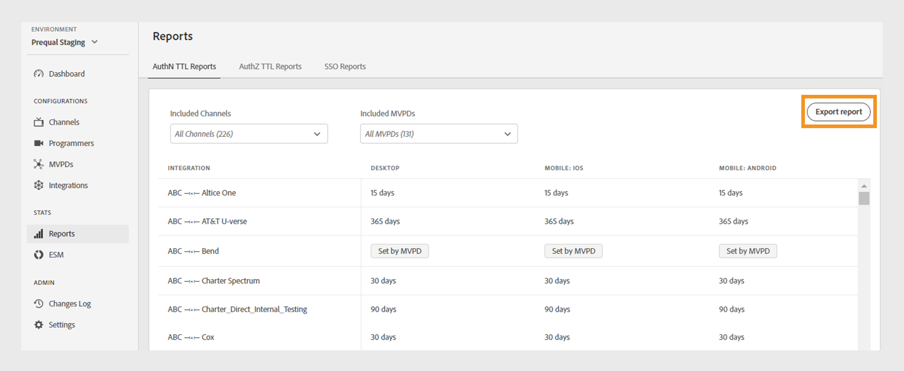
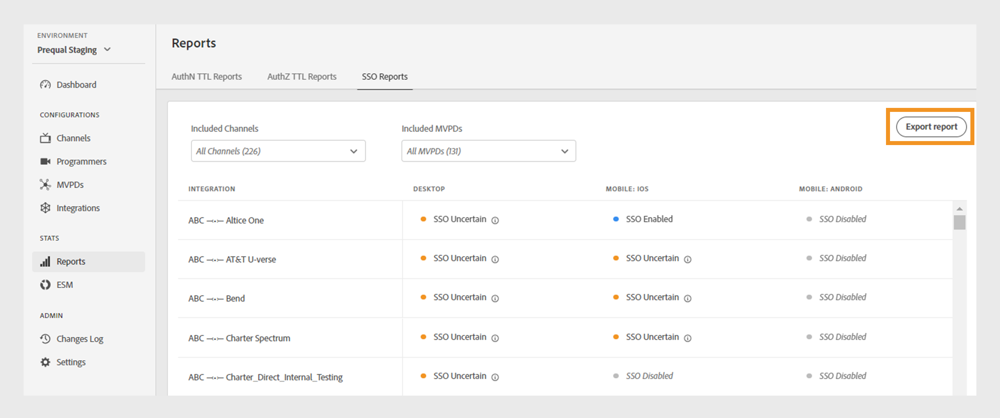

# 보고서 {#Reports}

>[!NOTE]
>
>이 페이지의 컨텐츠는 정보용으로만 제공됩니다. 이 API를 사용하려면 Adobe의 현재 라이선스가 필요합니다. 허가되지 않은 사용은 허용되지 않습니다.

TVE 대시보드의 **보고서** 섹션에서는 AuthN TTL, AuthZ TTL 및 SSO 보고서에 대한 집계된 데이터에 액세스할 수 있습니다. 이러한 보고서에는 모든 [플랫폼](#platforms)에서 다른 MVPD와의 채널 통합이 포함됩니다.

보고서를 사용하면 데이터를 필터링하고 [특정 채널 또는 MVPD](#selecting-specific-channels-mvpds)에 대한 인사이트를 수집할 수 있습니다. 추가 분석을 위해 CSV 파일로 보고서를 내보낼 수도 있습니다.

## 보고서 보기 {#view-reports}

특정 보고서를 보려면 다음 단계를 따르십시오.

1. 왼쪽 패널에서 **보고서** 탭을 선택합니다.
1. 다음 탭 중 하나를 선택하여 포함된 채널 및 MVPD의 집계된 데이터를 보고 내보냅니다.
   * [AuthN TTL 보고서](#authn-ttl-reports)
   * [AuthZ TTL 보고서](#authz-ttl-reports)
   * [SSO 보고서](#sso-reports)

   

   *보고서 유형*

### AuthN TTL 보고서 {#authn-ttl-reports}

TTL(Authentication Time-To-Live)이라고도 하는 AuthN TTL 보고서에는 모든 [플랫폼](#platforms)에서 다양한 MVPD와의 채널 통합에 대해 인증 토큰이 구성된 기간이 표시됩니다. 이러한 보고서를 사용하면 특정 MVPD 및 플랫폼에 대해 사용자가 인증된 상태를 유지하는 시간을 검사할 수 있습니다. 기간 값은 **일**, **시간**, **분**, **초** 등 사용자에게 친숙한 형식으로 표시됩니다. AuthN TTL 보고서 표에는 다양한 화면 크기를 수용할 수 있도록 가로 및 세로 스크롤이 제공됩니다.

[특정 채널 또는 MVPD](#selecting-specific-channels-mvpds)에 대한 데이터를 보고 다운로드할 수도 있습니다.

*AuthN TTL 보고서 내보내기*

>[!IMPORTANT]
>
> MVPD에서 설정한 **Set by Adobe Pass** 자리 표시자는 MVPD에서 인증 구성이 아닌 AuthN TTL 값을 적용할 때 사용됩니다.

데이터를 로컬 컴퓨터에 CSV 파일로 저장하려면 **보고서 내보내기**&#x200B;를 선택하십시오.

### AuthZ TTL 보고서 {#authz-ttl-reports}

AuthZ TTL 보고서(Authorization Time-To-Live(TTL)라고도 함)는 모든 [플랫폼](#platforms)에서 다양한 MVPD와 채널 통합에 대해 구성된 인증 토큰의 기간을 표시합니다. 이러한 보고서를 통해 사용자가 특정 MVPD 및 플랫폼에 대한 콘텐츠를 볼 수 있는 권한이 남아 있는 시간을 검사할 수 있습니다. 기간 값은 **일**, **시간**, **분**, **초** 등 사용자에게 친숙한 형식으로 표시됩니다. AuthZ TTL 보고서 표에는 다양한 화면 크기를 수용할 수 있도록 가로 및 세로 스크롤이 제공됩니다.

[특정 채널 또는 MVPD](#selecting-specific-channels-mvpds)에 대한 데이터를 보고 다운로드할 수도 있습니다.

*AuthZ TTL 보고서 내보내기*

>[!IMPORTANT]
>
> **MVPD에서 설정** 자리 표시자는 MVPD에서 Adobe Pass 인증 구성이 아닌 AuthZ TTL 값을 적용할 때 사용됩니다.

데이터를 로컬 컴퓨터에 CSV 파일로 저장하려면 **보고서 내보내기**&#x200B;를 선택하십시오.

### SSO 보고서 {#sso-reports}

SSO 보고서(Single Sign-On)는 모든 [플랫폼](#platforms)에서 다양한 MVPD와의 채널 통합에 대해 구성된 Single Sign-On 상태를 표시합니다. 이러한 보고서를 통해 특정 MVPD 및 플랫폼에 대해 예상되는 사용자 인증 SSO 경험을 검사할 수 있습니다. 이 값은 **SSO 사용 안 함**, **SSO 사용** 및 **SSO 불확실**&#x200B;과 같은 사용자에게 친숙한 형식으로 표시됩니다. SSO 보고서 표에는 다양한 화면 크기를 수용할 수 있도록 가로 및 세로 스크롤이 포함되어 있습니다.

[특정 채널 또는 MVPD](#selecting-specific-channels-mvpds)에 대한 데이터를 보고 다운로드할 수도 있습니다.

*SSO 보고서 내보내기*

>[!IMPORTANT]
>
> **SSO 불확실** 자리 표시자는 SSO(Single Sign-On)가 활성화되어 있으며 작동 중임을 나타냅니다. 그러나 아래 나열된 설정은 다음 예제에서 설명한 대로 SSO 인증을 금지할 수 있습니다.
>
> * 사용자 플랫폼 설정: 서드파티 쿠키를 차단하는 옵션.
> * 사용자 결정: 사용자가 TV 공급자 구독에 대한 플랫폼 액세스를 거부합니다.
> * MVPD 설정: MVPD은 각 채널에 대한 인증을 요청합니다.

데이터를 로컬 컴퓨터에 CSV 파일로 저장하려면 **보고서 내보내기**&#x200B;를 선택하십시오.

## 플랫폼 {#platforms}

[AuthN TTL 보고서](#authn-ttl-reports), [AuthZ TTL 보고서](#authz-ttl-reports) 및 [SSO 보고서](#sso-reports)는 다음과 같은 다양한 플랫폼에 데이터를 제공합니다.

* **데스크톱**: Adobe Pass 인증 JavaScript SDK을 통해 프로그래머 구현에 적용된 값을 표시합니다.

* **모바일**

  **iOS**: Adobe Pass 인증 iOS SDK을 사용하여 적용된 값을 표시합니다.

  **Android**: Adobe Pass 인증 Android SDK을 통해 적용된 값을 표시합니다.

  **기타**: 모바일 장치용으로 개발된 Adobe Pass 인증 REST API를 사용하여 적용된 값을 표시합니다.

* **TVCD**

  **Roku**: Adobe Pass 인증 REST API를 통해 적용된 값을 표시하여 Roku를 장치 유형으로 식별합니다.

  **FireTV**: Adobe Pass 인증 FireTV SDK을 통해 적용된 값을 표시합니다.

  **AppleTV**: Adobe Pass 인증 tvOS SDK을 통해 적용된 값을 표시합니다.

  **기타**: TV 연결 장치용 Adobe Pass 인증 REST API를 사용하여 적용된 값을 표시합니다.

* **확인되지 않은 플랫폼**: Adobe Pass 인증 서비스에서 알 수 없는 장치 형식을 감지할 때 프로그래머 구현에 적용된 값을 표시합니다.

원하는 장치 유형(예: **Roku**)을 Adobe Pass 인증 REST API 또는 SDK와 공유하는 방법에 대해 자세히 알아보려면 [클라이언트 정보 전달](/help/authentication/integration-guide-programmers/legacy/client-information/passing-client-information-device-connection-and-application.md) 메커니즘을 확인하십시오.

>[!IMPORTANT]
>
> 집계된 데이터는 각 Adobe Pass 인증 환경의 특정 구성을 기반으로 합니다. 서로 다른 TVE 대시보드 환경 간을 전환할 때 보고서 간에 데이터의 변형이 예상됩니다. 자세한 내용은 [Adobe Pass 인증 환경](/help/authentication/user-guide-tve-dashboard/tve-dashboard-environments.md)을 참조하세요.

## 특정 채널 및 MVPD 선택 {#selecting-specific-channels-mvpds}

[AuthN TTL 보고서](#authn-ttl-reports), [AuthZ TTL 보고서](#authz-ttl-reports) 및 [SSO 보고서](#sso-reports)에는 기본적으로 **모든 MVPD**&#x200B;와 **모든 채널** 통합을 위한 데이터가 있습니다.

>[!NOTE]
>
> 각 드롭다운 메뉴에서 **모든 채널** 또는 **모든 MVPD**&#x200B;를 선택 취소하면 의미 있는 보고서를 볼 수 있도록 선택하는 메시지가 표시됩니다.

특정 채널에 대한 보고서를 생성하려면 다음을 수행합니다.

1. 선택한 보고서 상단에서 **포함된 채널** 드롭다운 메뉴를 선택합니다.

   

   *포함된 채널 드롭다운 메뉴*

1. **모든 채널**&#x200B;을 선택 취소합니다.

1. 데이터를 생성할 **포함된 채널** 드롭다운 메뉴에서 필요한 채널을 선택합니다.

>[!NOTE]
>
> **포함된 MVPD** 드롭다운 메뉴에서 옵션을 사용하려면 **포함된 채널** 드롭다운 메뉴에서 채널을 하나 이상 선택해야 합니다.

특정 MVPD에 대한 보고서를 생성하려면:

1. 선택한 보고서 상단에서 **포함된 MVPD** 드롭다운 메뉴를 선택합니다.

   

   *포함된 MVPD 드롭다운 메뉴*

1. **모든 MVPD**&#x200B;을(를) 선택 취소합니다.

1. 데이터를 생성할 **포함된 MVPD** 드롭다운 메뉴에서 필요한 MVPD를 선택합니다.
