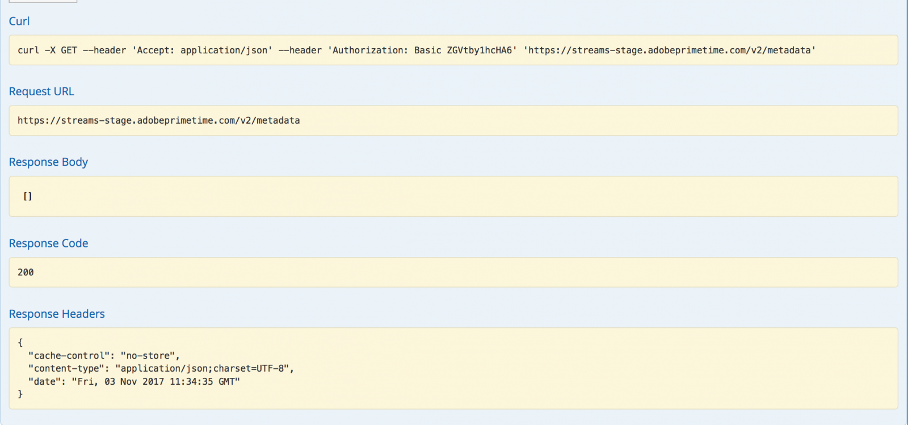

# API 개요 {#api-overview}

자세한 내용은 [온라인 API 설명서](http://docs.adobeptime.io/cm-api-v2/)를 참조하세요.

## 목적 및 사전 요구 사항 {#purpose-prerequisites}

이 문서는 Concurrency Monitoring과의 통합을 구현할 때 애플리케이션 개발자가 Swagger API 사양을 사용하는 데 도움이 됩니다. 이 지침을 따르기 전에 독자가 서비스에서 정의한 개념에 대해 이전에 이해한 적이 있는 것이 좋습니다. 이를 이해하려면 [제품 설명서](/help/concurrency-monitoring/cm-home.md) 및 [Swagger API 사양](http://docs.adobeptime.io/cm-api-v2/)에 대한 개요가 필요합니다.

## 소개 {#api-overview-intro}

개발 프로세스 중에 Swagger 공개 설명서는 API 흐름을 이해하고 테스트하는 데 있어 참조 지침을 나타냅니다. 실습 접근 방식을 사용하고 실제 애플리케이션이 사용자 상호 작용의 다양한 시나리오에서 작동하는 방식을 숙지하려면 이 곳을 시작하기 좋은 곳입니다.

[Zendesk](mailto:tve-support@adobe.com)에서 티켓을 제출하여 Concurrency Monitoring에 회사 및 응용 프로그램을 등록하세요. Adobe은 각 엔티티에 애플리케이션 ID를 할당합니다. 이 안내서에서는 테넌트 Adobe 아래에 있는 ID **demo-app** 및 **demo-app-2**&#x200B;을(를) 가진 두 개의 참조 응용 프로그램을 사용합니다.

## 사용 사례 {#api-use-case}

Swagger를 사용하여 플로우를 테스트하는 첫 번째 단계는 다음과 같이 페이지의 오른쪽 상단에 애플리케이션 ID를 입력하는 것입니다.

그런 다음 **탐색**&#x200B;을 눌러 REST API에 대한 모든 호출에 대한 인증 헤더에 사용할 ID를 설정합니다.  모든 API 호출은 HTTP 기본 인증을 통해 애플리케이션 ID가 전달될 것으로 예상합니다. 사용자 이름은 애플리케이션 ID이고 암호는 비어 있습니다.

### 첫 번째 애플리케이션 {#first-app-use-cases}

Adobe 팀에서 ID가 **demo-app**&#x200B;인 응용 프로그램에 동시 스트림 수를 3개로 제한하는 하나의 규칙이 있는 정책을 지정했습니다. Zendesk에서 제출된 요청에 따라 특정 애플리케이션에 정책이 할당됩니다.

#### 메타데이터 검색 중 {#retrieve-metadata-use-case}

세션 초기화 중에 양식 데이터로 전달하는 데 필요한 메타데이터 속성 목록을 가져오기 위해 Metadata 리소스에 대해 처음으로 를 호출합니다. 이 메타데이터는 이 애플리케이션에 할당된 정책을 평가하는 데 사용됩니다.

ID가 **demo-app**&#x200B;인 응용 프로그램에 대해 &quot;사용해 보기&quot;를 누르면 다음 결과가 표시됩니다.

응답 본문 필드에서 볼 수 있듯이 메타데이터 속성 목록이 비어 있습니다. 즉, 설계에 필요한 속성이 이 애플리케이션에 할당된 3 스트림 정책을 평가하기에 충분하다는 의미입니다. [표준 메타데이터 필드 설명서](/help/concurrency-monitoring/standard-metadata-attributes.md)를 참조하세요. 이 호출 후에 계속 진행하여 세션 REST 리소스에 새 세션을 만들 수 있습니다.

#### 세션 초기화 {#session-initial}

세션 초기화 호출은 수행하는 데 필요한 모든 정보를 가져온 후 애플리케이션에 의해 수행됩니다.

다른 활성 스트림이 없으므로 첫 번째 호출에 종료 코드를 제공할 필요가 없습니다. 메타데이터 검색 호출에서 아무 것도 반환되지 않았으므로 메타데이터 속성이 없습니다.

**subject** 및 **idp** 매개 변수는 필수 항목이며 URI 경로 변수로 지정됩니다. Adobe Pass 인증에서 **mvpd** 및 **upstreamUserID** 메타데이터 필드를 호출하여 **subject** 및 **idp** 매개 변수를 가져올 수 있습니다. 메타데이터 API의 [개요](https://experienceleague.adobe.com/docs/primetime/authentication/auth-features/user-metadat/user-metadata-feature.html?lang=en#)도 참조하세요. 이 예제에서는 값 &quot;12345&quot;을 제목으로 제공하고 &quot;adobe&quot;를 idp로 제공합니다.

세션 초기화 호출을 만듭니다. 다음 응답을 받게 됩니다.

필요한 모든 데이터는 응답 헤더에 포함됩니다. **Location** 헤더는 새로 만든 세션의 ID를 나타내고 **Date** 및 **Expires** 헤더는 세션을 활성 상태로 유지하기 위해 다음 하트비트를 수행하도록 응용 프로그램을 예약하는 데 사용되는 값을 나타냅니다.

#### 하트비트 {#heartbeat}

하트비트를 호출합니다. 사용된 **주체** 및 **idp** 매개 변수와 함께 세션 초기화 호출에서 가져온 **세션 ID**&#x200B;을(를) 제공하십시오.

세션이 여전히 유효하면(세션이 만료되지 않았거나 수동으로 삭제된 경우) 성공적인 결과를 받게 됩니다.

첫 번째 경우처럼 **날짜** 및 **만료** 헤더를 사용하여 이 특정 세션에 대한 다른 하트비트를 예약합니다. 세션이 더 이상 유효하지 않으면 410 GONE HTTP 상태 코드로 이 호출이 실패합니다.

Swagger UI에서 사용할 수 있는 &quot;스트림 활성 상태 유지&quot; 옵션을 사용하여 특정 세션에서 자동 하트비트를 실행할 수 있습니다. 이 옵션을 사용하면 적절한 세션 하트비트를 수행하는 데 필요한 보일러플레이트에 대해 걱정할 필요 없이 규칙을 테스트할 수 있습니다. 이 단추는 Swagger 하트비트 탭의 &quot;사용해 보기&quot; 단추와 함께 배치됩니다. 생성된 모든 세션에 대해 자동 하트비트를 설정하려면 웹 브라우저 탭에서 연 별도의 Swagger UI에서 각 세션을 예약해야 합니다.

#### 세션 종료 {#session-termination}

예를 들어 사용자가 비디오 보기를 중단하는 경우 회사의 비즈니스 사례에서 특정 세션을 종료하려면 동시성 모니터링이 필요할 수 있습니다. 이 작업은 세션 리소스에서 DELETE 호출을 수행하여 수행할 수 있습니다.

세션 하트비트 호출과 동일한 매개 변수를 호출에 사용합니다. 응답 HTTP 상태 코드는 다음과 같습니다.

* 202 수락됨 - 성공적인 응답
* 410 세션이 이미 중지된 경우 없어짐.

#### 실행 중인 모든 스트림 가져오기 {#get-all-running-streams}

이 끝점은 모든 애플리케이션에서 특정 테넌트에 대해 현재 실행 중인 모든 세션을 제공합니다. 호출에 **subject** 및 **idp** 매개 변수 사용:

전화를 걸면 다음과 같은 응답을 받게 됩니다.

**Expires** 헤더를 참고하십시오. 하트비트를 보내지 않는 한 첫 번째 세션이 만료되는 시간입니다. 다른 테넌트의 응용 프로그램에서 이 사용자에 대해 실행 중인 다른 스트림이 없으므로 OtherStreams의 값이 0입니다.
메타데이터 필드는 세션이 시작될 때 전송된 모든 메타데이터로 채워집니다. 필터링하지 않으므로 보낸 모든 항목을 받게 됩니다.
호출을 수행할 때 특정 사용자에 대해 실행 중인 세션이 없는 경우 다음 응답을 받게 됩니다.

또한 이 경우 **Expires** 헤더가 없습니다.

#### 정책 위반 {#breaking-policy-app-first}

할당된 3개의 스트림 정책이 중단되었을 때 애플리케이션의 동작을 시뮬레이션하려면 세션 초기화를 3번 호출해야 합니다. 정책이 적용되려면 하트비트 부족으로 인해 세션 중 하나가 만료되기 전에 호출을 수행해야 합니다. 이러한 호출이 모두 성공하는 것을 볼 수 있지만, 네 번째 호출을 수행하면 다음 오류가 발생하여 실패합니다.

페이로드의 평가 결과 개체와 함께 409 CONFLICT 응답을 가져옵니다. [Swagger API 사양](http://docs.adobeptime.io/cm-api-v2/#evaluation-result)에서 평가 결과에 대한 전체 설명을 읽어 보십시오.

애플리케이션은 평가 결과로부터의 정보를 사용하여, 비디오를 정지할 때 사용자에게 특정 메시지를 표시하고, 필요할 경우 추가 조치를 취할 수 있다. 한 가지 사용 사례는 새 스트림을 시작하기 위해 기존의 다른 스트림을 중지하는 것입니다. 이 작업은 충돌하는 특정 특성에 대해 **충돌** 필드에 있는 **terminationCode** 값을 사용하여 수행됩니다. 이 값은 새 세션 초기화를 위한 호출에서 X-Terminate HTTP 헤더로 제공됩니다.

세션 초기화 시 하나 이상의 종료 코드를 제공하면 호출이 성공하고 새 세션이 생성됩니다. 그런 다음 원격으로 중지된 세션 중 하나를 사용하여 하트비트를 생성하려고 하면 다음 예와 같이 세션이 원격으로 종료되었음을 설명하는 평가 결과 페이로드와 함께 410 GONE 응답을 다시 가져옵니다.

### 두 번째 애플리케이션 {#second-application}

사용할 다른 예제 응용 프로그램은 ID가 **demo-app-2**&#x200B;입니다. 채널에 사용할 수 있는 스트림 수를 최대 2개로 제한하는 하나의 규칙이 있는 정책이 할당되었습니다.   이 정책을 평가하려면 채널 변수를 제공해야 합니다.

#### 메타데이터 검색 중 {#retrieving-metadata}

페이지의 오른쪽 상단 모서리에서 새 애플리케이션 ID를 설정하고 메타데이터 리소스를 호출합니다. 다음 응답을 받게 됩니다.

이번에는 첫 번째 애플리케이션의 예처럼 응답 본문이 더 이상 빈 목록이 아닙니다. 이제 Concurrency Monitoring Service는 응답 본문에서 정책을 평가하기 위해 세션 초기화 시 **채널** 메타데이터가 필요함을 나타냅니다.

**channel** 매개 변수에 대한 값을 제공하지 않고 호출하는 경우 다음과 같은 결과가 발생합니다.

* 응답 코드 - 400 잘못된 요청
* 응답 본문 - 작업을 성공하기 위해 세션 초기화 요청에 필요한 사항을 **의무** 필드에 설명하는 평가 결과 페이로드입니다.

#### 세션 초기화 {#session-init}

필요한 메타데이터 키의 값을 할당하고 아래 표시된 대로 세션 초기화 요청에서 양식 매개 변수로 설정합니다.

이제 호출이 성공하고 새 세션이 생성됩니다.

#### 정책 위반 {#breaking-policy-second-app}

이 애플리케이션에 할당된 정책에 있는 규칙을 위반하려면 채널 값이 동일한 2개의 호출을 수행해야 합니다. 제1 예에서와 같이, 제2 호출은 생성된 제1 세션이 여전히 유효한 동안 행해질 필요가 있다.

새 세션을 만들 때마다 채널 메타데이터에 다른 값을 사용하면 임계값 2의 범위가 각 값에 개별적으로 할당되므로 모든 호출이 성공합니다.

첫 번째 예에서처럼, 충돌 스트림을 원격으로 중지하기 위해 종료 코드를 사용하거나 스트림 중 하나에서 하트비트가 작동하지 않는다고 가정하고 스트림 중 하나가 만료될 때까지 기다릴 수 있습니다.
