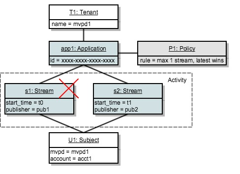

# 정책 결정 지점 {#policy-desc-pt}

## 도메인 모델 {#domain-model}

이 페이지는 다양한 사용 사례 및 정책 구현에 대한 참조 역할을 하기 위한 것입니다. 용어 정의는 설명서의 [용어집](/help/concurrency-monitoring/cm-glossary.md) 부분도 참조하는 것이 좋습니다.

**테넌트**&#x200B;이(가) **정책**&#x200B;을(를) 적용할 **응용 프로그램**&#x200B;을(를) 소유하고 있습니다. **클라이언트 응용 프로그램**&#x200B;은(는) **응용 프로그램 ID**(Adobe 제공)으로 구성해야 합니다.

그런 다음 테넌트는 자신이 만들었거나 다른 사용자가 만들고 공유한 하나 이상의 정책과 각 애플리케이션을 연결합니다. 여러 테넌트 간에 정책을 연결할 수 있습니다.

**주체 활동**&#x200B;은(는) 특정 주체에 대해 동시성 모니터링으로 보고되는 모든 스트림(애플리케이션에 관계 없음)으로 구성됩니다.

지정된 주제에 대해 스트림을 승인하려면 시스템은 먼저 스트림을 생성한 애플리케이션에 대해 정의된 모든 정책을 확인합니다.

적용 가능한 각 정책에 대해 규칙에 전달될 모든 **관련 활동**&#x200B;을 수집해야 합니다. 정책 P에 대한 **관련 활동**&#x200B;이 다음 조건을 충족하는 경우 스트림 S만 포함합니다.

**스트림 &quot;S&quot;는 정책에 정책 &quot;P&quot;가 포함된 응용 프로그램에서 시작합니다.**

## 시험 실행 사용 사례 {#dry-run-use-cases}

아래 연습에서는 일부 사용 사례에 대해 모델을 검증하는 것을 목표로 합니다. 기본 설정부터 시작하여 다양한 방법으로 복잡성을 추가하여 점진적으로 진행합니다.

### &#x200B;1. 임차인 1명 하나의 애플리케이션입니다. 정책 하나. 스트림 하나 {#onetenant-oneapp-onepolicy-onestream}

단일 테넌트로 시작하며, 단일 애플리케이션과 단일 정책이 연결됩니다. 모든 사용자에 대해 최대 하나의 활성 스트림이 있을 수 있다는 정책 상태(최신 스트림을 재생할 수 있음)를 가정해 보겠습니다.

스트림이 시작되면 해당 스트림으로만 활동이 구성되며 재생이 허용됩니다.

### &#x200B;2. 임차인 1명 하나의 애플리케이션입니다. 정책 하나. 두 개의 스트림. {#onetenant-oneapp-onepolicy-twostreams}

두 번째 스트림이 시작되면(동일한 피험자가 동일한 애플리케이션을 사용하여) 유효성 검사에 사용되는 활동은 **s1**&#x200B;과(와) **s2** 모두로 구성됩니다.

정책에서 하나의 스트림만 재생할 수 있다고 하므로 한도를 초과했습니다. 따라서 최신 스트림(**s2**)만 재생할 수 있습니다.

>[!NOTE]
>
>다이어그램은 사용자 활동에 대한 시스템 보기를 나타냅니다. 스트림 초기화를 시도하는 경우 액세스 결정이 응답에 포함됩니다. 활성 스트림의 경우 하트비트 응답 시 결정이 반환됩니다.

### &#x200B;3. 임차인 2명 두 개의 응용 프로그램. 정책 하나. 두 개의 스트림. {#twotenant-twoapp-onepolicy-twostreams}

이제 새 테넌트가 애플리케이션에서 동일한 정책을 적용하려고 한다고 가정해 보겠습니다.

두 테넌트가 동일한 정책에 의해 연결되어 있으므로 usecase 2에 설명된 상황이 여기에 해당되고 **s3**&#x200B;이(가) 최신 스트림으로 재생되도록 허용됩니다.

### &#x200B;4. 임차인 2명 세 가지 응용 프로그램. 두 가지 정책. 두 개의 스트림. {#twotenants-threeapps-twopolicies-twostreams}

이제 두 번째 테넌트가 새 애플리케이션을 배포하고 **app2**&#x200B;과(와) **app3** 간에 공유할 새 정책을 정의하려고 한다고 가정해 보겠습니다.

현재 활성 스트림 **s3** 및 **s4**&#x200B;이(가) 모두 허용됩니다. **s3**&#x200B;의 경우 정책 **P1**&#x200B;을(를) 평가할 때 시스템은 **s3**&#x200B;만 **관련 활동**&#x200B;로 계산합니다(**s4**&#x200B;은(는) 정책 **P1**&#x200B;과(와) 전혀 관련이 없으므로 위반이 없습니다.

정책 **P2**&#x200B;은(는) 두 스트림에 적용되며 관련 활동으로 **s3**&#x200B;과(와) **s4**&#x200B;을(를) 모두 포함합니다. 이 활동은 두 스트림의 범위 내에 있으므로 두 스트림을 모두 사용할 수 있습니다.

### &#x200B;5. 임차인 2명 세 가지 응용 프로그램. 두 가지 정책. 세줄이요 {#twotenants-threeapps-twopolicies-threestreams}

이제 **app2**&#x200B;을(를) 사용하여 새 스트림 초기화 시도를 수행한다고 가정합니다.

**s5**&#x200B;은(는) **P1**(최신 스트림을 인수할 수 있음)까지 시작할 수 있지만 **P2**&#x200B;에 의해 거부되므로 시작되지 않습니다.

app3에서 스트림 초기화를 시도하는 경우에도 동일하게 발생합니다. 동일한 정책 P2가 이에 대한 액세스를 거부합니다.

이제 사용자가 app1을 사용하여 새 스트림을 만들려고 하면 어떻게 되는지 살펴보겠습니다.

응용 프로그램 app1은 정책 **P2**&#x200B;과(와) 아무런 관련이 없으므로 정책 **P1**&#x200B;만 적용합니다. 이 정책에서는 새 스트림을 시작할 수 있도록 허용하고 이전 스트림을 거부합니다(이 경우 **s3**).
