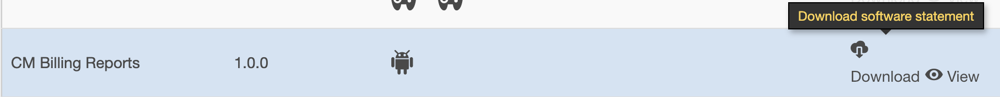
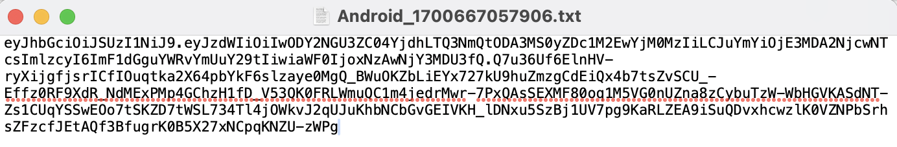
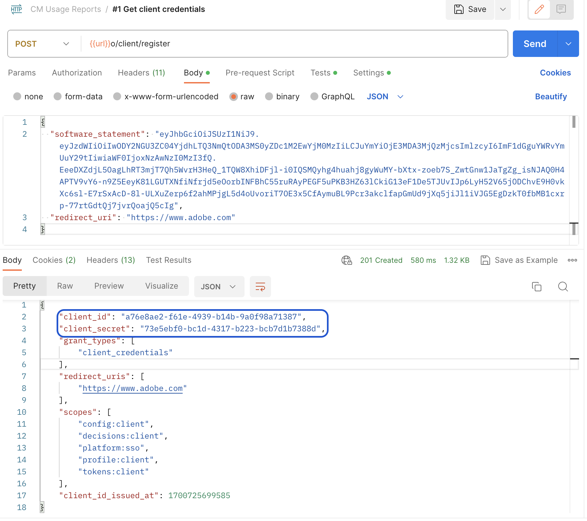

# 동시성 모니터링 사용 API 액세스 {#cmu-api-usage-access}

>[!NOTE]
>
>이 페이지의 컨텐츠는 정보용으로만 제공됩니다. 이 API를 사용하려면 Adobe의 현재 라이선스가 필요합니다. 허가되지 않은 사용은 허용되지 않습니다. 가용성에 대한 질문이 있는 경우 Adobe 담당자에게 문의하십시오.

## 액세스 절차 개요 {#api-access-procedure-overview}

OAuth 2.0 Dynamic Client Registration Protocol과 호환되도록 CMU 보고서 액세스를 업데이트했습니다.
사용자 지정 OAuth 2.0 인증 서버가 배포되어 Concurrency Monitoring 애플리케이션의 요구 사항을 해결합니다. \
클라이언트 애플리케이션이 OAuth 2.0 인증을 활용하려면 서버는 상호 작용할 수 있는 특정 정보(클라이언트 자격 증명)를 얻기 위해 동적으로 등록해야 합니다. 등록 프로세스의 일부로 클라이언트는 기본 제공 메타데이터 세트를 클라이언트 등록 엔드포인트에 제공해야 합니다.
이 메타데이터는 소프트웨어 문으로 통신되며, 인증 서버가 동일한 소프트웨어 문을 사용하여 애플리케이션의 다른 인스턴스를 상호 연관시킬 수 있도록 하는 &quot;software_id&quot;가 포함되어 있습니다.
소프트웨어 문은 클라이언트 소프트웨어에 대한 메타데이터 값을 번들로 어설션하는 JSON 웹 토큰(JWT)입니다. 클라이언트 등록 요청의 일부로 인증 서버에 표시되는 경우 소프트웨어 명령문은 JSON 웹 서명(JWS)을 사용하여 디지털 서명되거나 MAC편집되어야 합니다. \
공식 문서에서 소프트웨어 명령문이 무엇이며 어떻게 작동하는지에 대한 자세한 설명을 찾을 수 있습니다  <a href="https://datatracker.ietf.org/doc/html/rfc7591" target="_blank">[RFC7591]</a>.
액세스 권한을 얻으려면 아래 섹션의 단계를 따르십시오.

## 액세스 절차 단계 {#access-procedure-steps}

1. Adobe Pass DCR 서버에 등록된 응용 프로그램이 있습니다. 이 단계는 다음으로 문의하십시오. [지원 팀](mailto:tve-support@adobe.com).
2. 소프트웨어 구문 가져오기
   1. TVE 대시보드로 이동 <a href="https://console-preprod.auth.adobe.com/#!/" target="_blank"> 사전 프로덕션 </a> 또는 <a href="https://console.auth.adobe.com/" target="_blank">PROD</a>
   2. 프로그래머 선택
   3. 응용 프로그램 탭으로 이동
   4. 애플리케이션 선택
   5. DownLoad Software Statement 를 클릭하여 아래 캡처와 유사한 파일을 가져옵니다.
      <figure>
          
       </figure>
      <figure>
          
       </figure>

3. 액세스 토큰 가져오기
   1. 위에서 얻은 소프트웨어 문을 사용하고 아래 호출을 수행하여 클라이언트 자격 증명을 가져옵니다. 이러한 방식으로 액세스 토큰을 가져오는 데 사용할 수 있는 client_id - client_secret 쌍을 얻습니다.
      *이 단계는 매번 수행해서는 안 됩니다. 자격 증명이 만료될 때만 다시 수행해야 합니다.*
      <figure>
          
       </figure>

   2. 아래 호출을 사용하여 액세스 토큰을 가져옵니다. 토큰이 만료될 때까지 이 액세스 토큰을 사용하여 CMU API를 호출하십시오.
      *이 단계는 마지막으로 생성된 토큰이 만료된 경우에만 수행해야 합니다.*
      <figure>
          
       </figure>

4. CMU API 호출 - 아래 관련 정보를 참조하십시오.
   <figure>
          
       </figure>

## 관련 정보 {#related-information}

* [CMU 개요](/help/concurrency-monitoring/cm-usage-reports.md)
* [CMU API](/help/concurrency-monitoring/cmu-api.md)
